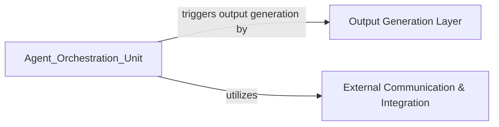

## Details

These two components are fundamental because they represent the "last mile" of the AI-powered software engineering tool. The Output Generation Layer ensures that the complex analysis results are presented in a human-understandable and usable format, directly addressing the documentation generation goal. The External Communication & Integration component ensures that the tool is not isolated but can actively participate and contribute to existing development processes, making it a truly integrated AI4SE solution. They are critical for the system's usability, impact, and seamless integration into a developer's workflow.

### Output Generation Layer
This component is responsible for transforming the processed information and analysis results into various human-readable formats, such as HTML, Markdown, or Sphinx documentation. It ensures that the generated documentation is well-formatted and consumable by users, serving as the final presentation layer for the system's insights.

**Related Classes/Methods**:

- <a href="https://github.com/CodeBoarding/CodeBoarding/blob/main/output_generators/html.py" target="_blank" rel="noopener noreferrer">`output_generators/html.py`</a>
- <a href="https://github.com/CodeBoarding/CodeBoarding/blob/main/output_generators/markdown.py" target="_blank" rel="noopener noreferrer">`output_generators/markdown.py`</a>
- <a href="https://github.com/CodeBoarding/CodeBoarding/blob/main/output_generators/sphinx.py" target="_blank" rel="noopener noreferrer">`output_generators/sphinx.py`</a>
- <a href="https://github.com/CodeBoarding/CodeBoarding/blob/main/output_generators/html_template.py" target="_blank" rel="noopener noreferrer">`output_generators/html_template.py`</a>

### External Communication & Integration
This component handles external communications and integrations, specifically facilitating interactions with external systems like updating pull request links. It ensures that the system can communicate its results or actions beyond its internal scope, enabling seamless integration into existing development workflows.

**Related Classes/Methods**:

- <a href="https://github.com/CodeBoarding/CodeBoarding/blob/main/outreach_utils/pr_util.py" target="_blank" rel="noopener noreferrer">`outreach_utils/pr_util.py`</a>

### [FAQ](https://github.com/CodeBoarding/GeneratedOnBoardings/tree/main?tab=readme-ov-file#faq)
