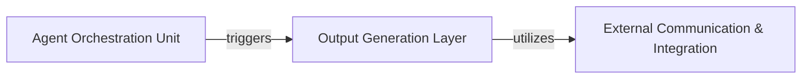

## Details

Overview of abstract components and their relationships within a software project.

### Output Generation Layer
This component is responsible for transforming the processed information and analysis results into various human-readable formats, including HTML, Markdown, Sphinx documentation, and now MDX. It ensures that the generated documentation is well-formatted, structured, and consumable by users, serving as the final presentation layer for the system's insights. The addition of MDX capabilities allows for more interactive and structured outputs, including the generation of Mermaid diagrams and dynamic frontmatter.

**Related Classes/Methods**:

- <a href="https://github.com/CodeBoarding/CodeBoarding/blob/main/output_generators/html.py" target="_blank" rel="noopener noreferrer">`output_generators/html.py`</a>
- <a href="https://github.com/CodeBoarding/CodeBoarding/blob/main/output_generators/markdown.py" target="_blank" rel="noopener noreferrer">`output_generators/markdown.py`</a>
- <a href="https://github.com/CodeBoarding/CodeBoarding/blob/main/output_generators/sphinx.py" target="_blank" rel="noopener noreferrer">`output_generators/sphinx.py`</a>
- <a href="https://github.com/CodeBoarding/CodeBoarding/blob/main/output_generators/html_template.py" target="_blank" rel="noopener noreferrer">`output_generators/html_template.py`</a>
- <a href="https://github.com/CodeBoarding/CodeBoarding/blob/main/output_generators/mdx.py#L12-L38" target="_blank" rel="noopener noreferrer">`output_generators/mdx.py:generated_mermaid_str` (12:38)</a>
- <a href="https://github.com/CodeBoarding/CodeBoarding/blob/main/output_generators/mdx.py#L41-L56" target="_blank" rel="noopener noreferrer">`output_generators/mdx.py:generate_frontmatter` (41:56)</a>
- <a href="https://github.com/CodeBoarding/CodeBoarding/blob/main/output_generators/mdx.py#L59-L124" target="_blank" rel="noopener noreferrer">`output_generators/mdx.py:generate_mdx` (59:124)</a>
- <a href="https://github.com/CodeBoarding/CodeBoarding/blob/main/output_generators/mdx.py#L127-L134" target="_blank" rel="noopener noreferrer">`output_generators/mdx.py:generate_mdx_file` (127:134)</a>

### External Communication & Integration
This component handles external communications and integrations, specifically facilitating interactions with external systems like updating pull request links and ensuring correct linking within generated documentation. It ensures that the system can communicate its results or actions beyond its internal scope, enabling seamless integration into existing development workflows. This now includes dynamically determining branch names for generating accurate repository URLs within the generated MDX documentation.

**Related Classes/Methods**:

- <a href="https://github.com/CodeBoarding/CodeBoarding/blob/main/outreach_utils/pr_util.py#L102-L139" target="_blank" rel="noopener noreferrer">`outreach_utils/pr_util.py:update_markdown_links` (102:139)</a>
- <a href="https://github.com/CodeBoarding/CodeBoarding/blob/main/outreach_utils/pr_util.py#L142-L147" target="_blank" rel="noopener noreferrer">`outreach_utils/pr_util.py:get_branch` (142:147)</a>

### Agent Orchestration Unit
This component orchestrates the overall workflow of the system, including the cloning of repositories, initiating the analysis process, and triggering the generation of various output formats. It acts as the central control point, coordinating different sub-components to achieve the desired outcome.

**Related Classes/Methods**:

- <a href="https://github.com/CodeBoarding/CodeBoarding/blob/main/github_action.py" target="_blank" rel="noopener noreferrer">`github_action.py`</a>

### [FAQ](https://github.com/CodeBoarding/GeneratedOnBoardings/tree/main?tab=readme-ov-file#faq)
