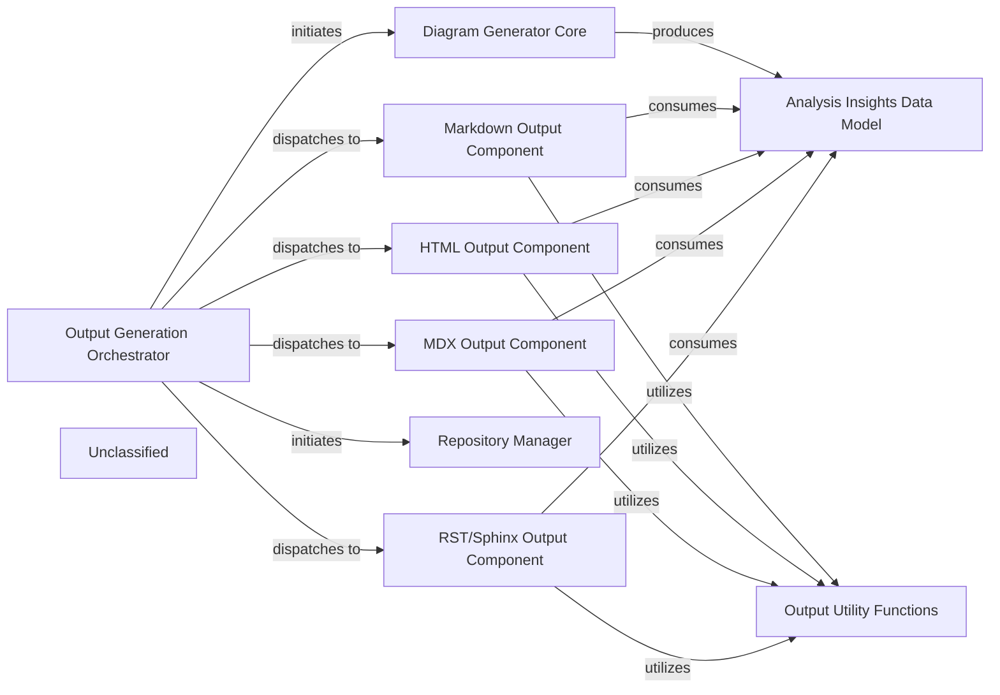

## Details

The Output Generation Engine subsystem is responsible for transforming architectural analysis insights into various documentation formats. The Output Generation Orchestrator acts as the central control, initiating the analysis process and delegating output generation to format-specific components. It first interacts with the Repository Manager to prepare the code repository and then leverages the Diagram Generator Core to produce the Analysis Insights Data Model. These insights are then consumed by dedicated Markdown, HTML, MDX, and RST/Sphinx Output Components to render the final documentation. Common functionalities like name sanitization and file existence checks are provided by the Output Utility Functions.

### Output Generation Orchestrator
This component, primarily `github_action.py`, orchestrates the entire output generation process within a GitHub Actions context. It handles repository preparation, initial analysis, and dispatches generation tasks to format-specific functions based on the desired output extension. It serves as the primary entry point for the subsystem.

**Related Classes/Methods**:

- <a href="https://github.com/CodeBoarding/CodeBoarding/blob/maingithub_action.py" target="_blank" rel="noopener noreferrer">`github_action.py`</a>
- <a href="https://github.com/CodeBoarding/CodeBoarding/blob/mainrepo_utils/__init__.py" target="_blank" rel="noopener noreferrer">`repo_utils.clone_repository`</a>
- <a href="https://github.com/CodeBoarding/CodeBoarding/blob/mainrepo_utils/__init__.py" target="_blank" rel="noopener noreferrer">`repo_utils.checkout_repo`</a>
- <a href="https://github.com/CodeBoarding/CodeBoarding/blob/maindiagram_analysis/diagram_generator.py" target="_blank" rel="noopener noreferrer">`diagram_analysis.diagram_generator.DiagramGenerator`</a>

### Markdown Output Component
Responsible for generating documentation in Markdown format. It processes `AnalysisInsights` objects and applies Markdown-specific formatting rules, including the generation of Markdown files. This component encapsulates both the high-level generation logic and the specific formatting functions.

**Related Classes/Methods**:

- <a href="https://github.com/CodeBoarding/CodeBoarding/blob/mainoutput_generators/markdown.py" target="_blank" rel="noopener noreferrer">`output_generators.markdown.generate_markdown_file`</a>
- <a href="https://github.com/CodeBoarding/CodeBoarding/blob/maingithub_action.py" target="_blank" rel="noopener noreferrer">`github_action.py`</a>
- <a href="https://github.com/CodeBoarding/CodeBoarding/blob/mainagents/agent_responses.py" target="_blank" rel="noopener noreferrer">`agents.agent_responses.AnalysisInsights`</a>

### HTML Output Component
Responsible for generating documentation in HTML format. It processes `AnalysisInsights` objects and applies HTML-specific formatting rules, including the generation of HTML files. This component encapsulates both the high-level generation logic and the specific formatting functions.

**Related Classes/Methods**:

- <a href="https://github.com/CodeBoarding/CodeBoarding/blob/mainoutput_generators/html.py" target="_blank" rel="noopener noreferrer">`output_generators.html.generate_html_file`</a>
- <a href="https://github.com/CodeBoarding/CodeBoarding/blob/maingithub_action.py" target="_blank" rel="noopener noreferrer">`github_action.py`</a>
- <a href="https://github.com/CodeBoarding/CodeBoarding/blob/mainagents/agent_responses.py" target="_blank" rel="noopener noreferrer">`agents.agent_responses.AnalysisInsights`</a>

### MDX Output Component
Responsible for generating documentation in MDX format. It processes `AnalysisInsights` objects and applies MDX-specific formatting rules, including the generation of MDX files. This component encapsulates both the high-level generation logic and the specific formatting functions.

**Related Classes/Methods**:

- <a href="https://github.com/CodeBoarding/CodeBoarding/blob/mainoutput_generators/mdx.py" target="_blank" rel="noopener noreferrer">`output_generators.mdx.generate_mdx_file`</a>
- <a href="https://github.com/CodeBoarding/CodeBoarding/blob/maingithub_action.py" target="_blank" rel="noopener noreferrer">`github_action.py`</a>
- <a href="https://github.com/CodeBoarding/CodeBoarding/blob/mainagents/agent_responses.py" target="_blank" rel="noopener noreferrer">`agents.agent_responses.AnalysisInsights`</a>

### RST/Sphinx Output Component
Responsible for generating documentation in reStructuredText (RST) format, leveraging Sphinx conventions. It processes `AnalysisInsights` objects, generates Mermaid diagrams, and formats detailed component information into RST files. This component encapsulates both the high-level generation logic and the specific formatting functions.

**Related Classes/Methods**:

- <a href="https://github.com/CodeBoarding/CodeBoarding/blob/mainoutput_generators/sphinx.py" target="_blank" rel="noopener noreferrer">`output_generators.sphinx.generate_rst_file`</a>
- <a href="https://github.com/CodeBoarding/CodeBoarding/blob/maingithub_action.py" target="_blank" rel="noopener noreferrer">`github_action.py`</a>
- <a href="https://github.com/CodeBoarding/CodeBoarding/blob/mainoutput_generators/__init__.py" target="_blank" rel="noopener noreferrer">`output_generators.sanitize`</a>
- <a href="https://github.com/CodeBoarding/CodeBoarding/blob/mainutils.py" target="_blank" rel="noopener noreferrer">`utils.contains_json`</a>
- <a href="https://github.com/CodeBoarding/CodeBoarding/blob/mainagents/agent_responses.py" target="_blank" rel="noopener noreferrer">`agents.agent_responses.AnalysisInsights`</a>

### Repository Manager [[Expand]](./Repository_Manager.md)
Manages repository operations such as cloning and checking out branches. It provides utilities for interacting with the Git repository.

**Related Classes/Methods**:

- <a href="https://github.com/CodeBoarding/CodeBoarding/blob/mainrepo_utils/__init__.py" target="_blank" rel="noopener noreferrer">`repo_utils.clone_repository`</a>
- <a href="https://github.com/CodeBoarding/CodeBoarding/blob/mainrepo_utils/__init__.py" target="_blank" rel="noopener noreferrer">`repo_utils.checkout_repo`</a>

### Diagram Generator Core
The core component responsible for generating the architectural analysis and diagrams. It utilizes various agents to perform static analysis, abstract components, plan analysis, and validate insights.

**Related Classes/Methods**:

- <a href="https://github.com/CodeBoarding/CodeBoarding/blob/maindiagram_analysis/diagram_generator.py" target="_blank" rel="noopener noreferrer">`diagram_analysis.diagram_generator.DiagramGenerator`</a>

### Analysis Insights Data Model
Defines the data structure for storing and representing the architectural analysis insights, including components, relationships, and referenced source code.

**Related Classes/Methods**:

- <a href="https://github.com/CodeBoarding/CodeBoarding/blob/mainagents/agent_responses.py" target="_blank" rel="noopener noreferrer">`agents.agent_responses.AnalysisInsights`</a>

### Output Utility Functions
Provides common utility functions used across different output generators, such as sanitizing names for diagram IDs and checking for the existence of analysis JSON files.

**Related Classes/Methods**:

- <a href="https://github.com/CodeBoarding/CodeBoarding/blob/mainoutput_generators/__init__.py" target="_blank" rel="noopener noreferrer">`output_generators.sanitize`</a>
- <a href="https://github.com/CodeBoarding/CodeBoarding/blob/mainutils.py" target="_blank" rel="noopener noreferrer">`utils.contains_json`</a>

### Unclassified
Component for all unclassified files and utility functions (Utility functions/External Libraries/Dependencies)

**Related Classes/Methods**: _None_

### [FAQ](https://github.com/CodeBoarding/GeneratedOnBoardings/tree/main?tab=readme-ov-file#faq)
