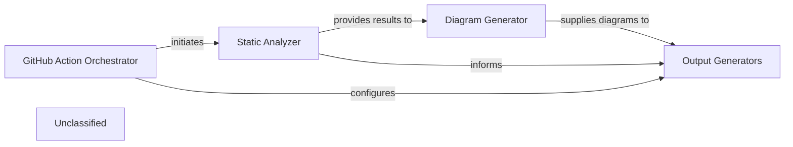

## Details

The system operates by first orchestrating a static analysis of the codebase via the GitHub Action Orchestrator, which delegates this task to the Static Analyzer. The Static Analyzer, with its enhanced TypeScript capabilities, processes the source code and generates detailed analysis results. These results are then fed into the Diagram Generator, which visualizes the architectural insights into various diagram formats. Finally, both the raw analysis data and the generated diagrams are consumed by the Output Generators to produce comprehensive documentation in desired formats, completing the automated documentation and diagram generation pipeline.

### GitHub Action Orchestrator
Serves as the primary entry point for initiating the analysis and documentation generation process within a GitHub Actions workflow. It orchestrates the execution flow, configuring and delegating tasks to other components based on user-defined inputs and project context.

**Related Classes/Methods**:

- <a href="https://github.com/CodeBoarding/CodeBoarding/blob/maingithub_action.py" target="_blank" rel="noopener noreferrer">`github_action`</a>

### Static Analyzer
This component performs in-depth static analysis of the project's source code. It includes specialized capabilities for TypeScript, utilizing a Language Server Protocol (LSP) client for detailed code understanding and a configuration scanner to interpret `tsconfig.json` files. The output is a structured analysis result, often represented as a graph, detailing code relationships and properties.

**Related Classes/Methods**:

- <a href="https://github.com/CodeBoarding/CodeBoarding/blob/mainstatic_analyzer/lsp_client/typescript_client.py" target="_blank" rel="noopener noreferrer">`static_analyzer.lsp_client.typescript_client`</a>
- <a href="https://github.com/CodeBoarding/CodeBoarding/blob/mainstatic_analyzer/typescript_config_scanner.py" target="_blank" rel="noopener noreferrer">`static_analyzer.typescript_config_scanner`</a>
- <a href="https://github.com/CodeBoarding/CodeBoarding/blob/mainstatic_analyzer/scanner.py" target="_blank" rel="noopener noreferrer">`static_analyzer.scanner`</a>
- <a href="https://github.com/CodeBoarding/CodeBoarding/blob/mainstatic_analyzer/graph.py" target="_blank" rel="noopener noreferrer">`static_analyzer.graph`</a>
- <a href="https://github.com/CodeBoarding/CodeBoarding/blob/mainstatic_analyzer/analysis_result.py" target="_blank" rel="noopener noreferrer">`static_analyzer.analysis_result`</a>

### Diagram Generator
Responsible for consuming the structured analysis results provided by the `Static Analyzer` and transforming them into visual diagrams. It focuses on creating clear and informative representations of code architecture and relationships, which can then be embedded into various documentation formats.

**Related Classes/Methods**:

- <a href="https://github.com/CodeBoarding/CodeBoarding/blob/maindiagram_analysis/diagram_generator.py" target="_blank" rel="noopener noreferrer">`diagram_analysis.diagram_generator`</a>
- <a href="https://github.com/CodeBoarding/CodeBoarding/blob/maindiagram_analysis/analysis_json.py" target="_blank" rel="noopener noreferrer">`diagram_analysis.analysis_json`</a>

### Output Generators
This component is a collection of specialized modules, each responsible for producing documentation in a specific format (e.g., Markdown, HTML, MDX, Sphinx/reStructuredText). It integrates the raw analysis data and generated diagrams into the final, human-readable documentation.

**Related Classes/Methods**:

- <a href="https://github.com/CodeBoarding/CodeBoarding/blob/mainoutput_generators/markdown.py" target="_blank" rel="noopener noreferrer">`output_generators.markdown`</a>
- <a href="https://github.com/CodeBoarding/CodeBoarding/blob/mainoutput_generators/html.py" target="_blank" rel="noopener noreferrer">`output_generators.html`</a>
- <a href="https://github.com/CodeBoarding/CodeBoarding/blob/mainoutput_generators/mdx.py" target="_blank" rel="noopener noreferrer">`output_generators.mdx`</a>
- <a href="https://github.com/CodeBoarding/CodeBoarding/blob/mainoutput_generators/sphinx.py" target="_blank" rel="noopener noreferrer">`output_generators.sphinx`</a>

### Unclassified
Component for all unclassified files and utility functions (Utility functions/External Libraries/Dependencies)

**Related Classes/Methods**: _None_

### [FAQ](https://github.com/CodeBoarding/GeneratedOnBoardings/tree/main?tab=readme-ov-file#faq)
