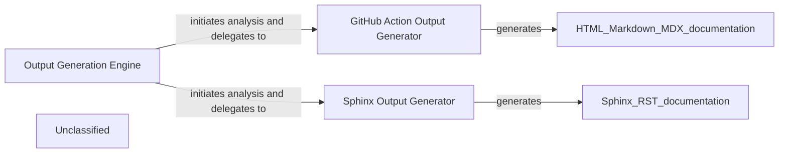

## Details

The output generation subsystem is orchestrated by the `Output Generation Engine`, which manages the end-to-end process of transforming architectural insights into various documentation formats. This engine first performs repository setup and analysis generation, then dynamically dispatches the resulting insights to specialized generators based on the required output format. The `GitHub Action Output Generator` is responsible for producing documentation in HTML, Markdown, and MDX, primarily for integration into GitHub Actions workflows. Concurrently, the `Sphinx Output Generator` focuses on creating structured reStructuredText (RST) documentation, catering to projects that utilize Sphinx for comprehensive and customizable documentation. This modular design ensures flexibility in output formats while maintaining a clear separation of concerns for each generation process.

### Output Generation Engine [[Expand]](./Output_Generation_Engine.md)
Acts as the orchestrator for the entire output generation process. It receives architectural insights, delegates to specific format generators, and manages the overall flow of documentation creation and delivery. This component is central due to its role in coordinating all output activities and integrating with upstream (AI Interpretation Layer) and downstream (API Service) components.

**Related Classes/Methods**:

- <a href="https://github.com/CodeBoarding/CodeBoarding/blob/maingithub_action.py" target="_blank" rel="noopener noreferrer">`github_action.generate_analysis`</a>

### GitHub Action Output Generator
Specializes in generating documentation outputs tailored for GitHub Actions workflows. It handles the creation of HTML, Markdown, and MDX formats, ensuring compatibility and proper structuring for automated deployment within a GitHub Actions environment. This component is crucial for enabling automated documentation updates and integration into CI/CD pipelines.

**Related Classes/Methods**:

- <a href="https://github.com/CodeBoarding/CodeBoarding/blob/maingithub_action.py" target="_blank" rel="noopener noreferrer">`github_action.generate_html`</a>
- <a href="https://github.com/CodeBoarding/CodeBoarding/blob/maingithub_action.py" target="_blank" rel="noopener noreferrer">`github_action.generate_markdown`</a>
- <a href="https://github.com/CodeBoarding/CodeBoarding/blob/maingithub_action.py" target="_blank" rel="noopener noreferrer">`github_action.generate_mdx`</a>

### Sphinx Output Generator
Focuses exclusively on generating documentation in the Sphinx format. It processes the architectural insights and renders them into the structured and extensible format required by Sphinx, including reStructuredText or MyST Markdown. This component is vital for projects requiring comprehensive, versioned, and highly customizable documentation.

**Related Classes/Methods**:

- <a href="https://github.com/CodeBoarding/CodeBoarding/blob/mainoutput_generators/sphinx.py" target="_blank" rel="noopener noreferrer">`output_generators.sphinx.generate_rst_file`</a>

### Unclassified
Component for all unclassified files and utility functions (Utility functions/External Libraries/Dependencies)

**Related Classes/Methods**: _None_

### [FAQ](https://github.com/CodeBoarding/GeneratedOnBoardings/tree/main?tab=readme-ov-file#faq)
