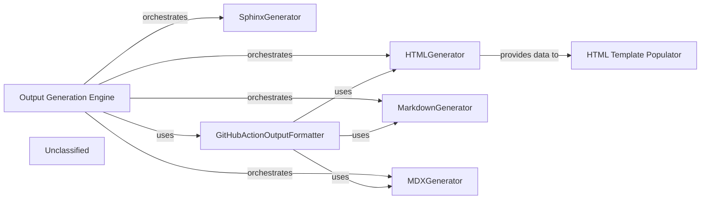

## Details

The Output Generation Engine subsystem is responsible for transforming processed architectural insights into various documentation formats. It orchestrates specialized generators for HTML, Markdown, MDX, and Sphinx, ensuring that the insights are presented in a structured and accessible manner. The GitHubActionOutputFormatter then adapts these outputs for seamless integration into GitHub Actions workflows. This modular design allows for flexible and extensible documentation generation across different platforms and tools.

### Output Generation Engine [[Expand]](./Output_Generation_Engine.md)
The primary component responsible for orchestrating the overall process of generating documentation in various formats. It handles repository cloning, initiates the analysis generation, and dispatches the actual documentation generation to specific format generators based on the desired output.

**Related Classes/Methods**:

- <a href="https://github.com/CodeBoarding/CodeBoarding/blob/main/demo.py#L57-L80" target="_blank" rel="noopener noreferrer">`demo.py`:57-80</a>
- <a href="https://github.com/CodeBoarding/CodeBoarding/blob/main/demo.py#L82-L101" target="_blank" rel="noopener noreferrer">`demo.py`:82-101</a>

### HTMLGenerator
This component is dedicated to converting the processed architectural insights into a structured HTML format. It handles the rendering of diagrams, text, and other elements into web-friendly documentation. It prepares data (e.g., Cytoscape.js compatible JSON) for interactive architectural diagrams.

**Related Classes/Methods**: _None_

### MarkdownGenerator
Responsible for generating documentation in standard Markdown format. This component ensures that architectural insights are presented in a widely compatible and easily readable text-based format, suitable for various platforms and tools. It includes embedded Mermaid diagrams and basic component details.

**Related Classes/Methods**: _None_

### MDXGenerator
This component extends Markdown generation by incorporating JSX capabilities, allowing for more dynamic and interactive documentation. It transforms insights into MDX, enabling the embedding of React components within the documentation, including Mermaid diagrams and frontmatter.

**Related Classes/Methods**: _None_

### SphinxGenerator
Focuses on generating documentation in reStructuredText (RST) format, specifically tailored for use with the Sphinx documentation generator. This component ensures compatibility with Sphinx's powerful features for technical documentation, including embedded Mermaid diagrams and structured component information.

**Related Classes/Methods**: _None_

### GitHubActionOutputFormatter
This component acts as an integration layer, specifically formatting and preparing the generated documentation for consumption within GitHub Actions workflows. It leverages the capabilities of the other generators (HTML, Markdown, MDX) to produce output suitable for GitHub's environment.

**Related Classes/Methods**: _None_

### HTML Template Populator
Integrates generated architectural data (like Cytoscape JSON and component-specific HTML snippets) into a predefined HTML template to produce the final, complete, and styled HTML output.

**Related Classes/Methods**: _None_

### Unclassified
Component for all unclassified files and utility functions (Utility functions/External Libraries/Dependencies)

**Related Classes/Methods**: _None_

### [FAQ](https://github.com/CodeBoarding/GeneratedOnBoardings/tree/main?tab=readme-ov-file#faq)
