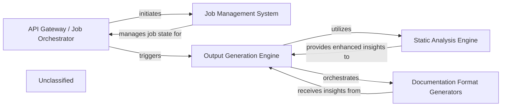

## Details

The system is structured around a clear pipeline for automated documentation generation. The `API Gateway / Job Orchestrator` serves as the user-facing interface and job manager, delegating job persistence to the `Job Management System`. The core processing begins when the `Output Generation Engine` is triggered, which first consults the `Static Analysis Engine` for deep architectural insights, now significantly improved by robust reference resolution. These comprehensive insights then feed into the `Documentation Format Generators`, which, operating with a streamlined agent framework, produce the final documentation in various formats. This architecture ensures a robust, scalable, and adaptable system for extracting and presenting codebase knowledge.

### API Gateway / Job Orchestrator
This FastAPI application serves as the API Gateway and Job Orchestrator. It handles incoming requests for documentation generation, manages job lifecycles (pending, running, completed, failed), and interacts with the `Output Generation Engine`. It also uses the `Job Management System` for persistent job storage and retrieval.

**Related Classes/Methods**: _None_

### Job Management System
The `Job Management System` provides persistence for job states and results, ensuring reliable tracking and retrieval of documentation generation tasks.

**Related Classes/Methods**: _None_

### Static Analysis Engine [[Expand]](./Static_Analysis_Engine.md)
The `Static Analysis Engine` extracts architectural insights from the codebase, now with enhanced capabilities in reference resolution, providing richer input for the documentation generation process.

**Related Classes/Methods**: _None_

### Output Generation Engine [[Expand]](./Output_Generation_Engine.md)
The `Output Generation Engine` orchestrates the entire documentation creation process. It leverages the enhanced `Static Analysis Engine` for richer architectural insights and then passes these to the `Documentation Format Generators`. The refactoring of its internal agent framework streamlines how it defines and interacts with specialized agents for documentation generation.

**Related Classes/Methods**: _None_

### Documentation Format Generators
The `Documentation Format Generators` receive processed insights from the `Output Generation Engine` and are responsible for producing documentation in various formats (HTML, Markdown, MDX, reStructuredText) and integrating with platforms like GitHub Actions. Its internal agents benefit from the refactored agent framework, leading to potentially refined or simplified responsibilities.

**Related Classes/Methods**: _None_

### Unclassified
Component for all unclassified files and utility functions (Utility functions/External Libraries/Dependencies).

**Related Classes/Methods**: _None_

### Unclassified
Component for all unclassified files and utility functions (Utility functions/External Libraries/Dependencies)

**Related Classes/Methods**: _None_

### [FAQ](https://github.com/CodeBoarding/GeneratedOnBoardings/tree/main?tab=readme-ov-file#faq)
