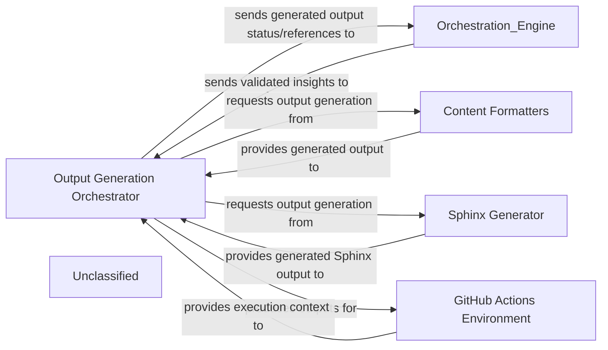

## Details

This subsystem, primarily driven by the Output Generation Orchestrator within a GitHub Actions Environment, is responsible for transforming validated architectural insights into various documentation formats. An external Orchestration Engine initiates this process by providing the necessary insights. The orchestrator then intelligently delegates content generation to internal Content Formatters for standard formats like Markdown, HTML, and MDX, and to a specialized Sphinx Generator for comprehensive technical documentation. Upon completion, the orchestrator provides the generated outputs to the GitHub Actions Environment for deployment or publishing, and communicates the status back to the Orchestration Engine.

### Output Generation Orchestrator
The central component responsible for receiving validated architectural insights, determining the required output formats, coordinating the invocation of specific format generators, and managing the generated outputs within the GitHub Actions environment.

**Related Classes/Methods**:

- <a href="https://github.com/CodeBoarding/CodeBoarding/blob/maingithub_action.py" target="_blank" rel="noopener noreferrer">`github_action`</a>

### Content Formatters
A collection of internal functions or modules within the orchestrator responsible for transforming architectural insights into various documentation formats such as Markdown, HTML, and MDX.

**Related Classes/Methods**:

- <a href="https://github.com/CodeBoarding/CodeBoarding/blob/maingithub_action.py#L20-L68" target="_blank" rel="noopener noreferrer">`github_action`:20-68</a>

### Sphinx Generator
A dedicated component that produces documentation artifacts compatible with the Sphinx documentation generator, commonly used for comprehensive technical project documentation.

**Related Classes/Methods**:

- <a href="https://github.com/CodeBoarding/CodeBoarding/blob/mainoutput_generators/sphinx.py" target="_blank" rel="noopener noreferrer">`output_generators.sphinx`</a>

### GitHub Actions Environment
The runtime environment provided by GitHub Actions, which hosts the Output Generation Orchestrator. It manages the execution context, handles inputs and outputs, and facilitates subsequent deployment or publishing of the generated documentation.

**Related Classes/Methods**:

- <a href="https://github.com/CodeBoarding/CodeBoarding/blob/maingithub_action.py" target="_blank" rel="noopener noreferrer">`github_action`</a>

### Unclassified
Component for all unclassified files and utility functions (Utility functions/External Libraries/Dependencies)

**Related Classes/Methods**: _None_

### [FAQ](https://github.com/CodeBoarding/GeneratedOnBoardings/tree/main?tab=readme-ov-file#faq)
