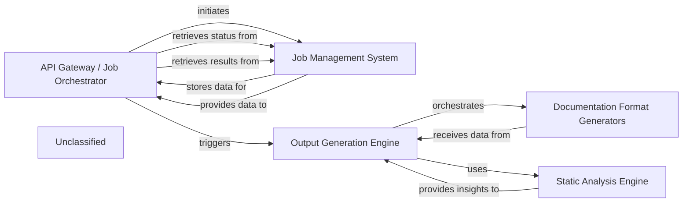

## Details

The system's architecture is centered around an API Gateway / Job Orchestrator that provides external access for initiating and managing documentation generation. This component interacts with a Job Management System to persist job states and results. Upon receiving a request, the API Gateway / Job Orchestrator triggers the Output Generation Engine, which orchestrates the entire documentation creation process. The Output Generation Engine first utilizes the Static Analysis Engine to extract architectural insights from the codebase. These insights are then passed to the Documentation Format Generators, a consolidated component responsible for producing documentation in various formats, including HTML, Markdown, MDX, and reStructuredText, and for integrating with platforms like GitHub Actions.

### API Gateway / Job Orchestrator
The `local_app.py` file reveals a FastAPI application that serves as an API Gateway and Job Orchestrator. It handles incoming requests to generate documentation, manages the lifecycle of these jobs (pending, running, completed, failed), and interacts with the `demo.py`'s `generate_docs_remote` function, which is part of the `Output Generation Engine`. It also uses `duckdb_crud` for persistent job storage and retrieval.

**Related Classes/Methods**: _None_

### Job Management System
The 'Job Management System' provides persistence for job states and results.

**Related Classes/Methods**: _None_

### Static Analysis Engine [[Expand]](./Static_Analysis_Engine.md)
The 'Output Generation Engine' first utilizes the **Static Analysis Engine** to extract architectural insights from the codebase.

**Related Classes/Methods**: _None_

### Output Generation Engine [[Expand]](./Output_Generation_Engine.md)
The **Output Generation Engine**, which orchestrates the entire documentation creation process. The **Output Generation Engine** first utilizes the **Static Analysis Engine** to extract architectural insights from the codebase. These insights are then passed to the **Documentation Format Generators**...

**Related Classes/Methods**: _None_

### Documentation Format Generators
These insights are then passed to the **Documentation Format Generators**, a consolidated component responsible for producing documentation in various formats, including HTML, Markdown, MDX, and reStructuredText, and for integrating with platforms like GitHub Actions.

**Related Classes/Methods**: _None_

### Unclassified
Component for all unclassified files and utility functions (Utility functions/External Libraries/Dependencies)

**Related Classes/Methods**: _None_

### [FAQ](https://github.com/CodeBoarding/GeneratedOnBoardings/tree/main?tab=readme-ov-file#faq)
