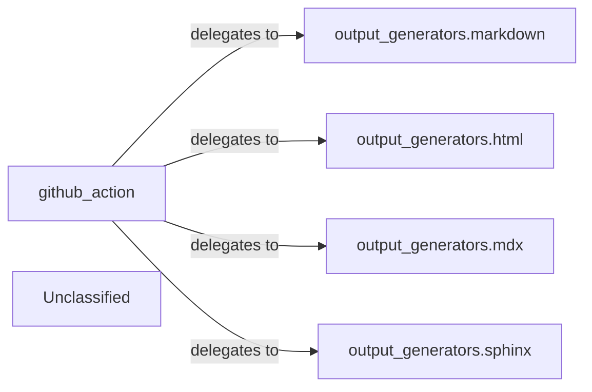

## Details

The Output Generation Engine subsystem transforms validated architectural insights into various documentation formats and integrates with external systems like GitHub Actions. The main flow involves the `github_action` component acting as the primary entry point, orchestrating the selection and execution of specific output format generators (Markdown, HTML, MDX, Sphinx/RST) based on user configuration. Its purpose is to provide diverse documentation outputs and enable seamless integration within a CI/CD environment.

### github_action
Acts as the primary entry point for initiating output generation within a GitHub Actions workflow. It orchestrates the selection and execution of specific output format generators based on user configuration.

**Related Classes/Methods**:

- <a href="https://github.com/CodeBoarding/CodeBoarding/blob/maingithub_action.py" target="_blank" rel="noopener noreferrer">`github_action`</a>

### output_generators.markdown
Generates documentation in Markdown format.

**Related Classes/Methods**:

- <a href="https://github.com/CodeBoarding/CodeBoarding/blob/mainoutput_generators/markdown.py" target="_blank" rel="noopener noreferrer">`output_generators.markdown`</a>

### output_generators.html
Generates documentation in HTML format.

**Related Classes/Methods**:

- <a href="https://github.com/CodeBoarding/CodeBoarding/blob/mainoutput_generators/html.py" target="_blank" rel="noopener noreferrer">`output_generators.html`</a>

### output_generators.mdx
Generates documentation in MDX (Markdown with JSX) format.

**Related Classes/Methods**:

- <a href="https://github.com/CodeBoarding/CodeBoarding/blob/mainoutput_generators/mdx.py" target="_blank" rel="noopener noreferrer">`output_generators.mdx`</a>

### output_generators.sphinx
Generates documentation in reStructuredText (RST) format, specifically tailored for Sphinx documentation projects, including embedded Mermaid diagrams.

**Related Classes/Methods**:

- <a href="https://github.com/CodeBoarding/CodeBoarding/blob/mainoutput_generators/sphinx.py" target="_blank" rel="noopener noreferrer">`output_generators.sphinx`</a>

### Unclassified
Component for all unclassified files and utility functions (Utility functions/External Libraries/Dependencies)

**Related Classes/Methods**: _None_

### [FAQ](https://github.com/CodeBoarding/GeneratedOnBoardings/tree/main?tab=readme-ov-file#faq)
