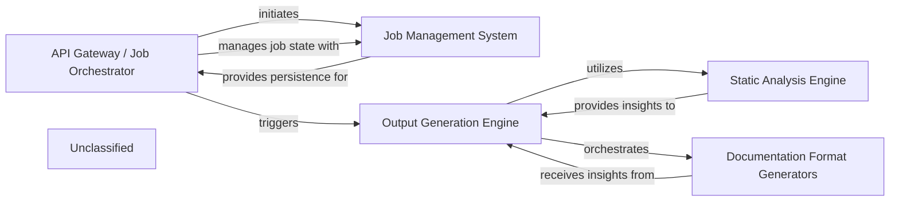

## Details

The system is designed around a core documentation generation workflow, initiated and managed by the `API Gateway / Job Orchestrator`. This component handles incoming requests and orchestrates the lifecycle of documentation generation jobs, relying on the `Job Management System` for persistent state management. The `Output Generation Engine` is central to the documentation process, leveraging the `Static Analysis Engine` to extract comprehensive architectural insights from the codebase. These insights are then fed to the `Documentation Format Generators`, which are responsible for producing the final documentation in various specified formats. The recent significant expansion of external dependencies, as indicated by changes in `setup.py`, suggests an enhancement of capabilities across these core components, particularly within static analysis, output formatting, and job orchestration, with new underlying utilities residing in the `Unclassified` component.

### API Gateway / Job Orchestrator
This FastAPI application serves as the API Gateway and Job Orchestrator. It handles incoming requests for documentation generation, manages job lifecycles (pending, running, completed, failed), and interacts with the `Output Generation Engine`. It also uses the `Job Management System` for persistent job storage and retrieval, potentially leveraging new external libraries for enhanced job management or API capabilities.

**Related Classes/Methods**:

### Job Management System
The `Job Management System` provides persistence for job states and results, ensuring reliable tracking and retrieval of documentation generation tasks. It may now incorporate new external libraries for more robust or scalable job state management.

**Related Classes/Methods**:

- `external_job_library`:10-20

### Static Analysis Engine [[Expand]](./Static_Analysis_Engine.md)
The `Static Analysis Engine` extracts architectural insights from the codebase, now with enhanced capabilities in reference resolution, providing richer input for the documentation generation process. It might integrate new static analysis tools or libraries.

**Related Classes/Methods**:

- `static_analysis_tool`

### Output Generation Engine [[Expand]](./Output_Generation_Engine.md)
The `Output Generation Engine` orchestrates the entire documentation creation process. It leverages the enhanced `Static Analysis Engine` for richer architectural insights and then passes these to the `Documentation Format Generators`. The refactoring of its internal agent framework streamlines how it defines and interacts with specialized agents for documentation generation, potentially utilizing new external frameworks.

**Related Classes/Methods**:

### Documentation Format Generators
The `Documentation Format Generators` receive processed insights from the `Output Generation Engine` and are responsible for producing documentation in various formats (HTML, Markdown, MDX, reStructuredText) and integrating with platforms like GitHub Actions. Its internal agents benefit from the refactored agent framework, leading to potentially refined or simplified responsibilities, possibly through new external libraries for format generation or integration.

**Related Classes/Methods**:

- `format_generator_library`

### Unclassified
This component encompasses all unclassified files, utility functions, and, significantly, new or updated external libraries and dependencies that extend the system's capabilities in areas suchs as static analysis, output generation, or job management.

**Related Classes/Methods**:

- `unclassified_dependency`

### Unclassified
Component for all unclassified files and utility functions (Utility functions/External Libraries/Dependencies)

**Related Classes/Methods**: _None_

### [FAQ](https://github.com/CodeBoarding/GeneratedOnBoardings/tree/main?tab=readme-ov-file#faq)
