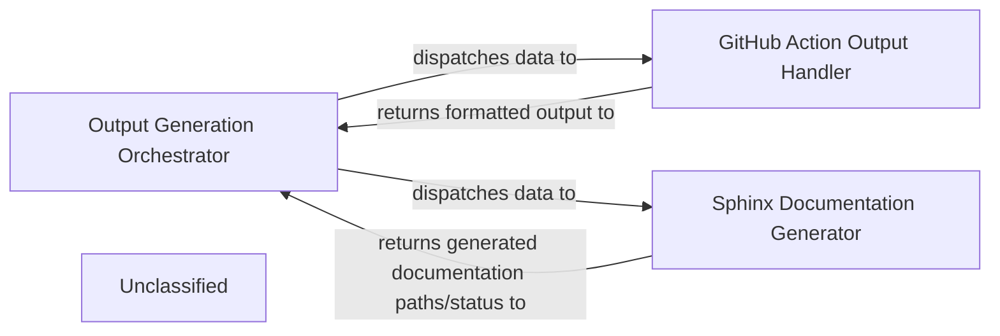

## Details

The `Output Generation Engine` is orchestrated by the `Output Generation Orchestrator`, which receives validated architectural insights. This orchestrator intelligently dispatches these insights to either the `GitHub Action Output Handler` for GitHub Actions-compatible formats (HTML, Markdown, MDX) or the `Sphinx Documentation Generator` for Sphinx-specific documentation. Each generator processes the data and returns the formatted output or generation status back to the orchestrator, ensuring a streamlined and adaptable documentation generation workflow.

### Output Generation Orchestrator
Acts as the central control point, receiving processed architectural insights. It intelligently determines the appropriate output format based on configuration or environment, then delegates the generation task to specialized components.

**Related Classes/Methods**:

- `output_generation_orchestrator.py`

### GitHub Action Output Handler
Responsible for transforming the insights into GitHub Actions-compatible formats (HTML, Markdown, MDX) and returning the results to the orchestrator.

**Related Classes/Methods**:

- `github_action_output_handler.py`

### Sphinx Documentation Generator
Responsible for transforming the insights into Sphinx-specific documentation and returning the generated documentation paths/status to the orchestrator.

**Related Classes/Methods**:

### Unclassified
Component for all unclassified files and utility functions (Utility functions/External Libraries/Dependencies)

**Related Classes/Methods**: _None_

### [FAQ](https://github.com/CodeBoarding/GeneratedOnBoardings/tree/main?tab=readme-ov-file#faq)
