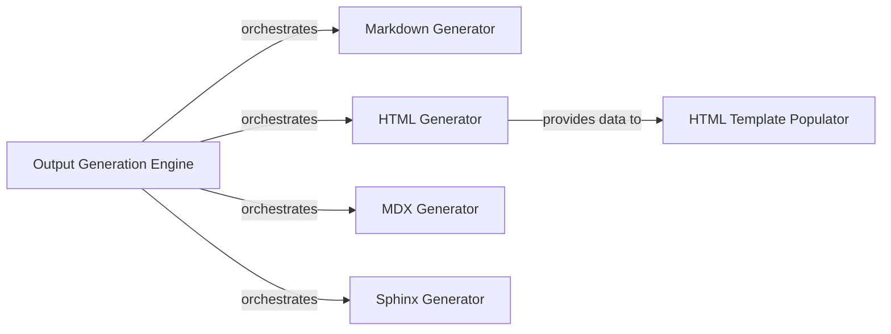

## Details

Updated component analysis with corrected source code references for generator components to ensure accurate documentation and diagram generation.

### Output Generation Engine [[Expand]](./Output_Generation_Engine.md)
The primary component responsible for orchestrating the overall process of generating documentation in various formats. It acts as a dispatcher, delegating the actual generation to specific format generators based on the desired output.

**Related Classes/Methods**:

- <a href="https://github.com/CodeBoarding/CodeBoarding/blob/main/github_action.py#L19-L67" target="_blank" rel="noopener noreferrer">`github_action.py`:19-67</a>

### Markdown Generator
Generates standard Markdown documentation, including embedded Mermaid diagrams and basic component details, making the architectural insights easily readable in Markdown viewers.

**Related Classes/Methods**:

### HTML Generator
Creates standalone HTML documentation, specifically preparing data (e.g., Cytoscape.js compatible JSON) for interactive architectural diagrams.

**Related Classes/Methods**:

### MDX Generator
Produces MDX (Markdown with JSX) files, incorporating Mermaid diagrams and frontmatter for rich, interactive documentation experiences, suitable for modern documentation sites.

**Related Classes/Methods**:

### Sphinx Generator
Generates reStructuredText (RST) formatted documentation, including embedded Mermaid diagrams and structured component information, suitable for Sphinx documentation projects.

**Related Classes/Methods**:

### HTML Template Populator
Integrates generated architectural data (like Cytoscape JSON and component-specific HTML snippets) into a predefined HTML template to produce the final, complete, and styled HTML output.

**Related Classes/Methods**:

### [FAQ](https://github.com/CodeBoarding/GeneratedOnBoardings/tree/main?tab=readme-ov-file#faq)
