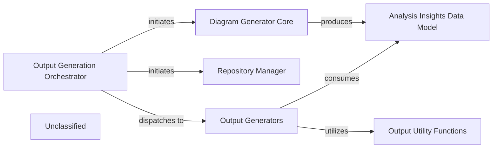

## Details

The system's architecture is centered around the Output Generation Orchestrator, which serves as the primary entry point for generating architectural documentation. This orchestrator first leverages the Repository Manager for repository setup and then initiates the Diagram Generator Core to perform static analysis and produce the Analysis Insights Data Model. Once insights are generated, the orchestrator dispatches tasks to the Output Generators component, which is responsible for transforming these insights into various documentation formats (Markdown, HTML, MDX, RST/Sphinx). The Output Generators component relies on Output Utility Functions for common formatting and data handling. The Unclassified component manages foundational project configurations, external dependencies, and environment-specific constants, supporting the overall system operations.

### Output Generation Orchestrator
This component, primarily `github_action.py`, orchestrates the entire output generation process within a GitHub Actions context. It handles repository preparation, initial analysis, and dispatches generation tasks to format-specific functions within the `Output Generators` component. It serves as the primary entry point for the subsystem.

**Related Classes/Methods**:

- <a href="https://github.com/CodeBoarding/CodeBoarding/blob/maingithub_action.py" target="_blank" rel="noopener noreferrer">`github_action.py`</a>
- <a href="https://github.com/CodeBoarding/CodeBoarding/blob/mainrepo_utils/__init__.py" target="_blank" rel="noopener noreferrer">`repo_utils.clone_repository`</a>
- <a href="https://github.com/CodeBoarding/CodeBoarding/blob/mainrepo_utils/__init__.py" target="_blank" rel="noopener noreferrer">`repo_utils.checkout_repo`</a>
- <a href="https://github.com/CodeBoarding/CodeBoarding/blob/maindiagram_analysis/diagram_generator.py" target="_blank" rel="noopener noreferrer">`diagram_analysis.diagram_generator.DiagramGenerator`</a>

### Output Generators
This component is responsible for generating documentation in various formats (Markdown, HTML, MDX, reStructuredText/Sphinx). It processes `AnalysisInsights` objects and applies format-specific rules, including the generation of corresponding output files. This component encapsulates the high-level generation logic and specific formatting functions for all supported output types.

**Related Classes/Methods**:

- <a href="https://github.com/CodeBoarding/CodeBoarding/blob/mainoutput_generators/markdown.py" target="_blank" rel="noopener noreferrer">`output_generators.markdown.generate_markdown_file`</a>
- <a href="https://github.com/CodeBoarding/CodeBoarding/blob/mainoutput_generators/html.py" target="_blank" rel="noopener noreferrer">`output_generators.html.generate_html_file`</a>
- <a href="https://github.com/CodeBoarding/CodeBoarding/blob/mainoutput_generators/mdx.py" target="_blank" rel="noopener noreferrer">`output_generators.mdx.generate_mdx_file`</a>
- <a href="https://github.com/CodeBoarding/CodeBoarding/blob/mainoutput_generators/sphinx.py" target="_blank" rel="noopener noreferrer">`output_generators.sphinx.generate_rst_file`</a>
- <a href="https://github.com/CodeBoarding/CodeBoarding/blob/mainagents/agent_responses.py" target="_blank" rel="noopener noreferrer">`agents.agent_responses.AnalysisInsights`</a>

### Repository Manager [[Expand]](./Repository_Manager.md)
Manages repository operations such as cloning and checking out branches. It provides utilities for interacting with the Git repository.

**Related Classes/Methods**:

- <a href="https://github.com/CodeBoarding/CodeBoarding/blob/mainrepo_utils/__init__.py" target="_blank" rel="noopener noreferrer">`repo_utils.clone_repository`</a>
- <a href="https://github.com/CodeBoarding/CodeBoarding/blob/mainrepo_utils/__init__.py" target="_blank" rel="noopener noreferrer">`repo_utils.checkout_repo`</a>

### Diagram Generator Core
The core component responsible for generating the architectural analysis and diagrams. It utilizes various agents to perform static analysis, abstract components, plan analysis, and validate insights.

**Related Classes/Methods**:

- <a href="https://github.com/CodeBoarding/CodeBoarding/blob/maindiagram_analysis/diagram_generator.py" target="_blank" rel="noopener noreferrer">`diagram_analysis.diagram_generator.DiagramGenerator`</a>

### Analysis Insights Data Model
Defines the data structure for storing and representing the architectural analysis insights, including components, relationships, and referenced source code.

**Related Classes/Methods**:

- <a href="https://github.com/CodeBoarding/CodeBoarding/blob/mainagents/agent_responses.py" target="_blank" rel="noopener noreferrer">`agents.agent_responses.AnalysisInsights`</a>

### Output Utility Functions
Provides common utility functions used across different output generators, such as sanitizing names for diagram IDs and checking for the existence of analysis JSON files.

**Related Classes/Methods**:

- <a href="https://github.com/CodeBoarding/CodeBoarding/blob/mainoutput_generators/__init__.py" target="_blank" rel="noopener noreferrer">`output_generators.sanitize`</a>
- <a href="https://github.com/CodeBoarding/CodeBoarding/blob/mainutils.py" target="_blank" rel="noopener noreferrer">`utils.contains_json`</a>

### Unclassified
This component encompasses foundational project aspects, including packaging configuration (`setup.py`), external dependencies, and environment-specific constants (`vscode_constants.py`). It also serves as a catch-all for unclassified files and general utility functions not directly tied to core functional components.

**Related Classes/Methods**:

- <a href="https://github.com/CodeBoarding/CodeBoarding/blob/mainsetup.py" target="_blank" rel="noopener noreferrer">`setup.py`</a>
- <a href="https://github.com/CodeBoarding/CodeBoarding/blob/mainvscode_constants.py" target="_blank" rel="noopener noreferrer">`vscode_constants.py`</a>

### Unclassified
Component for all unclassified files and utility functions (Utility functions/External Libraries/Dependencies)

**Related Classes/Methods**: _None_

### [FAQ](https://github.com/CodeBoarding/GeneratedOnBoardings/tree/main?tab=readme-ov-file#faq)
