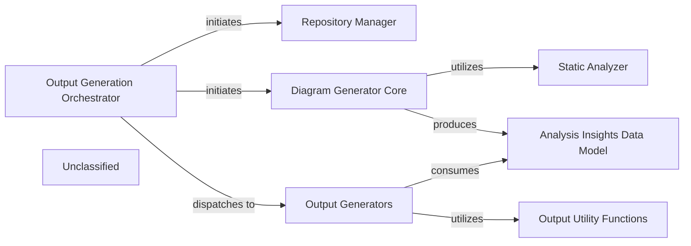

## Details

The system's architecture is centered around an Output Generation Orchestrator that manages the end-to-end process of generating architectural documentation. This orchestrator first leverages a Repository Manager to prepare the target codebase. It then initiates the Diagram Generator Core, which performs the core architectural analysis. The Diagram Generator Core now integrates a dedicated Static Analyzer component to perform specialized static code analysis, such as scanning TypeScript configurations. The findings from this analysis are structured and stored within the Analysis Insights Data Model. Finally, the Output Generation Orchestrator dispatches these insights to the Output Generators, which, supported by Output Utility Functions, transform the analysis results into various documentation formats.

### Output Generation Orchestrator
Manages the end-to-end process of generating architectural documentation, initiating repository preparation, architectural analysis, and dispatching insights for documentation generation.

**Related Classes/Methods**:

- `orchestrator.OutputGenerationOrchestrator`

### Repository Manager [[Expand]](./Repository_Manager.md)
Prepares the target repository for analysis.

**Related Classes/Methods**:

- `repository_manager.RepositoryManager`

### Diagram Generator Core
The central analytical component responsible for performing static analysis to generate architectural insights.

**Related Classes/Methods**:

- <a href="https://github.com/CodeBoarding/CodeBoarding/blob/maindiagram_analysis/diagram_generator.py#L25-L200" target="_blank" rel="noopener noreferrer">`diagram_generator_core.DiagramGeneratorCore`:25-200</a>

### Static Analyzer
Performs specialized static analysis, such as scanning TypeScript configuration files.

**Related Classes/Methods**:

- <a href="https://github.com/CodeBoarding/CodeBoarding/blob/mainstatic_analyzer/reference_resolve_mixin.py#L1-L100" target="_blank" rel="noopener noreferrer">`static_analyzer.StaticAnalyzer`:1-100</a>

### Analysis Insights Data Model
Structures and stores the results of the architectural analysis.

**Related Classes/Methods**:

- `analysis_insights_model.AnalysisInsightsDataModel`

### Output Generators
Produces the final documentation in various formats using the structured analysis insights.

**Related Classes/Methods**:

- <a href="https://github.com/CodeBoarding/CodeBoarding/blob/mainoutput_generators/__init__.py" target="_blank" rel="noopener noreferrer">`output_generators.OutputGenerators`</a>

### Output Utility Functions
Provides common formatting and utility tasks for the output generators.

**Related Classes/Methods**:

- `output_utils.OutputUtilityFunctions`

### Unclassified
Component for all unclassified files and utility functions (Utility functions/External Libraries/Dependencies)

**Related Classes/Methods**: _None_

### [FAQ](https://github.com/CodeBoarding/GeneratedOnBoardings/tree/main?tab=readme-ov-file#faq)
