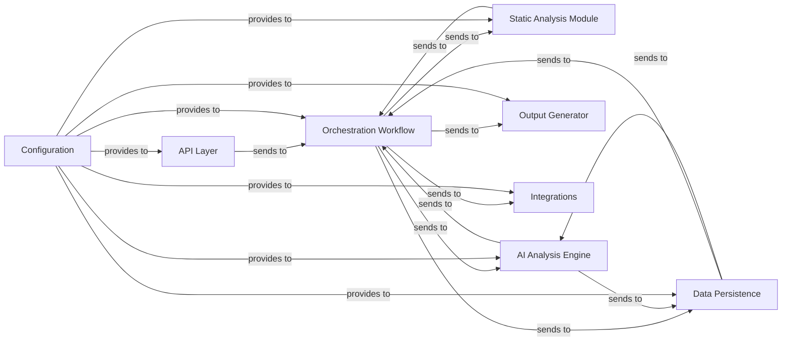

## Details

One paragraph explaining the functionality which is represented by this graph. What the main flow is and what is its purpose.

### API Layer
This component serves as the external interface for the application, built using FastAPI. It defines all public endpoints, handles incoming HTTP requests, validates request/response models, and orchestrates the initial interaction with the `Orchestration Workflow`. It ensures secure and structured communication with clients.

**Related Classes/Methods**:

- `local_app.py`

### Orchestration Workflow [[Expand]](./Orchestration_Workflow.md)
The `Orchestration Workflow` is the central coordinator of the analysis pipeline. Leveraging frameworks like LangChain/LangGraph, it manages the overall flow of operations, sequencing calls between the `Static Analysis Module`, `AI Analysis Engine`, and `Output Generation` components. It ensures data is correctly passed between stages and handles the overall execution logic.

**Related Classes/Methods**:

- `local_app.py`
- `demo.py`

### Static Analysis Module
This component is responsible for the initial, language-agnostic processing of source code. It parses code, builds Abstract Syntax Trees (ASTs), generates Control Flow Graphs (CFGs), and extracts raw code metadata. It acts as the foundational data provider for subsequent AI-driven analysis.

**Related Classes/Methods**:

- `agents/tools/read_cfg.py`
- `agents/tools/read_source.py`

### AI Analysis Engine [[Expand]](./AI_Analysis_Engine.md)
The `AI Analysis Engine` encapsulates all interactions with Large Language Models (LLMs) from various providers (OpenAI, Anthropic, Google Gemini, AWS Bedrock). It handles prompt engineering, manages multi-provider support, processes LLM responses, and transforms raw static analysis data into rich, structured analysis models using AI capabilities.

**Related Classes/Methods**:

- <a href="https://github.com/CodeBoarding/CodeBoarding/blob/main/agents/agent.py#L1-L1" target="_blank" rel="noopener noreferrer">`agents/agent.py` (1:1)</a>
- <a href="https://github.com/CodeBoarding/CodeBoarding/blob/main/agents/meta_agent.py#L1-L1" target="_blank" rel="noopener noreferrer">`agents/meta_agent.py` (1:1)</a>
- <a href="https://github.com/CodeBoarding/CodeBoarding/blob/main/agents/planner_agent.py#L1-L1" target="_blank" rel="noopener noreferrer">`agents/planner_agent.py` (1:1)</a>

### Data Persistence
This component provides an abstraction layer for all data storage and retrieval operations. It manages the persistence of analysis results, intermediate data, and caching mechanisms. It abstracts the underlying database technology (e.g., DuckDB via SQLAlchemy), ensuring other components do not need direct database knowledge.

**Related Classes/Methods**:

- <a href="https://github.com/CodeBoarding/CodeBoarding/blob/main/duckdb_crud.py#L1-L1" target="_blank" rel="noopener noreferrer">`duckdb_crud.py` (1:1)</a>

### Output Generator [[Expand]](./Output_Generator.md)
The `Output Generator` component serves as the final stage in the project's analysis pipeline. Its primary responsibility is to consume the rich, structured analysis models, which are typically produced by the `AI Analysis Engine` and coordinated by the `Orchestration Workflow`. It then transforms these models into various human-readable and machine-consumable formats, including Markdown, HTML, Sphinx documentation, and MDX. A key emphasis of this component is the generation of interactive diagrams, such as those using Mermaid.js, to enhance visualization of the analysis results. Recent architectural adjustments indicate a streamlining or simplification of its output capabilities, focusing on efficient and targeted rendering. This component is crucial for making complex code analysis results accessible and actionable for users.

**Related Classes/Methods**:

- <a href="https://github.com/CodeBoarding/CodeBoarding/blob/main/output_generators/html.py#L1-L1" target="_blank" rel="noopener noreferrer">`output_generators/html.py` (1:1)</a>
- `diagram_analysis/diagram_generator.py`

### Integrations
This component is dedicated to managing interactions with external services. This includes specific logic for cloning repositories from platforms like GitHub using `GitPython` or `Dulwich`, and potentially other integrations with tools like VS Code or an MCP Server. It isolates external API complexities from core business logic.

**Related Classes/Methods**:

- <a href="https://github.com/CodeBoarding/CodeBoarding/blob/main/github_action.py#L1-L1" target="_blank" rel="noopener noreferrer">`github_action.py` (1:1)</a>
- `repo_utils.py` (1:1)

### Configuration
The `Configuration` component centralizes all application settings, environment variable loading, and credential management. It provides a consistent and secure way for other components to access necessary parameters without hardcoding, facilitating easy deployment and environment-specific adjustments.

**Related Classes/Methods**:

- <a href="https://github.com/CodeBoarding/CodeBoarding/blob/main/logging_config.py#L1-L1" target="_blank" rel="noopener noreferrer">`logging_config.py` (1:1)</a>
- `local_app.py`

### [FAQ](https://github.com/CodeBoarding/GeneratedOnBoardings/tree/main?tab=readme-ov-file#faq)
