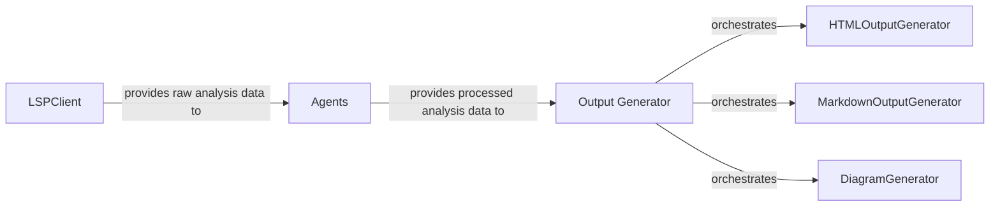

## Details

The system's architecture is centered around a data processing pipeline that transforms raw code information into various human-readable outputs. The LSPClient initiates this process by acquiring raw static analysis data from language servers. This raw data is then fed to the Agents component, which, guided by dynamic prompts defined in agents/prompts.py, performs intelligent analysis and transforms the raw data into structured, processed analysis results. Finally, the Output Generator acts as the presentation layer orchestrator, taking these processed analysis results and delegating their rendering to specialized sub-components: HTMLOutputGenerator for web-based views, MarkdownOutputGenerator for text-based documentation, and DiagramGenerator for visual representations like Mermaid diagrams. This modular design allows for flexible data acquisition, intelligent processing, and diverse output generation, adapting to changes in upstream data sources and downstream presentation requirements.

### LSPClient
Responsible for acquiring raw code data from Language Servers.

**Related Classes/Methods**:

- <a href="https://github.com/CodeBoarding/CodeBoarding/blob/main/static_analyzer/lsp_client/client.py#L19-L900" target="_blank" rel="noopener noreferrer">`LSPClient`:19-900</a>

### Agents
Processes raw analysis data into structured analysis results, guided by prompts.

**Related Classes/Methods**:

- <a href="https://github.com/CodeBoarding/CodeBoarding/blob/main/agents/prompts.py" target="_blank" rel="noopener noreferrer">`agents/prompts.py`</a>

### Output Generator [[Expand]](./Output_Generator.md)
Orchestrates the generation of various output formats from processed analysis data.

**Related Classes/Methods**: _None_

### HTMLOutputGenerator
Generates HTML output.

**Related Classes/Methods**: _None_

### MarkdownOutputGenerator
Generates Markdown output.

**Related Classes/Methods**: _None_

### DiagramGenerator
Generates diagrams.

**Related Classes/Methods**: _None_

### [FAQ](https://github.com/CodeBoarding/GeneratedOnBoardings/tree/main?tab=readme-ov-file#faq)
