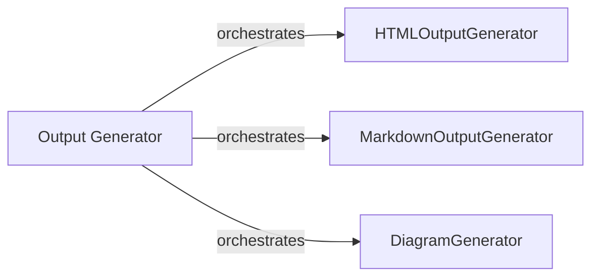

## Details

The `Output Generator` subsystem is responsible for transforming processed analysis data into various user-consumable formats. It orchestrates the generation of HTML, Markdown, and diagrams, acting as the final presentation layer for the `CodeBoarding` project's analysis results. The core flow involves the `Output Generator` delegating specific formatting tasks to specialized components like `HTMLOutputGenerator`, `MarkdownOutputGenerator`, and `DiagramGenerator`, ensuring a modular and extensible output pipeline.

### Output Generator [[Expand]](./Output_Generator.md)
This is the core component responsible for taking the processed analysis data and rendering it into various output formats. It acts as the orchestrator for the final presentation layer.

**Related Classes/Methods**:

### HTMLOutputGenerator
Specifically handles the conversion of analysis data into HTML format.

**Related Classes/Methods**:

### MarkdownOutputGenerator
Specifically handles the conversion of analysis data into Markdown format.

**Related Classes/Methods**:

### DiagramGenerator
Focuses on generating diagrams (e.g., using Mermaid.js) based on the analysis data.

**Related Classes/Methods**:

### [FAQ](https://github.com/CodeBoarding/GeneratedOnBoardings/tree/main?tab=readme-ov-file#faq)
