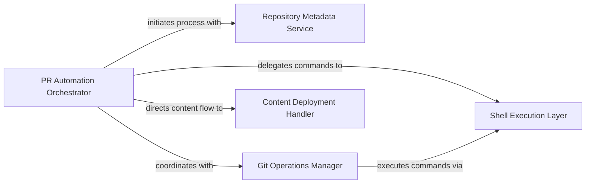

## Component Details

This subsystem, 'Outreach & Utility Services', provides general-purpose utilities primarily focused on operations related to pull requests and managing repository interactions. The main flow involves the 'PR Automation Orchestrator' initiating the process by extracting repository metadata, then coordinating with the 'Git Operations Manager' to clone the repository. Subsequently, the 'Content Deployment Handler' copies onboarding content into the cloned repository. Finally, the 'Git Operations Manager' commits and pushes these changes, all while relying on the 'Shell Execution Layer' for command execution.

### PR Automation Orchestrator
The central control component that manages the overall workflow of processing a repository for CodeBoarding, from initial setup to final Git push. It coordinates interactions between various sub-components.

**Related Classes/Methods**:

- <a href="https://github.com/CodeBoarding/CodeBoarding/blob/master/outreach_utils/pr_util.py#L34-L113" target="_blank" rel="noopener noreferrer">`outreach_utils.pr_util:main` (34:113)</a>

### Repository Metadata Service
Provides functionality to extract and process metadata related to Git repositories, such as deriving the repository name from a given SSH clone URL.

**Related Classes/Methods**:

- <a href="https://github.com/CodeBoarding/CodeBoarding/blob/master/outreach_utils/pr_util.py#L10-L19" target="_blank" rel="noopener noreferrer">`outreach_utils.pr_util:extract_repo_name` (10:19)</a>

### Shell Execution Layer
A foundational component responsible for securely executing external shell commands and handling their output and errors. It serves as a utility for various system-level and Git operations.

**Related Classes/Methods**:

- <a href="https://github.com/CodeBoarding/CodeBoarding/blob/master/outreach_utils/pr_util.py#L22-L31" target="_blank" rel="noopener noreferrer">`outreach_utils.pr_util:run_command` (22:31)</a>

### Git Operations Manager
Manages all Git-specific interactions, including cloning repositories, staging changes, committing, and pushing to remote branches. It relies on the Shell Execution Layer for command execution.

**Related Classes/Methods**:

- <a href="https://github.com/CodeBoarding/CodeBoarding/blob/master/outreach_utils/pr_util.py#L34-L113" target="_blank" rel="noopener noreferrer">`outreach_utils.pr_util:main` (34:113)</a>
- <a href="https://github.com/CodeBoarding/CodeBoarding/blob/master/outreach_utils/pr_util.py#L34-L113" target="_blank" rel="noopener noreferrer">`outreach_utils.pr_util:main` (34:113)</a>
- <a href="https://github.com/CodeBoarding/CodeBoarding/blob/master/outreach_utils/pr_util.py#L34-L113" target="_blank" rel="noopener noreferrer">`outreach_utils.pr_util:main` (34:113)</a>
- <a href="https://github.com/CodeBoarding/CodeBoarding/blob/master/outreach_utils/pr_util.py#L34-L113" target="_blank" rel="noopener noreferrer">`outreach_utils.pr_util:main` (34:113)</a>

### Content Deployment Handler
Handles the physical deployment of onboarding content, specifically copying markdown files from a source location to the designated '.codeboarding' directory within the cloned repository.

**Related Classes/Methods**:

- <a href="https://github.com/CodeBoarding/CodeBoarding/blob/master/outreach_utils/pr_util.py#L34-L113" target="_blank" rel="noopener noreferrer">`outreach_utils.pr_util:main` (34:113)</a>

### [FAQ](https://github.com/CodeBoarding/GeneratedOnBoardings/tree/main?tab=readme-ov-file#faq)
