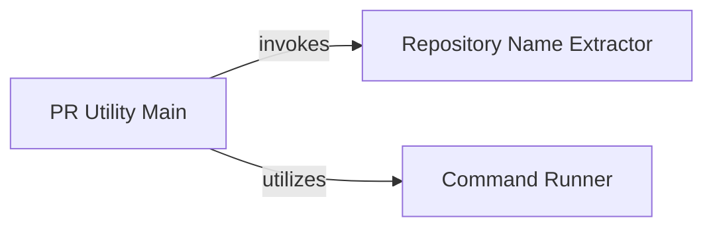

## Component Details

This graph outlines the structure and interactions within the PR & Repository Utility subsystem. Its main purpose is to automate the process of managing pull requests and local repository operations, including cloning, executing commands, and handling documentation. The central flow involves cloning a repository, extracting its name, executing various shell commands, and integrating documentation files into the repository for commit and push operations.

### PR Utility Main
This component serves as the primary orchestrator for the pull request utility. It handles the end-to-end process of cloning a Git repository, extracting the repository name, managing directories, copying relevant markdown files into a '.codeboarding' directory within the cloned repository, and performing Git operations like adding, committing, and pushing these changes. It is the central control flow for the `pr_util` script.

**Related Classes/Methods**:

- <a href="https://github.com/CodeBoarding/CodeBoarding/blob/master/outreach_utils/pr_util.py#L34-L113" target="_blank" rel="noopener noreferrer">`outreach_utils.pr_util:main` (34:113)</a>

### Repository Name Extractor
This component is a utility function specifically designed to parse an SSH clone URL and accurately extract the repository name from it. It ensures that the correct repository name is identified for subsequent operations, raising an error if the URL format is invalid.

**Related Classes/Methods**:

- <a href="https://github.com/CodeBoarding/CodeBoarding/blob/master/outreach_utils/pr_util.py#L10-L19" target="_blank" rel="noopener noreferrer">`outreach_utils.pr_util:extract_repo_name` (10:19)</a>

### Command Runner
This component provides a robust mechanism for executing arbitrary shell commands. It captures the standard output and handles potential errors by printing error messages and exiting the program, ensuring that command execution failures are properly managed.

**Related Classes/Methods**:

- <a href="https://github.com/CodeBoarding/CodeBoarding/blob/master/outreach_utils/pr_util.py#L22-L31" target="_blank" rel="noopener noreferrer">`outreach_utils.pr_util:run_command` (22:31)</a>

### [FAQ](https://github.com/CodeBoarding/GeneratedOnBoardings/tree/main?tab=readme-ov-file#faq)
