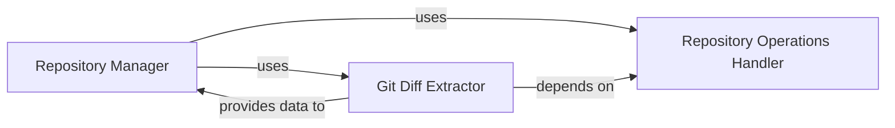

## Details

The `Repository Manager` serves as the central orchestrator for all source code repository interactions. It delegates core repository operations such as cloning, checking out, and managing repository metadata to the `Repository Operations Handler`. For analyzing code changes, the `Repository Manager` utilizes the `Git Diff Extractor`, which in turn relies on the `Repository Operations Handler` for accessing repository data. The `Git Diff Extractor` then provides the processed diff information back to the `Repository Manager` for further system use. This clear separation of concerns ensures modularity and maintainability within the repository management subsystem.

### Repository Manager [[Expand]](./Repository_Manager.md)
This is the top-level component responsible for orchestrating all interactions with source code repositories. It provides a unified interface for the rest of the system to access repository functionalities, including cloning, checking out versions, and initiating diff operations. It acts as a facade, delegating specific tasks to its sub-components.

**Related Classes/Methods**:

- <a href="https://github.com/CodeBoarding/CodeBoarding/blob/main/repo_utils/__init__.py" target="_blank" rel="noopener noreferrer">`repo_utils`</a>
- <a href="https://github.com/CodeBoarding/CodeBoarding/blob/main/repo_utils/git_diff.py" target="_blank" rel="noopener noreferrer">`repo_utils.git_diff`</a>

### Repository Operations Handler
Manages the fundamental, low-level operations related to local Git repositories. This includes cloning repositories from remote URLs, sanitizing repository URLs, verifying the existence of remote repositories, checking out specific branches or commits, and retrieving essential repository metadata (e.g., current commit hash, branch name). It also handles authentication tokens and the uploading of generated materials.

**Related Classes/Methods**:

- <a href="https://github.com/CodeBoarding/CodeBoarding/blob/main/repo_utils/__init__.py" target="_blank" rel="noopener noreferrer">`repo_utils.clone_repository`</a>
- <a href="https://github.com/CodeBoarding/CodeBoarding/blob/main/repo_utils/__init__.py" target="_blank" rel="noopener noreferrer">`repo_utils.checkout_repo`</a>
- <a href="https://github.com/CodeBoarding/CodeBoarding/blob/main/repo_utils/__init__.py" target="_blank" rel="noopener noreferrer">`repo_utils.sanitize_repo_url`</a>
- <a href="https://github.com/CodeBoarding/CodeBoarding/blob/main/repo_utils/__init__.py" target="_blank" rel="noopener noreferrer">`repo_utils.remote_repo_exists`</a>
- <a href="https://github.com/CodeBoarding/CodeBoarding/blob/main/repo_utils/__init__.py" target="_blank" rel="noopener noreferrer">`repo_utils.get_git_commit_hash`</a>
- <a href="https://github.com/CodeBoarding/CodeBoarding/blob/main/repo_utils/__init__.py" target="_blank" rel="noopener noreferrer">`repo_utils.get_branch`</a>
- <a href="https://github.com/CodeBoarding/CodeBoarding/blob/main/repo_utils/__init__.py" target="_blank" rel="noopener noreferrer">`repo_utils.upload_onboarding_materials`</a>

### Git Diff Extractor
Focuses specifically on extracting and processing differences between various versions of the codebase within a Git repository. It identifies changes at the file and line level (additions, deletions, modifications) and structures this information for further analysis by other components of the system.

**Related Classes/Methods**:

- <a href="https://github.com/CodeBoarding/CodeBoarding/blob/main/repo_utils/git_diff.py" target="_blank" rel="noopener noreferrer">`repo_utils.git_diff.git_diff`</a>
- <a href="https://github.com/CodeBoarding/CodeBoarding/blob/main/repo_utils/git_diff.py#L9-L24" target="_blank" rel="noopener noreferrer">`repo_utils.git_diff.FileChange`:9-24</a>

### [FAQ](https://github.com/CodeBoarding/GeneratedOnBoardings/tree/main?tab=readme-ov-file#faq)
