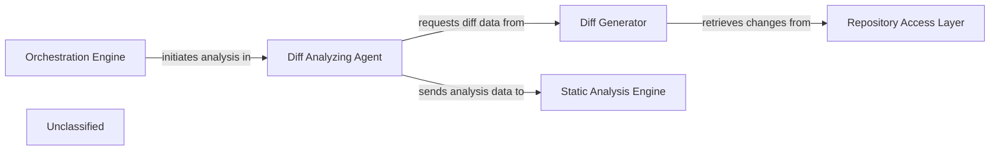

## Details

The core of the subsystem revolves around the `Diff Analyzing Agent`, which acts as the central orchestrator for analyzing code changes. Initiated by an external `Orchestration Engine`, the `Diff Analyzing Agent` delegates the task of generating raw diff data to the `Diff Generator`. The `Diff Generator`, in turn, interacts with the `Repository Access Layer` to retrieve the necessary version control information. Once the diff data is processed and analyzed by the `Diff Analyzing Agent`, the resulting insights and updates are then transmitted to the `Static Analysis Engine` for further, more in-depth code examination. This architecture ensures a clear separation of concerns, with dedicated components for managing the analysis workflow, generating diffs, and interacting with the repository.

### Diff Analyzing Agent
This component is responsible for orchestrating the analysis of code differences within a repository. It retrieves diff data, filters it for relevance, and uses an internal agent to generate insights and determine the degree of update required for existing analyses or components. It acts as the primary interface for initiating and managing diff-based analysis.

**Related Classes/Methods**:

- <a href="https://github.com/CodeBoarding/CodeBoarding/blob/mainagents/diff_analyzer.py" target="_blank" rel="noopener noreferrer">`DiffAnalyzingAgent`</a>

### Diff Generator
This component specializes in computing and extracting detailed differences between various versions or branches of source code within a repository. It directly interacts with the underlying version control system to obtain raw diff information.

**Related Classes/Methods**:

- <a href="https://github.com/CodeBoarding/CodeBoarding/blob/mainrepo_utils/git_diff.py" target="_blank" rel="noopener noreferrer">`get_git_diff`</a>

### Repository Access Layer
This component handles the direct, low-level interactions with the underlying version control system (e.g., Git). It encapsulates the specifics of executing VCS commands and managing local repository copies, providing the raw data for diff generation.

**Related Classes/Methods**:

- <a href="https://github.com/CodeBoarding/CodeBoarding/blob/mainrepo_utils/git_diff.py" target="_blank" rel="noopener noreferrer">`get_git_diff`</a>

### Orchestration Engine [[Expand]](./Orchestration_Engine.md)
This external component initiates and manages the overall code analysis workflow. It sends instructions to the `Diff Analyzing Agent` to start or update analyses.

**Related Classes/Methods**:

- `Orchestration Engine`:1-10

### Static Analysis Engine [[Expand]](./Static_Analysis_Engine.md)
This external component receives and processes data from the `Diff Analyzing Agent`, likely performing deeper static code analysis based on the identified changes.

**Related Classes/Methods**:

### Unclassified
Component for all unclassified files and utility functions (Utility functions/External Libraries/Dependencies)

**Related Classes/Methods**: _None_

### [FAQ](https://github.com/CodeBoarding/GeneratedOnBoardings/tree/main?tab=readme-ov-file#faq)
