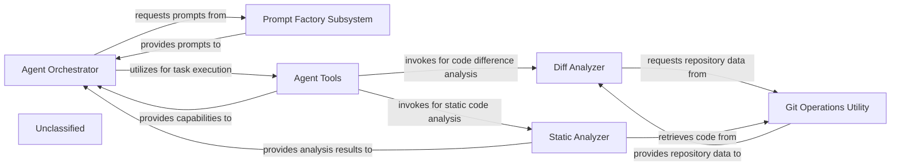

## Details

The system is designed around an `Agent Orchestrator` that directs intelligent agents. This orchestrator dynamically acquires prompts from the `Prompt Factory Subsystem` to guide agent behavior. For task execution and information gathering, the `Agent Orchestrator` interacts with `Agent Tools`, which encapsulate various functionalities. These tools include the `Diff Analyzer` for identifying and processing code changes, and the `Static Analyzer` for performing in-depth code analysis without execution. Both the `Diff Analyzer` and `Static Analyzer` depend on the `Git Operations Utility` to access and retrieve necessary code from repositories. The insights generated by the `Static Analyzer` are then fed back to the `Agent Orchestrator` to inform subsequent decision-making and actions.

### Agent Orchestrator
The central component responsible for driving the intelligent agents. It orchestrates the agent's logic, utilizing prompts and tools to execute tasks and make decisions based on gathered information and analysis results.

**Related Classes/Methods**:

- <a href="https://github.com/CodeBoarding/CodeBoarding/blob/mainagents/agent.py" target="_blank" rel="noopener noreferrer">`agents.agent:Agent`</a>

### Prompt Factory Subsystem
Manages the creation and retrieval of various prompt templates. It implements an Abstract Factory pattern to provide flexible and extensible prompt generation tailored to specific agent requirements.

**Related Classes/Methods**:

- <a href="https://github.com/CodeBoarding/CodeBoarding/blob/mainagents/prompts/abstract_prompt_factory.py" target="_blank" rel="noopener noreferrer">`agents.prompts.abstract_prompt_factory:AbstractPromptFactory`</a>
- <a href="https://github.com/CodeBoarding/CodeBoarding/blob/mainagents/prompts/prompt_factory.py" target="_blank" rel="noopener noreferrer">`agents.prompts.prompt_factory:PromptFactory`</a>
- <a href="https://github.com/CodeBoarding/CodeBoarding/blob/mainagents/prompts/gemini_flash_prompts_bidirectional.py" target="_blank" rel="noopener noreferrer">`agents.prompts.gemini_flash_prompts_bidirectional`</a>
- <a href="https://github.com/CodeBoarding/CodeBoarding/blob/mainagents/prompts/gemini_flash_prompts_unidirectional.py" target="_blank" rel="noopener noreferrer">`agents.prompts.gemini_flash_prompts_unidirectional`</a>

### Agent Tools
Provides a collection of specialized tools that agents can utilize to interact with the environment, gather information, or perform specific actions. These tools encapsulate functionalities like reading files, analyzing code structures, and fetching Git diffs, and static analysis results.

**Related Classes/Methods**:

- <a href="https://github.com/CodeBoarding/CodeBoarding/blob/mainagents/tools/read_file.py" target="_blank" rel="noopener noreferrer">`agents.tools.read_file`</a>
- <a href="https://github.com/CodeBoarding/CodeBoarding/blob/mainagents/tools/read_git_diff.py" target="_blank" rel="noopener noreferrer">`agents.tools.read_git_diff`</a>
- <a href="https://github.com/CodeBoarding/CodeBoarding/blob/mainagents/tools/read_source.py" target="_blank" rel="noopener noreferrer">`agents.tools.read_source`</a>

### Diff Analyzer
Orchestrates the process of identifying, analyzing, and preparing code differences from repositories. It leverages lower-level Git utilities to fetch raw data and then processes it into a usable format for subsequent analysis stages.

**Related Classes/Methods**:

- <a href="https://github.com/CodeBoarding/CodeBoarding/blob/mainagents/diff_analyzer.py" target="_blank" rel="noopener noreferrer">`agents.diff_analyzer:__init__`</a>

### Git Operations Utility
Provides low-level, atomic functionalities for interacting directly with Git repositories. This includes operations such as cloning repositories, fetching updates, and generating detailed version differences (diffs). It abstracts the complexities of Git commands.

**Related Classes/Methods**:

- <a href="https://github.com/CodeBoarding/CodeBoarding/blob/mainrepo_utils/git_diff.py" target="_blank" rel="noopener noreferrer">`repo_utils.git_diff:git_diff`</a>

### Static Analyzer
A new component responsible for performing static analysis on codebases. It identifies potential issues, patterns, or metrics without executing the code, providing valuable insights for the `Agent Orchestrator`.

**Related Classes/Methods**:

- <a href="https://github.com/CodeBoarding/CodeBoarding/blob/mainstatic_analyzer/__init__.py" target="_blank" rel="noopener noreferrer">`static_analyzer`</a>

### Unclassified
Component for all unclassified files and utility functions (Utility functions/External Libraries/Dependencies)

**Related Classes/Methods**: _None_

### [FAQ](https://github.com/CodeBoarding/GeneratedOnBoardings/tree/main?tab=readme-ov-file#faq)
