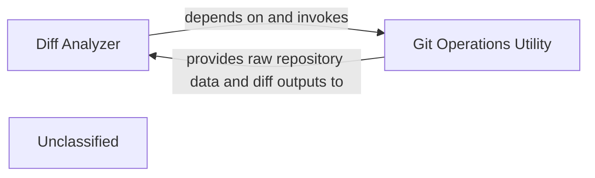

## Details

The system's core functionality revolves around analyzing code changes. The `Git Operations Utility` serves as the foundational layer, providing raw repository data and diffs to the `Diff Analyzer`. The `Diff Analyzer` then processes this raw information, transforming it into structured code artifacts and contextual data. These processed outputs are subsequently routed to two distinct downstream components: the `Static Analysis Engine` for identifying code quality and security issues, and the `AI Interpretation Layer` for advanced, AI-driven insights and recommendations based on the code changes. This architecture ensures a clear separation of concerns, with the `Diff Analyzer` acting as a central hub for preparing data for specialized analysis.

### Diff Analyzer
Orchestrates the process of identifying, analyzing, and preparing code differences from repositories. It leverages lower-level Git utilities to fetch raw data and then processes it into a usable format for subsequent analysis stages.

**Related Classes/Methods**:

- <a href="https://github.com/CodeBoarding/CodeBoarding/blob/mainagents/diff_analyzer.py" target="_blank" rel="noopener noreferrer">`agents.diff_analyzer:__init__`</a>

### Git Operations Utility
Provides low-level, atomic functionalities for interacting directly with Git repositories. This includes operations such as cloning repositories, fetching updates, and generating detailed version differences (diffs). It abstracts the complexities of Git commands.

**Related Classes/Methods**:

- <a href="https://github.com/CodeBoarding/CodeBoarding/blob/mainrepo_utils/git_diff.py" target="_blank" rel="noopener noreferrer">`repo_utils.git_diff:git_diff`</a>

### Unclassified
Component for all unclassified files and utility functions (Utility functions/External Libraries/Dependencies)

**Related Classes/Methods**: _None_

### [FAQ](https://github.com/CodeBoarding/GeneratedOnBoardings/tree/main?tab=readme-ov-file#faq)
