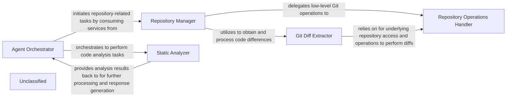

## Details

The system's architecture is centered around the Agent Orchestrator, which manages the overall agent-based processing workflow. It interacts with the Repository Manager to handle all source code repository operations, including cloning, checking out, and extracting code differences. The Repository Manager in turn delegates specific tasks to the Repository Operations Handler for low-level Git commands and the Git Diff Extractor for detailed code change analysis. Once repository data is prepared, the Agent Orchestrator orchestrates the Static Analyzer to perform in-depth static analysis, identifying code patterns, building graphs, and extracting structural information. The Static Analyzer then returns its findings to the Agent Orchestrator, which uses these results to generate refined responses. This modular design ensures clear separation of concerns, with the Static Analyzer's internal mechanisms recently enhanced to provide more robust analysis capabilities.

### Repository Manager [[Expand]](./Repository_Manager.md)
Orchestrates all interactions with source code repositories, providing a unified interface for cloning, checking out versions, and initiating diff operations. It delegates specific tasks to its sub-components.

**Related Classes/Methods**: _None_

### Repository Operations Handler
Manages fundamental, low-level operations related to local Git repositories, including cloning, checking out, sanitizing URLs, verifying remotes, and retrieving essential repository metadata.

**Related Classes/Methods**: _None_

### Git Diff Extractor
Focuses on extracting and processing file and line-level differences between codebase versions within a Git repository, structuring this information for further analysis.

**Related Classes/Methods**: _None_

### Agent Orchestrator
Manages the overall agent-based processing logic, consuming data from the Repository Manager and orchestrating operations with the Static Analyzer. It processes repository information and generates refined responses.

**Related Classes/Methods**: _None_

### Static Analyzer
Performs various static analysis tasks on source code provided by the Agent Orchestrator. It processes code to identify patterns, build graphs, and extract structural information. Recent internal refinements within scanner.py have enhanced its capabilities in these areas.

**Related Classes/Methods**: _None_

### Unclassified
Component for all unclassified files and utility functions (Utility functions/External Libraries/Dependencies)

**Related Classes/Methods**: _None_

### [FAQ](https://github.com/CodeBoarding/GeneratedOnBoardings/tree/main?tab=readme-ov-file#faq)
