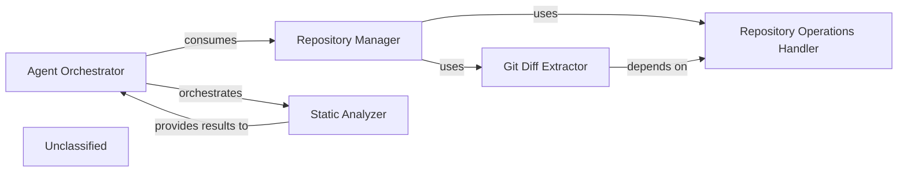

## Details

The system's architecture is centered around the `Repository Manager`, which provides foundational access to source code repositories through its `Repository Operations Handler` and `Git Diff Extractor` sub-components. Building upon this foundation, the `Agent Orchestrator` acts as the primary intelligence layer, consuming repository data to drive complex processing workflows. It leverages the `Static Analyzer` to perform in-depth code analysis, receiving structured results that inform its decision-making and response generation. This integrated approach allows for sophisticated analysis and intelligent interaction with the codebase, with the `Agent Orchestrator` serving as the central coordinator for both repository interactions and static analysis.

### Repository Manager [[Expand]](./Repository_Manager.md)
This is the top-level component responsible for orchestrating all interactions with source code repositories. It provides a unified interface for the rest of the system to access repository functionalities, including cloning, checking out versions, and initiating diff operations. It acts as a facade, delegating specific tasks to its sub-components.

**Related Classes/Methods**:

- <a href="https://github.com/CodeBoarding/CodeBoarding/blob/main/repo_utils" target="_blank" rel="noopener noreferrer">`repo_utils`</a>
- `repo_utils.git_diff`

### Repository Operations Handler
Manages the fundamental, low-level operations related to local Git repositories. This includes cloning repositories from remote URLs, sanitizing repository URLs, verifying the existence of remote repositories, checking out specific branches or commits, and retrieving essential repository metadata (e.g., current commit hash, branch name). It also handles authentication tokens and the uploading of generated materials.

**Related Classes/Methods**:

- <a href="https://github.com/CodeBoarding/CodeBoarding/blob/main/repo_utils/__init__.py" target="_blank" rel="noopener noreferrer">`repo_utils.clone_repository`</a>
- <a href="https://github.com/CodeBoarding/CodeBoarding/blob/main/repo_utils/__init__.py" target="_blank" rel="noopener noreferrer">`repo_utils.checkout_repo`</a>
- <a href="https://github.com/CodeBoarding/CodeBoarding/blob/main/repo_utils/__init__.py" target="_blank" rel="noopener noreferrer">`repo_utils.sanitize_repo_url`</a>
- <a href="https://github.com/CodeBoarding/CodeBoarding/blob/main/repo_utils/__init__.py" target="_blank" rel="noopener noreferrer">`repo_utils.remote_repo_exists`</a>
- <a href="https://github.com/CodeBoarding/CodeBoarding/blob/main/repo_utils/__init__.py" target="_blank" rel="noopener noreferrer">`repo_utils.get_git_commit_hash`</a>
- <a href="https://github.com/CodeBoarding/CodeBoarding/blob/main/repo_utils/__init__.py" target="_blank" rel="noopener noreferrer">`repo_utils.get_branch`</a>
- <a href="https://github.com/CodeBoarding/CodeBoarding/blob/main/repo_utils/__init__.py" target="_blank" rel="noopener noreferrer">`repo_utils.upload_onboarding_materials`</a>

### Git Diff Extractor
Focuses specifically on extracting and processing differences between various versions of the codebase within a Git repository. It identifies changes at the file and line level (additions, deletions, modifications) and structures this information for further analysis by other components of the system.

**Related Classes/Methods**:

- <a href="https://github.com/CodeBoarding/CodeBoarding/blob/main/repo_utils/git_diff.py" target="_blank" rel="noopener noreferrer">`repo_utils.git_diff.git_diff`</a>
- <a href="https://github.com/CodeBoarding/CodeBoarding/blob/main/repo_utils/git_diff.py#L9-L24" target="_blank" rel="noopener noreferrer">`repo_utils.git_diff.FileChange`:9-24</a>

### Agent Orchestrator
Manages the overall agent-based processing logic, consuming data from the `Repository Manager` and orchestrating operations with the `Static Analyzer`. It is responsible for complex task execution, processing repository information, and generating refined responses based on analysis.

**Related Classes/Methods**: _None_

### Static Analyzer
Performs various static analysis tasks on source code provided by the `Agent Orchestrator`. It processes code to identify patterns, build graphs, and extract structural information, which is then returned for further agent-based processing.

**Related Classes/Methods**: _None_

### Unclassified
Component for all unclassified files and utility functions (Utility functions/External Libraries/Dependencies)

**Related Classes/Methods**: _None_

### [FAQ](https://github.com/CodeBoarding/GeneratedOnBoardings/tree/main?tab=readme-ov-file#faq)
