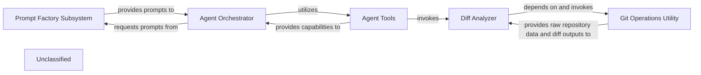

## Details

The system is structured around an Agent Orchestrator that drives various analytical tasks. This orchestrator dynamically obtains specialized prompt templates from the Prompt Factory Subsystem, which employs an Abstract Factory pattern to ensure flexible and context-specific prompt generation. To execute its tasks, the Agent Orchestrator leverages a suite of Agent Tools. These tools encapsulate specific functionalities, such as interacting with the Diff Analyzer to process code changes. The Diff Analyzer, in turn, relies on the Git Operations Utility for low-level Git interactions, providing a clear separation of concerns for repository data retrieval and processing. This architecture promotes modularity, allowing for easy extension of agents, prompts, and tools while maintaining a clear flow of information and control.

### Diff Analyzer
Orchestrates the process of identifying, analyzing, and preparing code differences from repositories. It leverages lower-level Git utilities to fetch raw data and then processes it into a usable format for subsequent analysis stages.

**Related Classes/Methods**:

- <a href="https://github.com/CodeBoarding/CodeBoarding/blob/mainagents/diff_analyzer.py" target="_blank" rel="noopener noreferrer">`agents.diff_analyzer:__init__`</a>

### Git Operations Utility
Provides low-level, atomic functionalities for interacting directly with Git repositories. This includes operations such as cloning repositories, fetching updates, and generating detailed version differences (diffs). It abstracts the complexities of Git commands.

**Related Classes/Methods**:

- <a href="https://github.com/CodeBoarding/CodeBoarding/blob/mainrepo_utils/git_diff.py" target="_blank" rel="noopener noreferrer">`repo_utils.git_diff:git_diff`</a>

### Prompt Factory Subsystem
Manages the creation and retrieval of various prompt templates used by different agents. It implements an Abstract Factory pattern, allowing for flexible and extensible prompt generation based on specific agent requirements (e.g., unidirectional or bidirectional communication).

**Related Classes/Methods**:

- <a href="https://github.com/CodeBoarding/CodeBoarding/blob/mainagents/prompts/abstract_prompt_factory.py" target="_blank" rel="noopener noreferrer">`agents.prompts.abstract_prompt_factory:AbstractPromptFactory`</a>
- <a href="https://github.com/CodeBoarding/CodeBoarding/blob/mainagents/prompts/prompt_factory.py" target="_blank" rel="noopener noreferrer">`agents.prompts.prompt_factory:PromptFactory`</a>
- <a href="https://github.com/CodeBoarding/CodeBoarding/blob/mainagents/prompts/gemini_flash_prompts_bidirectional.py" target="_blank" rel="noopener noreferrer">`agents.prompts.gemini_flash_prompts_bidirectional`</a>
- <a href="https://github.com/CodeBoarding/CodeBoarding/blob/mainagents/prompts/gemini_flash_prompts_unidirectional.py" target="_blank" rel="noopener noreferrer">`agents.prompts.gemini_flash_prompts_unidirectional`</a>

### Agent Orchestrator
Represents the core agent logic that utilizes prompts and tools to perform its tasks. This component interacts with the `Prompt Factory Subsystem` to obtain appropriate prompts and then executes its operational flow, potentially involving the `Diff Analyzer` and other tools.

**Related Classes/Methods**:

- <a href="https://github.com/CodeBoarding/CodeBoarding/blob/mainagents/agent.py" target="_blank" rel="noopener noreferrer">`agents.agent:Agent`</a>

### Agent Tools
Provides a collection of specialized tools that agents can utilize to interact with the environment, gather information, or perform specific actions. These tools encapsulate functionalities like reading files, analyzing code structures, or fetching Git diffs.

**Related Classes/Methods**:

- <a href="https://github.com/CodeBoarding/CodeBoarding/blob/mainagents/tools/read_file.py" target="_blank" rel="noopener noreferrer">`agents.tools.read_file`</a>
- <a href="https://github.com/CodeBoarding/CodeBoarding/blob/mainagents/tools/read_git_diff.py" target="_blank" rel="noopener noreferrer">`agents.tools.read_git_diff`</a>
- <a href="https://github.com/CodeBoarding/CodeBoarding/blob/mainagents/tools/read_source.py" target="_blank" rel="noopener noreferrer">`agents.tools.read_source`</a>

### Unclassified
Component for all unclassified files and utility functions (Utility functions/External Libraries/Dependencies)

**Related Classes/Methods**: _None_

### [FAQ](https://github.com/CodeBoarding/GeneratedOnBoardings/tree/main?tab=readme-ov-file#faq)
