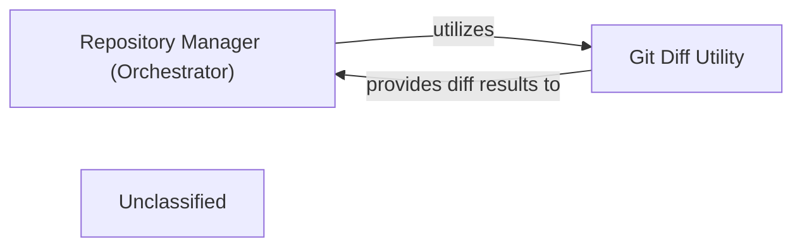

## Details

The core of this subsystem revolves around the `DiffAnalyzingAgent`, which acts as the orchestrator for analyzing code changes within a project. It is responsible for managing the overall diff analysis workflow, from retrieving existing analysis and fetching new diff data to processing and interpreting these changes. The `DiffAnalyzingAgent` directly leverages the `Git Diff Utility` to obtain granular file change information, which it then uses to determine the degree of update required for the project's analysis. This streamlined architecture ensures a clear separation of concerns, with the orchestrator managing the analysis process and the utility providing the essential diffing capabilities.

### Repository Manager (Orchestrator)
This is the overarching component for the subsystem, embodied by the `DiffAnalyzingAgent`. It orchestrates all repository-related operations for diff analysis, acting as the primary interface for managing and processing code changes. It directly utilizes the `Git Diff Utility` to obtain diff data and then uses an LLM to analyze these changes and determine the update degree.

**Related Classes/Methods**:

- <a href="https://github.com/CodeBoarding/CodeBoarding/blob/mainagents/diff_analyzer.py" target="_blank" rel="noopener noreferrer">`agents.diff_analyzer.DiffAnalyzingAgent`</a>

### Git Diff Utility
A specialized, stateless utility focused solely on calculating and providing version differences between specified code states (e.g., commits, branches, or working directory vs. index). It is fundamental for change analysis within the tool, providing the raw file change data to the `Repository Manager (Orchestrator)`.

**Related Classes/Methods**:

- <a href="https://github.com/CodeBoarding/CodeBoarding/blob/mainrepo_utils/git_diff.py" target="_blank" rel="noopener noreferrer">`repo_utils.git_diff:get_git_diff`</a>

### Unclassified
Component for all unclassified files and utility functions (Utility functions/External Libraries/Dependencies)

**Related Classes/Methods**: _None_

### [FAQ](https://github.com/CodeBoarding/GeneratedOnBoardings/tree/main?tab=readme-ov-file#faq)
