```mermaid
graph LR
    Repository_Manager["Repository Manager"]
    Orchestration_Engine["Orchestration Engine"]
    Static_Analysis_Engine["Static Analysis Engine"]
    AI_Interpretation_Layer["AI Interpretation Layer"]
    Output_Generation_Engine["Output Generation Engine"]
    API_Service["API Service"]
    Job_Database["Job Database"]
    Configuration_Management["Configuration Management"]
    Unclassified["Unclassified"]
    Repository_Manager -- "provides fetched source code to" --> Static_Analysis_Engine
    Repository_Manager -- "queries to retrieve settings for repository access" --> Configuration_Management
    Orchestration_Engine -- "dispatches analysis tasks to" --> Static_Analysis_Engine
    Orchestration_Engine -- "submits jobs to for tracking and persistence" --> Job_Database
    Static_Analysis_Engine -- "sends extracted code insights to for further processing" --> AI_Interpretation_Layer
    Static_Analysis_Engine -- "retrieves analysis rules and configurations from" --> Configuration_Management
    AI_Interpretation_Layer -- "sends interpreted insights and documentation drafts to" --> Output_Generation_Engine
    Output_Generation_Engine -- "provides final documentation and diagrams to for delivery" --> API_Service
    Output_Generation_Engine -- "uses templates and styling rules from" --> Configuration_Management
    API_Service -- "submits new analysis jobs to" --> Orchestration_Engine
    API_Service -- "retrieves final outputs from" --> Output_Generation_Engine
    Job_Database -- "is queried by for job status and results" --> API_Service
    click Repository_Manager href "https://github.com/CodeBoarding/CodeBoarding/blob/main/.codeboarding/Repository_Manager.md" "Details"
    click Orchestration_Engine href "https://github.com/CodeBoarding/CodeBoarding/blob/main/.codeboarding/Orchestration_Engine.md" "Details"
    click Static_Analysis_Engine href "https://github.com/CodeBoarding/CodeBoarding/blob/main/.codeboarding/Static_Analysis_Engine.md" "Details"
    click AI_Interpretation_Layer href "https://github.com/CodeBoarding/CodeBoarding/blob/main/.codeboarding/AI_Interpretation_Layer.md" "Details"
    click Output_Generation_Engine href "https://github.com/CodeBoarding/CodeBoarding/blob/main/.codeboarding/Output_Generation_Engine.md" "Details"
    click API_Service href "https://github.com/CodeBoarding/CodeBoarding/blob/main/.codeboarding/API_Service.md" "Details"
```

## Details

The system operates by orchestrating a series of analysis and generation tasks. The `Orchestration Engine` initiates and manages the entire workflow. It instructs the `Repository Manager` to fetch or update the codebase, which then provides the source code to the `Static Analysis Engine`. The `Static Analysis Engine`, now with enhanced and specialized capabilities for TypeScript analysis, performs in-depth code analysis, extracting structural information and dependencies. It also retrieves analysis rules and configurations from `Configuration Management`. The extracted code insights are then passed to the `AI Interpretation Layer`, which leverages LLMs to interpret the context and generate architectural patterns and documentation drafts. These drafts are subsequently sent to the `Output Generation Engine` for formatting and rendering into various output formats, utilizing templates and styling rules from `Configuration Management`. Finally, the `API Service` provides an interface for users to submit jobs, monitor status, and retrieve the generated documentation and analysis results, querying the `Job Database` for job status and results.

### Repository Manager [[Expand]](./Repository_Manager.md)
Manages all interactions with source code repositories, including cloning, fetching, and extracting version differences, to provide the necessary codebase for analysis.

**Related Classes/Methods**:

- <a href="https://github.com/CodeBoarding/CodeBoarding/blob/mainagents/diff_analyzer.py#L21-L32" target="_blank" rel="noopener noreferrer">`__init__`:21-32</a>
- <a href="https://github.com/CodeBoarding/CodeBoarding/blob/mainrepo_utils/git_diff.py#L27-L76" target="_blank" rel="noopener noreferrer">`git_diff`:27-76</a>

### Orchestration Engine [[Expand]](./Orchestration_Engine.md)
Coordinates the overall workflow of codebase analysis, managing the sequence of operations from repository ingestion to final output generation. It acts as the central control for job execution.

**Related Classes/Methods**:

- <a href="https://github.com/CodeBoarding/CodeBoarding/blob/mainagents/diff_analyzer.py" target="_blank" rel="noopener noreferrer">`agents.diff_analyzer.DiffAnalyzingAgent`</a>
- <a href="https://github.com/CodeBoarding/CodeBoarding/blob/mainagents/agent.py" target="_blank" rel="noopener noreferrer">`agents.agent.CodeBoardingAgent`</a>

### Static Analysis Engine [[Expand]](./Static_Analysis_Engine.md)
Performs in-depth analysis of the source code provided by the Repository Manager, extracting structural information, dependencies, and other relevant metrics without executing the code. Its capabilities for TypeScript analysis have been significantly enhanced and specialized, including dedicated modules for scanning TypeScript configuration files and leveraging Language Server Protocol (LSP) for deeper code analysis.

**Related Classes/Methods**:

- <a href="https://github.com/CodeBoarding/CodeBoarding/blob/mainstatic_analyzer/scanner.py" target="_blank" rel="noopener noreferrer">`static_analyzer.scanner.ProjectScanner`</a>
- <a href="https://github.com/CodeBoarding/CodeBoarding/blob/mainstatic_analyzer/lsp_client/typescript_client.py" target="_blank" rel="noopener noreferrer">`static_analyzer/lsp_client/typescript_client.py`</a>
- <a href="https://github.com/CodeBoarding/CodeBoarding/blob/mainstatic_analyzer/typescript_config_scanner.py" target="_blank" rel="noopener noreferrer">`static_analyzer/typescript_config_scanner.py`</a>

### AI Interpretation Layer [[Expand]](./AI_Interpretation_Layer.md)
Processes the raw analysis data from the Static Analysis Engine using Large Language Models (LLMs) to interpret code context, identify architectural patterns, and generate human-readable insights and documentation drafts.

**Related Classes/Methods**:

- <a href="https://github.com/CodeBoarding/CodeBoarding/blob/mainagents/agent.py" target="_blank" rel="noopener noreferrer">`agents.agent.CodeBoardingAgent`</a>

### Output Generation Engine [[Expand]](./Output_Generation_Engine.md)
Formats and renders the interpreted insights and documentation into various output formats (e.g., Mermaid diagrams, Markdown, JSON), making them consumable by users or other systems.

**Related Classes/Methods**:

- <a href="https://github.com/CodeBoarding/CodeBoarding/blob/mainoutput_generators/markdown.py" target="_blank" rel="noopener noreferrer">`output_generators.markdown`</a>

### API Service [[Expand]](./API_Service.md)
Provides external interfaces for users and other systems to interact with the tool, enabling job submission, status monitoring, and retrieval of analysis results and generated documentation.

**Related Classes/Methods**:

- <a href="https://github.com/CodeBoarding/CodeBoarding/blob/mainagents/agent.py" target="_blank" rel="noopener noreferrer">`agents.agent.CodeBoardingAgent`</a>

### Job Database
Persists information about analysis jobs, their status, parameters, and results, ensuring durability and enabling asynchronous processing and historical tracking.

**Related Classes/Methods**:

- <a href="https://github.com/CodeBoarding/CodeBoarding/blob/mainagents/diff_analyzer.py#L39-L41" target="_blank" rel="noopener noreferrer">`agents/diff_analyzer.py`:39-41</a>
- <a href="https://github.com/CodeBoarding/CodeBoarding/blob/mainagents/diff_analyzer.py#L48-L53" target="_blank" rel="noopener noreferrer">`agents/diff_analyzer.py`:48-53</a>

### Configuration Management
Centralizes and manages all system configurations, including repository access credentials, analysis rules, LLM API keys, and output preferences, ensuring consistent behavior across components.

**Related Classes/Methods**:

- <a href="https://github.com/CodeBoarding/CodeBoarding/blob/mainagents/agent.py#L55-L64" target="_blank" rel="noopener noreferrer">`agents.agent.CodeBoardingAgent`:55-64</a>

### Unclassified
Component for all unclassified files and utility functions (Utility functions/External Libraries/Dependencies)

**Related Classes/Methods**: _None_

### [FAQ](https://github.com/CodeBoarding/GeneratedOnBoardings/tree/main?tab=readme-ov-file#faq)
