```mermaid
graph LR
    Repository_Manager["Repository Manager"]
    Orchestration_Engine["Orchestration Engine"]
    Static_Analysis_Engine["Static Analysis Engine"]
    AI_Interpretation_Layer["AI Interpretation Layer"]
    Output_Generation_Engine["Output Generation Engine"]
    API_Service["API Service"]
    Job_Database["Job Database"]
    Configuration_Management["Configuration Management"]
    Unclassified["Unclassified"]
    Repository_Manager -- "provides fetched source code to" --> Static_Analysis_Engine
    Repository_Manager -- "queries to retrieve settings for repository access" --> Configuration_Management
    Orchestration_Engine -- "instructs to fetch or update codebase" --> Repository_Manager
    Orchestration_Engine -- "dispatches analysis tasks to" --> Static_Analysis_Engine
    Orchestration_Engine -- "submits jobs to for tracking and persistence" --> Job_Database
    Static_Analysis_Engine -- "sends extracted code insights to for further processing" --> AI_Interpretation_Layer
    Static_Analysis_Engine -- "retrieves analysis rules and configurations from" --> Configuration_Management
    AI_Interpretation_Layer -- "sends interpreted insights and documentation drafts to" --> Output_Generation_Engine
    Output_Generation_Engine -- "provides final documentation and diagrams to for delivery" --> API_Service
    Output_Generation_Engine -- "uses templates and styling rules from" --> Configuration_Management
    API_Service -- "submits new analysis jobs to" --> Orchestration_Engine
    API_Service -- "retrieves final outputs from" --> Output_Generation_Engine
    Job_Database -- "is queried by for job status and results" --> API_Service
    click Repository_Manager href "https://github.com/CodeBoarding/CodeBoarding/blob/main/.codeboarding/Repository_Manager.md" "Details"
    click Orchestration_Engine href "https://github.com/CodeBoarding/CodeBoarding/blob/main/.codeboarding/Orchestration_Engine.md" "Details"
    click Static_Analysis_Engine href "https://github.com/CodeBoarding/CodeBoarding/blob/main/.codeboarding/Static_Analysis_Engine.md" "Details"
    click AI_Interpretation_Layer href "https://github.com/CodeBoarding/CodeBoarding/blob/main/.codeboarding/AI_Interpretation_Layer.md" "Details"
    click Output_Generation_Engine href "https://github.com/CodeBoarding/CodeBoarding/blob/main/.codeboarding/Output_Generation_Engine.md" "Details"
    click API_Service href "https://github.com/CodeBoarding/CodeBoarding/blob/main/.codeboarding/API_Service.md" "Details"
```

## Details

The system is designed around a core `Orchestration Engine` that manages the entire codebase analysis workflow. This engine interacts with the `Repository Manager` to acquire source code, which is then passed to the `Static Analysis Engine` for initial processing. The raw analysis data is subsequently fed into the `AI Interpretation Layer`, where Large Language Models generate insights and documentation drafts. The `Output Generation Engine` takes these drafts and formats them into various consumable outputs. An `API Service` provides the external interface for users to initiate analysis jobs, monitor their status, and retrieve results. All job-related information is persisted in the `Job Database`, while the `Configuration Management` component centralizes system settings and credentials, ensuring consistent operation across all components.

### Repository Manager [[Expand]](./Repository_Manager.md)
Manages all interactions with source code repositories, including cloning, fetching, and extracting version differences, to provide the necessary codebase for analysis.

**Related Classes/Methods**:

- <a href="https://github.com/CodeBoarding/CodeBoarding/blob/mainagents/diff_analyzer.py#L21-L32" target="_blank" rel="noopener noreferrer">`__init__`:21-32</a>
- <a href="https://github.com/CodeBoarding/CodeBoarding/blob/mainrepo_utils/git_diff.py#L27-L76" target="_blank" rel="noopener noreferrer">`git_diff`:27-76</a>

### Orchestration Engine [[Expand]](./Orchestration_Engine.md)
Coordinates the overall workflow of codebase analysis, managing the sequence of operations from repository ingestion to final output generation. It acts as the central control for job execution.

**Related Classes/Methods**:

- <a href="https://github.com/CodeBoarding/CodeBoarding/blob/mainagents/diff_analyzer.py" target="_blank" rel="noopener noreferrer">`agents.diff_analyzer.DiffAnalyzingAgent`</a>
- <a href="https://github.com/CodeBoarding/CodeBoarding/blob/mainagents/agent.py" target="_blank" rel="noopener noreferrer">`agents.agent.CodeBoardingAgent`</a>

### Static Analysis Engine [[Expand]](./Static_Analysis_Engine.md)
Performs in-depth analysis of the source code provided by the Repository Manager, extracting structural information, dependencies, and other relevant metrics without executing the code.

**Related Classes/Methods**:

- <a href="https://github.com/CodeBoarding/CodeBoarding/blob/mainstatic_analyzer/scanner.py" target="_blank" rel="noopener noreferrer">`static_analyzer.scanner.ProjectScanner`</a>

### AI Interpretation Layer [[Expand]](./AI_Interpretation_Layer.md)
Processes the raw analysis data from the Static Analysis Engine using Large Language Models (LLMs) to interpret code context, identify architectural patterns, and generate human-readable insights and documentation drafts.

**Related Classes/Methods**:

- <a href="https://github.com/CodeBoarding/CodeBoarding/blob/mainagents/agent.py" target="_blank" rel="noopener noreferrer">`agents.agent.CodeBoardingAgent`</a>

### Output Generation Engine [[Expand]](./Output_Generation_Engine.md)
Formats and renders the interpreted insights and documentation into various output formats (e.g., Mermaid diagrams, Markdown, JSON), making them consumable by users or other systems.

**Related Classes/Methods**:

- <a href="https://github.com/CodeBoarding/CodeBoarding/blob/mainoutput_generators/markdown.py" target="_blank" rel="noopener noreferrer">`output_generators.markdown`</a>

### API Service [[Expand]](./API_Service.md)
Provides external interfaces for users and other systems to interact with the tool, enabling job submission, status monitoring, and retrieval of analysis results and generated documentation.

**Related Classes/Methods**:

- <a href="https://github.com/CodeBoarding/CodeBoarding/blob/mainagents/agent.py" target="_blank" rel="noopener noreferrer">`agents.agent.CodeBoardingAgent`</a>

### Job Database
Persists information about analysis jobs, their status, parameters, and results, ensuring durability and enabling asynchronous processing and historical tracking.

**Related Classes/Methods**:

- <a href="https://github.com/CodeBoarding/CodeBoarding/blob/mainagents/diff_analyzer.py#L39-L41" target="_blank" rel="noopener noreferrer">`agents/diff_analyzer.py`:39-41</a>
- <a href="https://github.com/CodeBoarding/CodeBoarding/blob/mainagents/diff_analyzer.py#L48-L53" target="_blank" rel="noopener noreferrer">`agents/diff_analyzer.py`:48-53</a>

### Configuration Management
Centralizes and manages all system configurations, including repository access credentials, analysis rules, LLM API keys, and output preferences, ensuring consistent behavior across components.

**Related Classes/Methods**:

- <a href="https://github.com/CodeBoarding/CodeBoarding/blob/mainagents/agent.py#L55-L64" target="_blank" rel="noopener noreferrer">`agents.agent.CodeBoardingAgent`:55-64</a>

### Unclassified
Component for all unclassified files and utility functions (Utility functions/External Libraries/Dependencies)

**Related Classes/Methods**: _None_

### [FAQ](https://github.com/CodeBoarding/GeneratedOnBoardings/tree/main?tab=readme-ov-file#faq)
