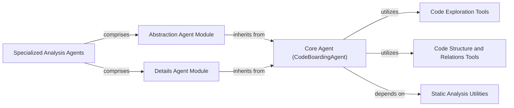

## Component Details

This graph illustrates the architecture of the 'Specialized Analysis Agents' subsystem, which extends core functionalities for high-level abstractions and detailed code analysis. The central orchestrator is the 'Core Agent (CodeBoardingAgent)', which initializes the LLM, manages agent invocations, and utilizes various code analysis tools. The 'Abstraction Agent Module' and 'Details Agent Module' inherit from the 'Core Agent' to perform specialized analysis tasks, such as stepping through CFGs, analyzing source code, and enhancing code structure. These specialized agents are logically grouped under 'Specialized Analysis Agents'. The 'Core Agent' further interacts with 'Code Exploration Tools' for reading and exploring source code, 'Code Structure and Relations Tools' for understanding code hierarchy and control flow, and 'Static Analysis Utilities' for precise code referencing.

### Specialized Analysis Agents
Agents that extend the core functionality to perform high-level abstractions and detailed code analysis, stepping through CFGs and enhancing code structure. This component logically groups the Abstraction Agent and Details Agent.

**Related Classes/Methods**:

- <a href="https://github.com/CodeBoarding/CodeBoarding/blob/master/agents/abstraction_agent.py#L12-L38" target="_blank" rel="noopener noreferrer">`agents.abstraction_agent.AbstractionAgent:__init__` (12:38)</a>
- <a href="https://github.com/CodeBoarding/CodeBoarding/blob/master/agents/abstraction_agent.py#L40-L45" target="_blank" rel="noopener noreferrer">`agents.abstraction_agent.AbstractionAgent:step_cfg` (40:45)</a>
- <a href="https://github.com/CodeBoarding/CodeBoarding/blob/master/agents/abstraction_agent.py#L47-L62" target="_blank" rel="noopener noreferrer">`agents.abstraction_agent.AbstractionAgent:step_source` (47:62)</a>
- <a href="https://github.com/CodeBoarding/CodeBoarding/blob/master/agents/abstraction_agent.py#L64-L72" target="_blank" rel="noopener noreferrer">`agents.abstraction_agent.AbstractionAgent:generate_analysis` (64:72)</a>
- <a href="https://github.com/CodeBoarding/CodeBoarding/blob/master/agents/details_agent.py#L13-L40" target="_blank" rel="noopener noreferrer">`agents.details_agent.DetailsAgent:__init__` (13:40)</a>
- <a href="https://github.com/CodeBoarding/CodeBoarding/blob/master/agents/details_agent.py#L42-L47" target="_blank" rel="noopener noreferrer">`agents.details_agent.DetailsAgent:step_subcfg` (42:47)</a>
- <a href="https://github.com/CodeBoarding/CodeBoarding/blob/master/agents/details_agent.py#L49-L56" target="_blank" rel="noopener noreferrer">`agents.details_agent.DetailsAgent:step_cfg` (49:56)</a>
- <a href="https://github.com/CodeBoarding/CodeBoarding/blob/master/agents/details_agent.py#L58-L67" target="_blank" rel="noopener noreferrer">`agents.details_agent.DetailsAgent:step_enhance_structure` (58:67)</a>
- <a href="https://github.com/CodeBoarding/CodeBoarding/blob/master/agents/details_agent.py#L69-L76" target="_blank" rel="noopener noreferrer">`agents.details_agent.DetailsAgent:step_analysis` (69:76)</a>

### Abstraction Agent Module
A specialized agent designed to perform abstraction-level analysis of code, leveraging the core functionalities provided by the CodeBoardingAgent for stepping through CFG, source, and generating analysis.

**Related Classes/Methods**:

- <a href="https://github.com/CodeBoarding/CodeBoarding/blob/master/agents/abstraction_agent.py#L11-L72" target="_blank" rel="noopener noreferrer">`agents.abstraction_agent.AbstractionAgent` (11:72)</a>
- <a href="https://github.com/CodeBoarding/CodeBoarding/blob/master/agents/abstraction_agent.py#L12-L38" target="_blank" rel="noopener noreferrer">`agents.abstraction_agent.AbstractionAgent.__init__` (12:38)</a>
- <a href="https://github.com/CodeBoarding/CodeBoarding/blob/master/agents/abstraction_agent.py#L40-L45" target="_blank" rel="noopener noreferrer">`agents.abstraction_agent.AbstractionAgent:step_cfg` (40:45)</a>
- <a href="https://github.com/CodeBoarding/CodeBoarding/blob/master/agents/abstraction_agent.py#L47-L62" target="_blank" rel="noopener noreferrer">`agents.abstraction_agent.AbstractionAgent:step_source` (47:62)</a>
- <a href="https://github.com/CodeBoarding/CodeBoarding/blob/master/agents/abstraction_agent.py#L64-L72" target="_blank" rel="noopener noreferrer">`agents.abstraction_agent.AbstractionAgent:generate_analysis` (64:72)</a>

### Details Agent Module
A specialized agent focused on generating detailed code analysis, utilizing the CodeBoardingAgent's capabilities for sub-CFG, CFG, structure enhancement, and general analysis steps.

**Related Classes/Methods**:

- <a href="https://github.com/CodeBoarding/CodeBoarding/blob/master/agents/details_agent.py#L12-L76" target="_blank" rel="noopener noreferrer">`agents.details_agent.DetailsAgent` (12:76)</a>
- <a href="https://github.com/CodeBoarding/CodeBoarding/blob/master/agents/details_agent.py#L13-L40" target="_blank" rel="noopener noreferrer">`agents.details_agent.DetailsAgent.__init__` (13:40)</a>
- <a href="https://github.com/CodeBoarding/CodeBoarding/blob/master/agents/details_agent.py#L42-L47" target="_blank" rel="noopener noreferrer">`agents.details_agent.DetailsAgent:step_subcfg` (42:47)</a>
- <a href="https://github.com/CodeBoarding/CodeBoarding/blob/master/agents/details_agent.py#L49-L56" target="_blank" rel="noopener noreferrer">`agents.details_agent.DetailsAgent:step_cfg` (49:56)</a>
- <a href="https://github.com/CodeBoarding/CodeBoarding/blob/master/agents/details_agent.py#L58-L67" target="_blank" rel="noopener noreferrer">`agents.details_agent.DetailsAgent:step_enhance_structure` (58:67)</a>
- <a href="https://github.com/CodeBoarding/CodeBoarding/blob/master/agents/details_agent.py#L69-L76" target="_blank" rel="noopener noreferrer">`agents.details_agent.DetailsAgent:step_analysis` (69:76)</a>

### Core Agent (CodeBoardingAgent)
The central orchestrator of the CodeBoarding subsystem, responsible for initializing the LLM, setting up various code analysis tools, managing agent invocations, and handling response parsing and source code reference line fixing.

**Related Classes/Methods**:

- <a href="https://github.com/CodeBoarding/CodeBoarding/blob/master/agents/agent.py#L18-L94" target="_blank" rel="noopener noreferrer">`agents.agent.CodeBoardingAgent` (18:94)</a>
- <a href="https://github.com/CodeBoarding/CodeBoarding/blob/master/agents/agent.py#L19-L38" target="_blank" rel="noopener noreferrer">`agents.agent.CodeBoardingAgent.__init__` (19:38)</a>
- <a href="https://github.com/CodeBoarding/CodeBoarding/blob/master/agents/agent.py#L40-L44" target="_blank" rel="noopener noreferrer">`agents.agent.CodeBoardingAgent._setup_env_vars` (40:44)</a>
- <a href="https://github.com/CodeBoarding/CodeBoarding/blob/master/agents/agent.py#L46-L62" target="_blank" rel="noopener noreferrer">`agents.agent.CodeBoardingAgent._invoke` (46:62)</a>
- <a href="https://github.com/CodeBoarding/CodeBoarding/blob/master/agents/agent.py#L64-L71" target="_blank" rel="noopener noreferrer">`agents.agent.CodeBoardingAgent._parse_invoke` (64:71)</a>
- <a href="https://github.com/CodeBoarding/CodeBoarding/blob/master/agents/agent.py#L73-L94" target="_blank" rel="noopener noreferrer">`agents.agent.CodeBoardingAgent.fix_source_code_reference_lines` (73:94)</a>

### Code Exploration Tools
A collection of tools used by the CodeBoardingAgent to read and explore source code files, including specific tools for reading source references, file content, and handling path transformations.

**Related Classes/Methods**:

- `agents.tools.read_source.CodeExplorerTool` (full file reference)
- `agents.tools.read_source.CodeExplorerTool:read_file` (full file reference)
- `agents.tools.read_source.CodeExplorerTool.is_subsequence` (full file reference)
- `agents.tools.read_source.CodeExplorerTool.read_content` (full file reference)
- <a href="https://github.com/CodeBoarding/CodeBoarding/blob/master/agents/tools/read_source.py#L171-L174" target="_blank" rel="noopener noreferrer">`agents.tools.read_source.transform_path` (171:174)</a>
- <a href="https://github.com/CodeBoarding/CodeBoarding/blob/master/agents/tools/read_file.py#L16-L105" target="_blank" rel="noopener noreferrer">`agents.tools.read_file.ReadFileTool` (16:105)</a>

### Code Structure and Relations Tools
Tools responsible for providing information about package relationships, class structures, file structures, CFG, and method invocations within the codebase.

**Related Classes/Methods**:

- <a href="https://github.com/CodeBoarding/CodeBoarding/blob/master/agents/tools/read_packages.py#L29-L83" target="_blank" rel="noopener noreferrer">`agents.tools.read_packages.PackageRelationsTool` (29:83)</a>
- <a href="https://github.com/CodeBoarding/CodeBoarding/blob/master/agents/tools/read_structure.py#L12-L66" target="_blank" rel="noopener noreferrer">`agents.tools.read_structure.CodeStructureTool` (12:66)</a>
- <a href="https://github.com/CodeBoarding/CodeBoarding/blob/master/agents/tools/read_file_structure.py#L20-L86" target="_blank" rel="noopener noreferrer">`agents.tools.read_file_structure.FileStructureTool` (20:86)</a>
- <a href="https://github.com/CodeBoarding/CodeBoarding/blob/master/agents/tools/read_cfg.py#L7-L34" target="_blank" rel="noopener noreferrer">`agents.tools.read_cfg.GetCFGTool` (7:34)</a>
- `agents.tools.read_method_invocations.MethodInvocationsTool` (full file reference)

### Static Analysis Utilities
Provides core functionalities for static analysis of Python code, specifically for locating fully qualified names (FQNs) within source files and counting lines, used for precise code referencing.

**Related Classes/Methods**:

- <a href="https://github.com/CodeBoarding/CodeBoarding/blob/master/static_analyzer/reference_lines.py#L4-L52" target="_blank" rel="noopener noreferrer">`static_analyzer.reference_lines.find_fqn_location` (4:52)</a>
- <a href="https://github.com/CodeBoarding/CodeBoarding/blob/master/static_analyzer/reference_lines.py#L21-L30" target="_blank" rel="noopener noreferrer">`static_analyzer.reference_lines.find_fqn_location.find_node` (21:30)</a>
- `static_analyzer.reference_lines.find_fqn_location.LineCounter` (full file reference)
- `static_analyzer.reference_lines.find_fqn_location.LineCounter.visit` (full file reference)

### [FAQ](https://github.com/CodeBoarding/GeneratedOnBoardings/tree/main?tab=readme-ov-file#faq)
