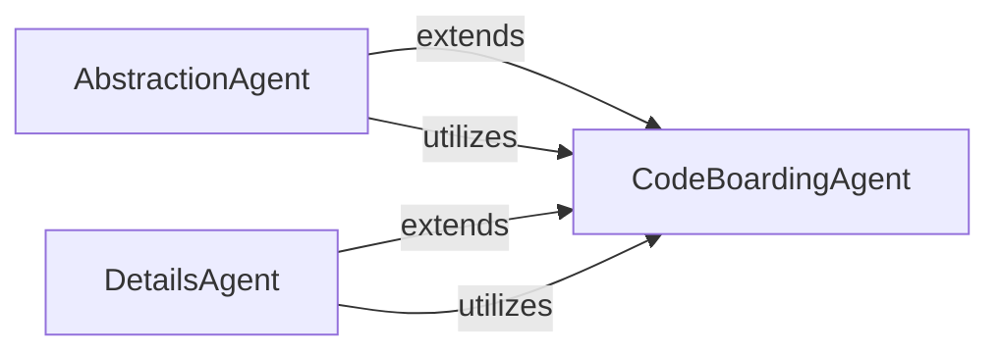

## Component Details

The Specialized Analysis Agents component encompasses agents designed for specific analytical tasks within the CodeBoarding system. These agents, namely the Abstraction Agent and the Details Agent, extend the core CodeBoardingAgent to perform specialized analyses, such as generating high-level abstractions or conducting in-depth, granular code examinations. They leverage the foundational capabilities of the core agent orchestrator to achieve their distinct analytical objectives.

### AbstractionAgent
An agent specialized in performing high-level abstraction analysis of a project. It extends the `CodeBoardingAgent`'s core capabilities to analyze Control Flow Graphs (CFG) and source code, generating initial insights and a conclusive analysis. It manages different prompts and parsers for its specific analysis steps.

**Related Classes/Methods**:

- <a href="https://github.com/CodeBoarding/CodeBoarding/blob/master/agents/abstraction_agent.py#L11-L72" target="_blank" rel="noopener noreferrer">`agents.abstraction_agent.AbstractionAgent` (11:72)</a>
- <a href="https://github.com/CodeBoarding/CodeBoarding/blob/master/agents/abstraction_agent.py#L12-L38" target="_blank" rel="noopener noreferrer">`agents.abstraction_agent.AbstractionAgent:__init__` (12:38)</a>
- <a href="https://github.com/CodeBoarding/CodeBoarding/blob/master/agents/abstraction_agent.py#L40-L45" target="_blank" rel="noopener noreferrer">`agents.abstraction_agent.AbstractionAgent:step_cfg` (40:45)</a>
- <a href="https://github.com/CodeBoarding/CodeBoarding/blob/master/agents/abstraction_agent.py#L47-L62" target="_blank" rel="noopener noreferrer">`agents.abstraction_agent.AbstractionAgent:step_source` (47:62)</a>
- <a href="https://github.com/CodeBoarding/CodeBoarding/blob/master/agents/abstraction_agent.py#L64-L72" target="_blank" rel="noopener noreferrer">`agents.abstraction_agent.AbstractionAgent:generate_analysis` (64:72)</a>

### DetailsAgent
An agent focused on providing detailed analysis of specific components within a project. It extends the `CodeBoardingAgent` to perform in-depth analysis of sub-CFGs, enhance structural insights, and generate detailed documentation for individual components.

**Related Classes/Methods**:

- <a href="https://github.com/CodeBoarding/CodeBoarding/blob/master/agents/details_agent.py#L12-L76" target="_blank" rel="noopener noreferrer">`agents.details_agent.DetailsAgent` (12:76)</a>
- <a href="https://github.com/CodeBoarding/CodeBoarding/blob/master/agents/details_agent.py#L13-L40" target="_blank" rel="noopener noreferrer">`agents.details_agent.DetailsAgent:__init__` (13:40)</a>
- <a href="https://github.com/CodeBoarding/CodeBoarding/blob/master/agents/details_agent.py#L42-L47" target="_blank" rel="noopener noreferrer">`agents.details_agent.DetailsAgent:step_subcfg` (42:47)</a>
- <a href="https://github.com/CodeBoarding/CodeBoarding/blob/master/agents/details_agent.py#L49-L56" target="_blank" rel="noopener noreferrer">`agents.details_agent.DetailsAgent:step_cfg` (49:56)</a>
- <a href="https://github.com/CodeBoarding/CodeBoarding/blob/master/agents/details_agent.py#L58-L67" target="_blank" rel="noopener noreferrer">`agents.details_agent.DetailsAgent:step_enhance_structure` (58:67)</a>
- <a href="https://github.com/CodeBoarding/CodeBoarding/blob/master/agents/details_agent.py#L69-L76" target="_blank" rel="noopener noreferrer">`agents.details_agent.DetailsAgent:step_analysis` (69:76)</a>

### [FAQ](https://github.com/CodeBoarding/GeneratedOnBoardings/tree/main?tab=readme-ov-file#faq)
