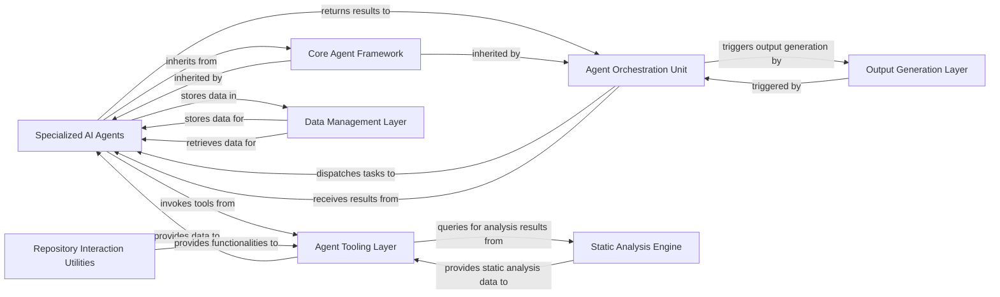

## Details

This document outlines the architecture of an AI-powered Software Engineering (AI4SE) tool, focusing on its core components and their interactions. The system is designed around an intelligent agent system pattern, where specialized AI agents perform distinct code analysis and documentation generation tasks, coordinated by a central orchestration unit. Key components include Specialized AI Agents, Core Agent Framework, Agent Orchestration Unit, Agent Tooling Layer, Static Analysis Engine, Data Management Layer, Output Generation Layer, and Repository Interaction Utilities. These components collectively form a robust, modular, and scalable architecture for complex code analysis and generation tasks.

### Specialized AI Agents [[Expand]](./Specialized_AI_Agents.md)
A collection of AI agents, each designed for a specific analysis task within the software engineering workflow. These agents inherit from the Core Agent Framework and leverage the Agent Tooling Layer to perform their specialized functions, such as generating abstractions, extracting details, analyzing diffs, planning, or validating code. They are distinct from the Agent Orchestration Unit, which coordinates their activities.

**Related Classes/Methods**:

- <a href="https://github.com/CodeBoarding/CodeBoarding/blob/main/agents/abstraction_agent.py#L9-L94" target="_blank" rel="noopener noreferrer">`agents.abstraction_agent.AbstractionAgent` (9:94)</a>
- <a href="https://github.com/CodeBoarding/CodeBoarding/blob/main/agents/details_agent.py#L11-L103" target="_blank" rel="noopener noreferrer">`agents.details_agent.DetailsAgent` (11:103)</a>
- <a href="https://github.com/CodeBoarding/CodeBoarding/blob/main/agents/diff_analyzer.py#L16-L130" target="_blank" rel="noopener noreferrer">`agents.diff_analyzer.DiffAnalyzingAgent` (16:130)</a>
- <a href="https://github.com/CodeBoarding/CodeBoarding/blob/main/agents/planner_agent.py#L8-L26" target="_blank" rel="noopener noreferrer">`agents.planner_agent.PlannerAgent` (8:26)</a>
- <a href="https://github.com/CodeBoarding/CodeBoarding/blob/main/agents/validator_agent.py#L8-L42" target="_blank" rel="noopener noreferrer">`agents.validator_agent.ValidatorAgent` (8:42)</a>

### Core Agent Framework
This component provides the foundational structure and common functionalities for all agents, including the specialized ones and the orchestrator. It defines the base CodeBoardingAgent class, ensuring consistency, reusability, and reducing boilerplate code across different agent implementations. It's crucial for maintaining a cohesive agent ecosystem.

**Related Classes/Methods**:

- <a href="https://github.com/CodeBoarding/CodeBoarding/blob/main/agents/agent.py" target="_blank" rel="noopener noreferrer">`agents/agent.py`</a>
- <a href="https://github.com/CodeBoarding/CodeBoarding/blob/main/agents/agent_responses.py" target="_blank" rel="noopener noreferrer">`agents/agent_responses.py`</a>
- <a href="https://github.com/CodeBoarding/CodeBoarding/blob/main/agents/prompts.py" target="_blank" rel="noopener noreferrer">`agents/prompts.py`</a>

### Agent Orchestration Unit
As the central brain, this component coordinates the overall workflow, manages the execution of specialized agents, and integrates their outputs. It embodies the "Intelligent Agent System" pattern by providing the high-level control flow and decision-making, ensuring that the various specialized agents work together towards a common goal (e.g., comprehensive documentation generation).

**Related Classes/Methods**:

- <a href="https://github.com/CodeBoarding/CodeBoarding/blob/main/agents/meta_agent.py" target="_blank" rel="noopener noreferrer">`agents/meta_agent.py`</a>

### Agent Tooling Layer
This layer provides a suite of tools that agents can utilize to interact with the codebase and external environments. It's essential for enabling agents to perform their tasks by giving them access to necessary information (e.g., source code, file structure, Git diffs). It promotes modularity by separating tool implementations from agent logic.

**Related Classes/Methods**:

- <a href="https://github.com/CodeBoarding/CodeBoarding/blob/main/agents/tools/read_file.py" target="_blank" rel="noopener noreferrer">`agents/tools/read_file.py`</a>
- <a href="https://github.com/CodeBoarding/CodeBoarding/blob/main/agents/tools/read_source.py" target="_blank" rel="noopener noreferrer">`agents/tools/read_source.py`</a>
- <a href="https://github.com/CodeBoarding/CodeBoarding/blob/main/agents/tools/read_git_diff.py" target="_blank" rel="noopener noreferrer">`agents/tools/read_git_diff.py`</a>

### Static Analysis Engine
This component is responsible for deep static analysis of the codebase, generating structured data like call graphs and structure graphs. It's fundamental for an AI4SE tool as it provides the raw, analytical insights about the code's structure and relationships, which agents then interpret and utilize.

**Related Classes/Methods**:

- `static_analyzer/pylint_analyze.py`
- <a href="https://github.com/CodeBoarding/CodeBoarding/blob/main/static_analyzer/pylint_graph_transform.py" target="_blank" rel="noopener noreferrer">`static_analyzer/pylint_graph_transform.py`</a>
- <a href="https://github.com/CodeBoarding/CodeBoarding/blob/main/static_analyzer/reference_lines.py" target="_blank" rel="noopener noreferrer">`static_analyzer/reference_lines.py`</a>

### Data Management Layer
Handles the persistence, retrieval, and management of structured data, such as analysis results and intermediate states. This component is crucial for efficiency, allowing the system to store, query, and reuse analysis results, preventing redundant computations and supporting complex workflows.

**Related Classes/Methods**:

- <a href="https://github.com/CodeBoarding/CodeBoarding/blob/main/duckdb_crud.py" target="_blank" rel="noopener noreferrer">`duckdb_crud.py`</a>

### Output Generation Layer
Transforms processed information and analysis results into various human-readable formats. This component is vital for the usability of the AI4SE tool, as it makes the system's insights consumable by end-users, fulfilling the ultimate goal of documentation or analysis reporting.

**Related Classes/Methods**:

- <a href="https://github.com/CodeBoarding/CodeBoarding/blob/main/output_generators/html.py" target="_blank" rel="noopener noreferrer">`output_generators/html.py`</a>
- <a href="https://github.com/CodeBoarding/CodeBoarding/blob/main/output_generators/markdown.py" target="_blank" rel="noopener noreferrer">`output_generators/markdown.py`</a>
- <a href="https://github.com/CodeBoarding/CodeBoarding/blob/main/output_generators/sphinx.py" target="_blank" rel="noopener noreferrer">`output_generators/sphinx.py`</a>
- <a href="https://github.com/CodeBoarding/CodeBoarding/blob/main/output_generators/html_template.py" target="_blank" rel="noopener noreferrer">`output_generators/html_template.py`</a>

### Repository Interaction Utilities
Provides functionalities for interacting with Git repositories. This is a foundational utility for any code analysis tool, enabling agents to understand code changes, access repository metadata, and perform operations like cloning or diffing.

**Related Classes/Methods**:

- <a href="https://github.com/CodeBoarding/CodeBoarding/blob/main/repo_utils/git_diff.py" target="_blank" rel="noopener noreferrer">`repo_utils/git_diff.py`</a>
- <a href="https://github.com/CodeBoarding/CodeBoarding/blob/main/repo_utils/errors.py" target="_blank" rel="noopener noreferrer">`repo_utils/errors.py`</a>

### [FAQ](https://github.com/CodeBoarding/GeneratedOnBoardings/tree/main?tab=readme-ov-file#faq)
