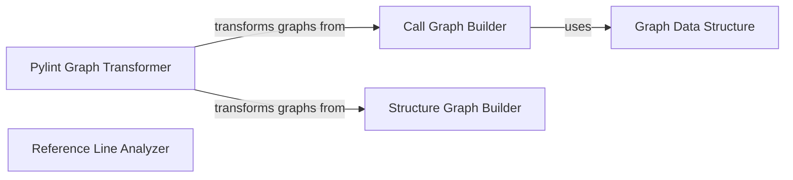

## Component Details

This subsystem is responsible for performing static analysis of Python projects, building various graph representations such as call graphs and structure graphs, transforming these graph data structures into usable formats, and precisely locating code references within the project. It leverages AST traversal and external tools to achieve its analysis and graphing capabilities.

### Call Graph Builder
This component constructs a call graph for a given Python project. It traverses the Abstract Syntax Tree (AST) of Python files, identifies function calls, resolves callees, and builds a directed graph representing the flow of calls between functions and methods.

**Related Classes/Methods**:

- <a href="https://github.com/CodeBoarding/CodeBoarding/blob/master/static_analyzer/pylint_analyze/call_graph_builder.py#L100-L105" target="_blank" rel="noopener noreferrer">`static_analyzer.pylint_analyze.call_graph_builder.CallGraphBuilder:__init__` (100:105)</a>
- <a href="https://github.com/CodeBoarding/CodeBoarding/blob/master/static_analyzer/pylint_analyze/call_graph_builder.py#L107-L125" target="_blank" rel="noopener noreferrer">`static_analyzer.pylint_analyze.call_graph_builder.CallGraphBuilder:build` (107:125)</a>
- <a href="https://github.com/CodeBoarding/CodeBoarding/blob/master/static_analyzer/pylint_analyze/call_graph_builder.py#L137-L159" target="_blank" rel="noopener noreferrer">`static_analyzer.pylint_analyze.call_graph_builder.CallGraphBuilder:_process_file` (137:159)</a>
- <a href="https://github.com/CodeBoarding/CodeBoarding/blob/master/static_analyzer/pylint_analyze/call_graph_builder.py#L161-L168" target="_blank" rel="noopener noreferrer">`static_analyzer.pylint_analyze.call_graph_builder.CallGraphBuilder:_visit_module` (161:168)</a>
- <a href="https://github.com/CodeBoarding/CodeBoarding/blob/master/static_analyzer/pylint_analyze/call_graph_builder.py#L174-L195" target="_blank" rel="noopener noreferrer">`static_analyzer.pylint_analyze.call_graph_builder.CallGraphBuilder:_visit_function` (174:195)</a>
- <a href="https://github.com/CodeBoarding/CodeBoarding/blob/master/static_analyzer/pylint_analyze/call_graph_builder.py#L198-L216" target="_blank" rel="noopener noreferrer">`static_analyzer.pylint_analyze.call_graph_builder.CallGraphBuilder:_resolve_callee` (198:216)</a>

### Structure Graph Builder
This component is responsible for building structural graphs of the codebase, likely using external tools like pyreverse. It collects file paths and orchestrates the graph generation process to visualize code structure.

**Related Classes/Methods**:

- <a href="https://github.com/CodeBoarding/CodeBoarding/blob/master/static_analyzer/pylint_analyze/structure_graph_builder.py#L18-L46" target="_blank" rel="noopener noreferrer">`static_analyzer.pylint_analyze.structure_graph_builder.StructureGraphBuilder:run_pyreverse` (18:46)</a>
- <a href="https://github.com/CodeBoarding/CodeBoarding/blob/master/static_analyzer/pylint_analyze/structure_graph_builder.py#L48-L51" target="_blank" rel="noopener noreferrer">`static_analyzer.pylint_analyze.structure_graph_builder.StructureGraphBuilder:build` (48:51)</a>

### Pylint Graph Transformer
This component is responsible for transforming graph data, likely generated by Pylint or similar tools, into a usable format. It includes functionality for loading and scanning directories to process graph-related information.

**Related Classes/Methods**:

- <a href="https://github.com/CodeBoarding/CodeBoarding/blob/master/static_analyzer/pylint_graph_transform.py#L10-L13" target="_blank" rel="noopener noreferrer">`static_analyzer.pylint_graph_transform.DotGraphTransformer:__init__` (10:13)</a>
- <a href="https://github.com/CodeBoarding/CodeBoarding/blob/master/static_analyzer/pylint_graph_transform.py#L15-L19" target="_blank" rel="noopener noreferrer">`static_analyzer.pylint_graph_transform.DotGraphTransformer:_load` (15:19)</a>
- <a href="https://github.com/CodeBoarding/CodeBoarding/blob/master/static_analyzer/pylint_graph_transform.py#L44-L65" target="_blank" rel="noopener noreferrer">`static_analyzer.pylint_graph_transform.DotGraphTransformer:transform` (44:65)</a>

### Reference Line Analyzer
This component is dedicated to static analysis, specifically finding the location (line numbers) of fully qualified names (FQNs) within source code files. It uses AST traversal to pinpoint exact code references.

**Related Classes/Methods**:

- <a href="https://github.com/CodeBoarding/CodeBoarding/blob/master/static_analyzer/reference_lines.py#L4-L52" target="_blank" rel="noopener noreferrer">`static_analyzer.reference_lines:find_fqn_location` (4:52)</a>

### Graph Data Structure
This component provides the fundamental data structure for representing directed graphs, used by other static analysis components like the Call Graph Builder. It supports adding nodes and edges and querying graph properties.

**Related Classes/Methods**:

- <a href="https://github.com/CodeBoarding/CodeBoarding/blob/master/static_analyzer/pylint_analyze/call_graph_builder.py#L10-L37" target="_blank" rel="noopener noreferrer">`static_analyzer.pylint_analyze.call_graph_builder.DiGraph` (10:37)</a>

### [FAQ](https://github.com/CodeBoarding/GeneratedOnBoardings/tree/main?tab=readme-ov-file#faq)
