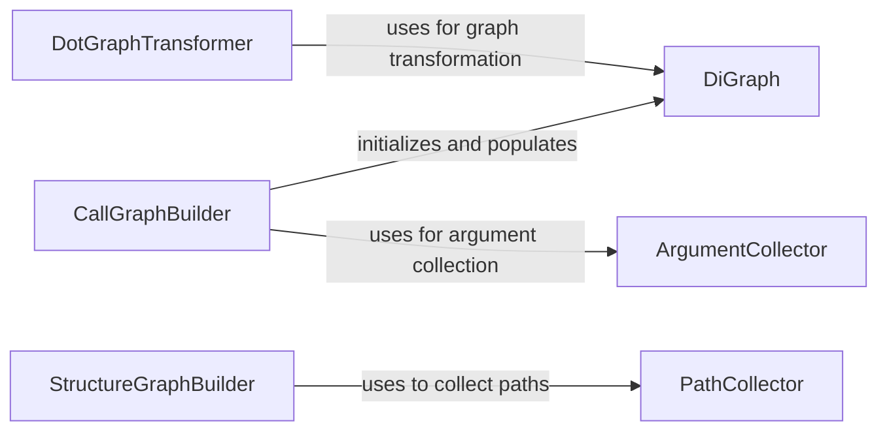

## Component Details

The Static Analysis Engine performs static analysis of the codebase to generate various graphical representations, such as call graphs and structure graphs, and handles the transformation of this graph data for further processing. It leverages components like CallGraphBuilder and StructureGraphBuilder to create initial graph representations, and DotGraphTransformer to process and refine these graphs.

### DotGraphTransformer
This component is responsible for loading a DOT graph file, scanning a directory for Python packages, and transforming the graph based on the identified packages. It filters graph edges to include only those where both source and destination nodes belong to recognized packages within the repository.

**Related Classes/Methods**:

- <a href="https://github.com/CodeBoarding/CodeBoarding/blob/master/static_analyzer/pylint_graph_transform.py#L9-L65" target="_blank" rel="noopener noreferrer">`static_analyzer.pylint_graph_transform.DotGraphTransformer` (9:65)</a>
- <a href="https://github.com/CodeBoarding/CodeBoarding/blob/master/static_analyzer/pylint_graph_transform.py#L10-L13" target="_blank" rel="noopener noreferrer">`static_analyzer.pylint_graph_transform.DotGraphTransformer:__init__` (10:13)</a>
- <a href="https://github.com/CodeBoarding/CodeBoarding/blob/master/static_analyzer/pylint_graph_transform.py#L15-L19" target="_blank" rel="noopener noreferrer">`static_analyzer.pylint_graph_transform.DotGraphTransformer:_load` (15:19)</a>

### CallGraphBuilder
This component builds a static call graph of Python code. It traverses Python files, parses their Abstract Syntax Trees (ASTs), identifies function and method calls, and constructs a directed graph representing the call relationships. It also handles the resolution of callees and collects arguments for each call.

**Related Classes/Methods**:

- <a href="https://github.com/CodeBoarding/CodeBoarding/blob/master/static_analyzer/pylint_analyze/call_graph_builder.py#L90-L245" target="_blank" rel="noopener noreferrer">`static_analyzer.pylint_analyze.call_graph_builder.CallGraphBuilder` (90:245)</a>
- <a href="https://github.com/CodeBoarding/CodeBoarding/blob/master/static_analyzer/pylint_analyze/call_graph_builder.py#L107-L125" target="_blank" rel="noopener noreferrer">`static_analyzer.pylint_analyze.call_graph_builder.CallGraphBuilder:build` (107:125)</a>

### DiGraph
This component represents a directed graph data structure. It provides methods for adding nodes and edges, and for querying the number of nodes and edges. It also includes functionality to convert the graph to a node-link data format suitable for visualization.

**Related Classes/Methods**:

- <a href="https://github.com/CodeBoarding/CodeBoarding/blob/master/static_analyzer/pylint_analyze/call_graph_builder.py#L10-L37" target="_blank" rel="noopener noreferrer">`static_analyzer.pylint_analyze.call_graph_builder.DiGraph` (10:37)</a>
- <a href="https://github.com/CodeBoarding/CodeBoarding/blob/master/static_analyzer/pylint_analyze/call_graph_builder.py#L18-L21" target="_blank" rel="noopener noreferrer">`static_analyzer.pylint_analyze.call_graph_builder.DiGraph:add_edge` (18:21)</a>
- <a href="https://github.com/CodeBoarding/CodeBoarding/blob/master/static_analyzer/pylint_analyze/call_graph_builder.py#L15-L16" target="_blank" rel="noopener noreferrer">`static_analyzer.pylint_analyze.call_graph_builder.DiGraph:add_node` (15:16)</a>
- <a href="https://github.com/CodeBoarding/CodeBoarding/blob/master/static_analyzer/pylint_analyze/call_graph_builder.py#L23-L24" target="_blank" rel="noopener noreferrer">`static_analyzer.pylint_analyze.call_graph_builder.DiGraph:number_of_nodes` (23:24)</a>
- <a href="https://github.com/CodeBoarding/CodeBoarding/blob/master/static_analyzer/pylint_analyze/call_graph_builder.py#L26-L27" target="_blank" rel="noopener noreferrer">`static_analyzer.pylint_analyze.call_graph_builder.DiGraph:number_of_edges` (26:27)</a>
- <a href="https://github.com/CodeBoarding/CodeBoarding/blob/master/static_analyzer/pylint_analyze/call_graph_builder.py#L11-L13" target="_blank" rel="noopener noreferrer">`static_analyzer.pylint_analyze.call_graph_builder.DiGraph:__init__` (11:13)</a>

### ArgumentCollector
This component is responsible for collecting and representing arguments from function calls. It provides a utility function to extract positional and keyword arguments from an AST `Call` node, converting them into string representations.

**Related Classes/Methods**:

- <a href="https://github.com/CodeBoarding/CodeBoarding/blob/master/static_analyzer/pylint_analyze/call_graph_builder.py#L61-L87" target="_blank" rel="noopener noreferrer">`static_analyzer.pylint_analyze.call_graph_builder._collect_arguments` (61:87)</a>
- <a href="https://github.com/CodeBoarding/CodeBoarding/blob/master/static_analyzer/pylint_analyze/call_graph_builder.py#L40-L58" target="_blank" rel="noopener noreferrer">`static_analyzer.pylint_analyze.call_graph_builder._expr_to_str` (40:58)</a>

### StructureGraphBuilder
This component leverages Pylint's `pyreverse` tool to generate structural graphs (class and package diagrams) of Python code. It iterates through specified packages and invokes `pyreverse` to produce DOT files, then renames and saves the relevant class diagram.

**Related Classes/Methods**:

- <a href="https://github.com/CodeBoarding/CodeBoarding/blob/master/static_analyzer/pylint_analyze/structure_graph_builder.py#L10-L51" target="_blank" rel="noopener noreferrer">`static_analyzer.pylint_analyze.structure_graph_builder.StructureGraphBuilder` (10:51)</a>
- <a href="https://github.com/CodeBoarding/CodeBoarding/blob/master/static_analyzer/pylint_analyze/structure_graph_builder.py#L48-L51" target="_blank" rel="noopener noreferrer">`static_analyzer.pylint_analyze.structure_graph_builder.StructureGraphBuilder:build` (48:51)</a>

### PathCollector
This component is responsible for collecting Python package paths within a given root directory. It recursively walks through directories, identifying packages by the presence of an `__init__.py` file and excluding specified directories like 'test' or '__pycache__'.

**Related Classes/Methods**:

- <a href="https://github.com/CodeBoarding/CodeBoarding/blob/master/static_analyzer/pylint_analyze/structure_graph_builder.py#L54-L71" target="_blank" rel="noopener noreferrer">`static_analyzer.pylint_analyze.structure_graph_builder:collect_paths` (54:71)</a>
- <a href="https://github.com/CodeBoarding/CodeBoarding/blob/master/static_analyzer/pylint_analyze/structure_graph_builder.py#L59-L68" target="_blank" rel="noopener noreferrer">`static_analyzer.pylint_analyze.structure_graph_builder.collect_paths._walk` (59:68)</a>

### [FAQ](https://github.com/CodeBoarding/GeneratedOnBoardings/tree/main?tab=readme-ov-file#faq)
