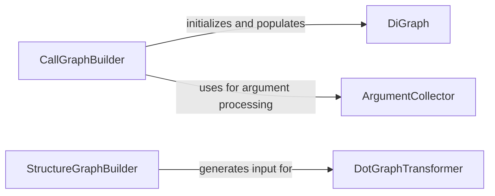

## Component Details

The Static Analysis Engine is a core subsystem responsible for analyzing Python source code to build various graph representations. Its main flow involves constructing call graphs to represent function/method invocations and structural graphs to depict module/class relationships. These graphs are then transformed to provide insights into the codebase's structure and control flow, aiding in understanding and navigating complex projects.

### DotGraphTransformer
This component is responsible for loading a DOT graph file, scanning the repository for Python packages, and transforming the graph to show relationships between methods within those packages. It identifies source and destination nodes that belong to recognized packages and constructs a simplified control flow graph.

**Related Classes/Methods**:

- <a href="https://github.com/CodeBoarding/CodeBoarding/blob/master/static_analyzer/pylint_graph_transform.py#L9-L69" target="_blank" rel="noopener noreferrer">`static_analyzer.pylint_graph_transform.DotGraphTransformer` (9:69)</a>
- <a href="https://github.com/CodeBoarding/CodeBoarding/blob/master/static_analyzer/pylint_graph_transform.py#L10-L13" target="_blank" rel="noopener noreferrer">`static_analyzer.pylint_graph_transform.DotGraphTransformer:__init__` (10:13)</a>
- <a href="https://github.com/CodeBoarding/CodeBoarding/blob/master/static_analyzer/pylint_graph_transform.py#L15-L19" target="_blank" rel="noopener noreferrer">`static_analyzer.pylint_graph_transform.DotGraphTransformer:_load` (15:19)</a>
- <a href="https://github.com/CodeBoarding/CodeBoarding/blob/master/static_analyzer/pylint_graph_transform.py#L21-L42" target="_blank" rel="noopener noreferrer">`static_analyzer.pylint_graph_transform.DotGraphTransformer.bfs_scan_directory` (21:42)</a>
- <a href="https://github.com/CodeBoarding/CodeBoarding/blob/master/static_analyzer/pylint_graph_transform.py#L44-L69" target="_blank" rel="noopener noreferrer">`static_analyzer.pylint_graph_transform.DotGraphTransformer.transform` (44:69)</a>

### CallGraphBuilder
This component is responsible for building a call graph from Python source code. It iterates through Python files, processes each file to identify functions and their calls, and adds nodes and edges to a directed graph representation. It also handles the resolution of callee names and argument collection.

**Related Classes/Methods**:

- <a href="https://github.com/CodeBoarding/CodeBoarding/blob/master/static_analyzer/pylint_analyze/call_graph_builder.py#L90-L245" target="_blank" rel="noopener noreferrer">`static_analyzer.pylint_analyze.call_graph_builder.CallGraphBuilder` (90:245)</a>
- <a href="https://github.com/CodeBoarding/CodeBoarding/blob/master/static_analyzer/pylint_analyze/call_graph_builder.py#L100-L105" target="_blank" rel="noopener noreferrer">`static_analyzer.pylint_analyze.call_graph_builder.CallGraphBuilder:__init__` (100:105)</a>
- <a href="https://github.com/CodeBoarding/CodeBoarding/blob/master/static_analyzer/pylint_analyze/call_graph_builder.py#L107-L125" target="_blank" rel="noopener noreferrer">`static_analyzer.pylint_analyze.call_graph_builder.CallGraphBuilder:build` (107:125)</a>
- <a href="https://github.com/CodeBoarding/CodeBoarding/blob/master/static_analyzer/pylint_analyze/call_graph_builder.py#L137-L159" target="_blank" rel="noopener noreferrer">`static_analyzer.pylint_analyze.call_graph_builder.CallGraphBuilder:_process_file` (137:159)</a>
- <a href="https://github.com/CodeBoarding/CodeBoarding/blob/master/static_analyzer/pylint_analyze/call_graph_builder.py#L161-L168" target="_blank" rel="noopener noreferrer">`static_analyzer.pylint_analyze.call_graph_builder.CallGraphBuilder:_visit_module` (161:168)</a>
- <a href="https://github.com/CodeBoarding/CodeBoarding/blob/master/static_analyzer/pylint_analyze/call_graph_builder.py#L174-L195" target="_blank" rel="noopener noreferrer">`static_analyzer.pylint_analyze.call_graph_builder.CallGraphBuilder:_visit_function` (174:195)</a>
- <a href="https://github.com/CodeBoarding/CodeBoarding/blob/master/static_analyzer/pylint_analyze/call_graph_builder.py#L198-L216" target="_blank" rel="noopener noreferrer">`static_analyzer.pylint_analyze.call_graph_builder.CallGraphBuilder:_resolve_callee` (198:216)</a>
- <a href="https://github.com/CodeBoarding/CodeBoarding/blob/master/static_analyzer/pylint_analyze/call_graph_builder.py#L219-L224" target="_blank" rel="noopener noreferrer">`static_analyzer.pylint_analyze.call_graph_builder.CallGraphBuilder:_as_string` (219:224)</a>
- <a href="https://github.com/CodeBoarding/CodeBoarding/blob/master/static_analyzer/pylint_analyze/call_graph_builder.py#L236-L245" target="_blank" rel="noopener noreferrer">`static_analyzer.pylint_analyze.call_graph_builder.CallGraphBuilder.fix_reference_name` (236:245)</a>

### DiGraph
This component represents a directed graph used for storing the call graph. It provides methods for adding nodes and edges to the graph and for querying the number of nodes and edges.

**Related Classes/Methods**:

- <a href="https://github.com/CodeBoarding/CodeBoarding/blob/master/static_analyzer/pylint_analyze/call_graph_builder.py#L10-L37" target="_blank" rel="noopener noreferrer">`static_analyzer.pylint_analyze.call_graph_builder.DiGraph` (10:37)</a>
- <a href="https://github.com/CodeBoarding/CodeBoarding/blob/master/static_analyzer/pylint_analyze/call_graph_builder.py#L18-L21" target="_blank" rel="noopener noreferrer">`static_analyzer.pylint_analyze.call_graph_builder.DiGraph:add_edge` (18:21)</a>
- <a href="https://github.com/CodeBoarding/CodeBoarding/blob/master/static_analyzer/pylint_analyze/call_graph_builder.py#L15-L16" target="_blank" rel="noopener noreferrer">`static_analyzer.pylint_analyze.call_graph_builder.DiGraph.add_node` (15:16)</a>
- <a href="https://github.com/CodeBoarding/CodeBoarding/blob/master/static_analyzer/pylint_analyze/call_graph_builder.py#L23-L24" target="_blank" rel="noopener noreferrer">`static_analyzer.pylint_analyze.call_graph_builder.DiGraph.number_of_nodes` (23:24)</a>
- <a href="https://github.com/CodeBoarding/CodeBoarding/blob/master/static_analyzer/pylint_analyze/call_graph_builder.py#L26-L27" target="_blank" rel="noopener noreferrer">`static_analyzer.pylint_analyze.call_graph_builder.DiGraph.number_of_edges` (26:27)</a>

### ArgumentCollector
This component is responsible for collecting arguments from function calls within the source code. It converts expressions to string representations.

**Related Classes/Methods**:

- <a href="https://github.com/CodeBoarding/CodeBoarding/blob/master/static_analyzer/pylint_analyze/call_graph_builder.py#L61-L87" target="_blank" rel="noopener noreferrer">`static_analyzer.pylint_analyze.call_graph_builder._collect_arguments` (61:87)</a>
- <a href="https://github.com/CodeBoarding/CodeBoarding/blob/master/static_analyzer/pylint_analyze/call_graph_builder.py#L40-L58" target="_blank" rel="noopener noreferrer">`static_analyzer.pylint_analyze.call_graph_builder._expr_to_str` (40:58)</a>

### StructureGraphBuilder
This component is responsible for building a structure graph, likely representing class or module relationships, by running pyreverse and collecting file paths.

**Related Classes/Methods**:

- <a href="https://github.com/CodeBoarding/CodeBoarding/blob/master/static_analyzer/pylint_analyze/structure_graph_builder.py#L10-L51" target="_blank" rel="noopener noreferrer">`static_analyzer.pylint_analyze.structure_graph_builder.StructureGraphBuilder` (10:51)</a>
- <a href="https://github.com/CodeBoarding/CodeBoarding/blob/master/static_analyzer/pylint_analyze/structure_graph_builder.py#L18-L46" target="_blank" rel="noopener noreferrer">`static_analyzer.pylint_analyze.structure_graph_builder.StructureGraphBuilder:run_pyreverse` (18:46)</a>
- <a href="https://github.com/CodeBoarding/CodeBoarding/blob/master/static_analyzer/pylint_analyze/structure_graph_builder.py#L48-L51" target="_blank" rel="noopener noreferrer">`static_analyzer.pylint_analyze.structure_graph_builder.StructureGraphBuilder:build` (48:51)</a>
- <a href="https://github.com/CodeBoarding/CodeBoarding/blob/master/static_analyzer/pylint_analyze/structure_graph_builder.py#L54-L71" target="_blank" rel="noopener noreferrer">`static_analyzer.pylint_analyze.structure_graph_builder:collect_paths` (54:71)</a>
- <a href="https://github.com/CodeBoarding/CodeBoarding/blob/master/static_analyzer/pylint_analyze/structure_graph_builder.py#L59-L68" target="_blank" rel="noopener noreferrer">`static_analyzer.pylint_analyze.structure_graph_builder.collect_paths._walk` (59:68)</a>

### [FAQ](https://github.com/CodeBoarding/GeneratedOnBoardings/tree/main?tab=readme-ov-file#faq)
