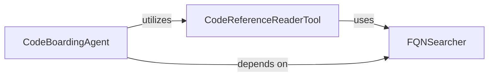

## Component Details

This graph illustrates the core components of a code analysis system. The `CodeBoardingAgent` acts as the central orchestrator, utilizing the `CodeReferenceReaderTool` to access and read source code. The `CodeReferenceReaderTool`, in turn, relies on the `FQNSearcher` to precisely locate fully qualified names within the source files. The `CodeBoardingAgent` also has a direct dependency on the `FQNSearcher` for its static analysis needs.

### CodeBoardingAgent
This component acts as the main agent for code analysis within the CodeBoarding system. It orchestrates various tools to process code references, specifically focusing on fixing source code reference lines by reading file content and determining the exact line numbers for fully qualified names (FQNs).

**Related Classes/Methods**:

- <a href="https://github.com/CodeBoarding/CodeBoarding/blob/master/agents/agent.py#L73-L94" target="_blank" rel="noopener noreferrer">`agents.agent.CodeBoardingAgent:fix_source_code_reference_lines` (73:94)</a>
- <a href="https://github.com/CodeBoarding/CodeBoarding/blob/master/agents/agent.py#L46-L62" target="_blank" rel="noopener noreferrer">`agents.agent.CodeBoardingAgent:_invoke` (46:62)</a>
- <a href="https://github.com/CodeBoarding/CodeBoarding/blob/master/agents/agent.py#L64-L71" target="_blank" rel="noopener noreferrer">`agents.agent.CodeBoardingAgent:_parse_invoke` (64:71)</a>

### CodeReferenceReaderTool
This component provides functionality to retrieve the source code for specified Python modules, classes, functions, or methods. It manages a cache of indexed files and can read the content of a file given a Python code reference, also attempting to locate the exact lines for a given FQN within that file.

**Related Classes/Methods**:

- <a href="https://github.com/CodeBoarding/CodeBoarding/blob/master/agents/tools/read_source.py#L91-L156" target="_blank" rel="noopener noreferrer">`agents.tools.read_source.CodeReferenceReader.read_file` (91:156)</a>
- <a href="https://github.com/CodeBoarding/CodeBoarding/blob/master/agents/tools/read_source.py#L48-L89" target="_blank" rel="noopener noreferrer">`agents.tools.read_source.CodeReferenceReader._run` (48:89)</a>

### FQNSearcher
This component is responsible for statically analyzing Python source code to find the start and end line numbers of a given fully qualified name (FQN), which can be a class, function, or method. It parses the source code into an Abstract Syntax Tree (AST) and traverses it to locate the specified FQN. It serves as a core utility for static analysis.

**Related Classes/Methods**:

- <a href="https://github.com/CodeBoarding/CodeBoarding/blob/master/static_analyzer/reference_lines.py#L4-L52" target="_blank" rel="noopener noreferrer">`static_analyzer.reference_lines:find_fqn_location` (4:52)</a>
- <a href="https://github.com/CodeBoarding/CodeBoarding/blob/master/static_analyzer/reference_lines.py#L21-L30" target="_blank" rel="noopener noreferrer">`static_analyzer.reference_lines.find_fqn_location.find_node` (21:30)</a>
- `static_analyzer.reference_lines.find_fqn_location.LineCounter` (full file reference)
- `static_analyzer.reference_lines.find_fqn_location.LineCounter.visit` (full file reference)

### [FAQ](https://github.com/CodeBoarding/GeneratedOnBoardings/tree/main?tab=readme-ov-file#faq)
