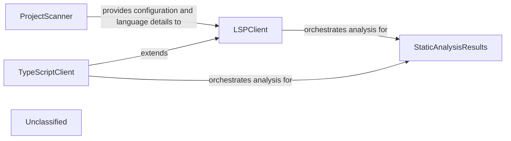

## Details

The static analysis subsystem orchestrates the extraction of comprehensive code insights. It begins with the `ProjectScanner`, which identifies programming languages and their associated LSP server configurations using an external scanning tool. This initial data is then consumed by the `LSPClient`, a generic component responsible for managing communication with Language Server Protocol servers. For specific languages like TypeScript, the `TypeScriptClient` extends `LSPClient` to handle language-specific configurations. Both `LSPClient` and `TypeScriptClient` perform detailed static analysis, extracting symbols, call graphs, and class hierarchies, and then populate the `StaticAnalysisResults` component, which serves as the central repository for all aggregated analysis data.

### ProjectScanner
Initiates the static analysis process by leveraging the external `tokei` tool to scan the project repository. It identifies programming languages used, their code distribution, and relevant file suffixes. Crucially, it also determines the appropriate Language Server Protocol (LSP) server commands for each detected language, preparing a structured list of `ProgrammingLanguage` objects. This component acts as the initial data gatherer, providing the necessary configuration and language-specific details for subsequent LSP-based analysis.

**Related Classes/Methods**:

- <a href="https://github.com/CodeBoarding/CodeBoarding/blob/main/static_analyzer/scanner.py#L13-L82" target="_blank" rel="noopener noreferrer">`ProjectScanner`:13-82</a>

### LSPClient
Serves as the generic Language Server Protocol client. It manages the communication lifecycle with an LSP server (initialization, sending requests, receiving responses, shutdown). It orchestrates the detailed static analysis for individual files and the entire workspace, extracting symbols, imports, call graphs, and class hierarchies. It populates the `StaticAnalysisResults` with its findings.

**Related Classes/Methods**:

- <a href="https://github.com/CodeBoarding/CodeBoarding/blob/main/static_analyzer/lsp_client/client.py#L37-L924" target="_blank" rel="noopener noreferrer">`LSPClient`:37-924</a>

### TypeScriptClient
A specialized implementation of `LSPClient` tailored for TypeScript projects. It handles TypeScript-specific initialization parameters, workspace configuration (e.g., processing `tsconfig.json`), and file discovery, ensuring the LSP server is correctly set up for TypeScript analysis. This component exemplifies the extensibility of the static analysis engine for different programming languages and also populates `StaticAnalysisResults`.

**Related Classes/Methods**:

- <a href="https://github.com/CodeBoarding/CodeBoarding/blob/main/static_analyzer/lsp_client/typescript_client.py#L10-L214" target="_blank" rel="noopener noreferrer">`TypeScriptClient`:10-214</a>

### StaticAnalysisResults
This central component acts as a repository for all aggregated static analysis results across different programming languages. It collects and manages various types of analysis data, including class hierarchies, control flow graphs, package dependencies, and source code references, provided by the LSP clients. It offers methods to add and retrieve these structured results for downstream processing and consumption.

**Related Classes/Methods**:

- <a href="https://github.com/CodeBoarding/CodeBoarding/blob/main/static_analyzer/analysis_result.py#L6-L171" target="_blank" rel="noopener noreferrer">`StaticAnalysisResults`:6-171</a>

### Unclassified
Component for all unclassified files and utility functions (Utility functions/External Libraries/Dependencies)

**Related Classes/Methods**: _None_

### Unclassified
Component for all unclassified files and utility functions (Utility functions/External Libraries/Dependencies)

**Related Classes/Methods**: _None_

### [FAQ](https://github.com/CodeBoarding/GeneratedOnBoardings/tree/main?tab=readme-ov-file#faq)
