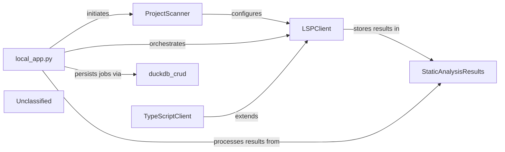

## Details

The system operates as a FastAPI application, local_app.py, which serves as the central orchestrator for generating documentation and diagrams from GitHub repositories. It manages job lifecycles, from creation and status tracking to the actual execution of static analysis and documentation generation. The ProjectScanner initiates the analysis by identifying programming languages and their configurations. Subsequently, specialized LSPClient implementations (like TypeScriptClient) perform detailed static analysis, populating the StaticAnalysisResults with structured data. Finally, the local_app.py processes these results to generate the desired documentation and diagrams.

### local_app.py
The core application component, responsible for exposing API endpoints for job management (creation, status retrieval) and orchestrating the entire documentation and diagram generation workflow. It handles repository cloning, triggers the static analysis process, and manages the storage and retrieval of generated results. It uses `duckdb_crud` for job persistence and `utils` for temporary folder management.

**Related Classes/Methods**:

- <a href="https://github.com/CodeBoarding/CodeBoarding/blob/main/local_app.py#L165-L182" target="_blank" rel="noopener noreferrer">`start_generation_job`:165-182</a>
- <a href="https://github.com/CodeBoarding/CodeBoarding/blob/main/local_app.py#L92-L161" target="_blank" rel="noopener noreferrer">`generate_onboarding`:92-161</a>
- <a href="https://github.com/CodeBoarding/CodeBoarding/blob/main/local_app.py#L243-L293" target="_blank" rel="noopener noreferrer">`start_docs_generation_job`:243-293</a>
- <a href="https://github.com/CodeBoarding/CodeBoarding/blob/main/local_app.py#L376-L440" target="_blank" rel="noopener noreferrer">`process_docs_generation_job`:376-440</a>

### ProjectScanner
Initiates the static analysis process by leveraging the external `tokei` tool to scan the project repository. It identifies programming languages used, their code distribution, and relevant file suffixes. Crucially, it also determines the appropriate Language Server Protocol (LSP) server commands for each detected language, preparing a structured list of `ProgrammingLanguage` objects. This component acts as the initial data gatherer, providing the necessary configuration and language-specific details for subsequent LSP-based analysis.

**Related Classes/Methods**:

- <a href="https://github.com/CodeBoarding/CodeBoarding/blob/main/static_analyzer/scanner.py#L13-L82" target="_blank" rel="noopener noreferrer">`ProjectScanner`:13-82</a>

### LSPClient
Serves as the generic Language Server Protocol client. It manages the communication lifecycle with an LSP server (initialization, sending requests, receiving responses, shutdown). It orchestrates the detailed static analysis for individual files and the entire workspace, extracting symbols, imports, call graphs, and class hierarchies. It populates the `StaticAnalysisResults` with its findings.

**Related Classes/Methods**:

- <a href="https://github.com/CodeBoarding/CodeBoarding/blob/main/static_analyzer/lsp_client/client.py#L37-L924" target="_blank" rel="noopener noreferrer">`LSPClient`:37-924</a>

### TypeScriptClient
A specialized implementation of `LSPClient` tailored for TypeScript projects. It handles TypeScript-specific initialization parameters, workspace configuration (e.g., processing `tsconfig.json`), and file discovery, ensuring the LSP server is correctly set up for TypeScript analysis. This component exemplifies the extensibility of the static analysis engine for different programming languages and also populates `StaticAnalysisResults`.

**Related Classes/Methods**:

- <a href="https://github.com/CodeBoarding/CodeBoarding/blob/main/static_analyzer/lsp_client/typescript_client.py#L10-L214" target="_blank" rel="noopener noreferrer">`TypeScriptClient`:10-214</a>

### StaticAnalysisResults
This central component acts as a repository for all aggregated static analysis results across different programming languages. It collects and manages various types of analysis data, including class hierarchies, control flow graphs, package dependencies, and source code references, provided by the LSP clients. It offers methods to add and retrieve these structured results for downstream processing and consumption.

**Related Classes/Methods**:

- <a href="https://github.com/CodeBoarding/CodeBoarding/blob/main/static_analyzer/analysis_result.py#L6-L171" target="_blank" rel="noopener noreferrer">`StaticAnalysisResults`:6-171</a>

### duckdb_crud
A component responsible for persisting and retrieving job-related information, likely interacting with a DuckDB database.

**Related Classes/Methods**: _None_

### Unclassified
Component for all unclassified files and utility functions (Utility functions/External Libraries/Dependencies)

**Related Classes/Methods**: _None_

### [FAQ](https://github.com/CodeBoarding/GeneratedOnBoardings/tree/main?tab=readme-ov-file#faq)
