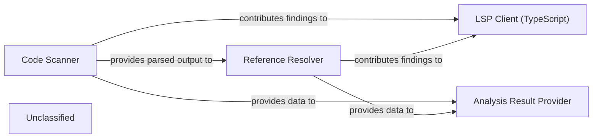

## Details

The Static Analysis Engine subsystem is responsible for performing deep, language-specific analysis of source code, including reference resolution and integration with the VS Code environment. It processes raw source code and produces structured analysis results for downstream components.

### Code Scanner
This component performs the initial lexical and syntactical analysis of source code. It breaks down raw code into tokens and constructs an intermediate representation (e.g., an Abstract Syntax Tree), serving as the foundational input for further analysis.

**Related Classes/Methods**:

- <a href="https://github.com/CodeBoarding/CodeBoarding/blob/mainstatic_analyzer/scanner.py" target="_blank" rel="noopener noreferrer">`static_analyzer.scanner`</a>

### Reference Resolver
This component identifies and resolves symbolic references within the code, such as variable declarations, function calls, class definitions, and imports. It builds a comprehensive understanding of how different code elements relate to each other, crucial for semantic analysis.

**Related Classes/Methods**:

- <a href="https://github.com/CodeBoarding/CodeBoarding/blob/mainstatic_analyzer/reference_resolve_mixin.py" target="_blank" rel="noopener noreferrer">`static_analyzer.reference_resolve_mixin`</a>

### LSP Client (TypeScript)
This component acts as the interface for integrating the static analysis capabilities with the VS Code environment, specifically tailored for TypeScript. It communicates via the Language Server Protocol (LSP) to enable real-time code intelligence features like go-to-definition, hover information, and diagnostics.

**Related Classes/Methods**:

- <a href="https://github.com/CodeBoarding/CodeBoarding/blob/mainstatic_analyzer/lsp_client/typescript_client.py" target="_blank" rel="noopener noreferrer">`static_analyzer.lsp_client.typescript_client`</a>
- <a href="https://github.com/CodeBoarding/CodeBoarding/blob/mainvscode_constants.py" target="_blank" rel="noopener noreferrer">`vscode_constants`</a>

### Analysis Result Provider
This component is responsible for gathering and formatting the comprehensive output from the `Code Scanner` and `Reference Resolver`. It structures the analysis results into a consumable format specifically designed for subsequent processing by the `AI Interpretation Layer` to generate architectural insights and documentation.

**Related Classes/Methods**:

- <a href="https://github.com/CodeBoarding/CodeBoarding/blob/mainagents/abstraction_agent.py" target="_blank" rel="noopener noreferrer">`agents.abstraction_agent`</a>

### Unclassified
Component for all unclassified files and utility functions (Utility functions/External Libraries/Dependencies)

**Related Classes/Methods**: _None_

### [FAQ](https://github.com/CodeBoarding/GeneratedOnBoardings/tree/main?tab=readme-ov-file#faq)
