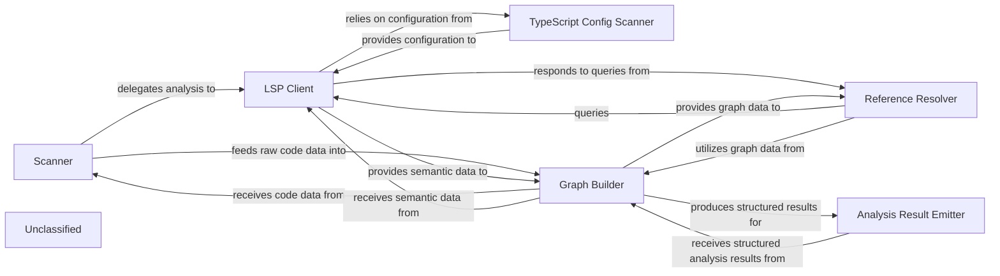

## Details

The static analysis subsystem is designed to systematically process and understand a codebase. The `Scanner` initiates the analysis by identifying relevant files and programming languages. The `LSP Client` then interacts with language servers to extract rich semantic information, leveraging the `TypeScript Config Scanner` for language-specific configurations. This raw and semantic data is fed into the `Graph Builder`, which constructs various graph representations of the code, such as call graphs. The `Reference Resolver` utilizes these graphs and the `LSP Client` to trace and resolve code references. Finally, the `Analysis Result Emitter` formats the structured analysis results for consumption by other parts of the system, such as an AI interpretation layer. This architecture ensures a comprehensive and extensible approach to static code analysis.

### Scanner
Orchestrates the initial phase of code analysis. It's responsible for traversing the codebase, identifying files for analysis, and initiating the parsing process. It acts as the entry point for feeding raw code into the analysis pipeline.

**Related Classes/Methods**:

- <a href="https://github.com/CodeBoarding/CodeBoarding/blob/mainstatic_analyzer/scanner.py" target="_blank" rel="noopener noreferrer">`static_analyzer.scanner.ProjectScanner`</a>

### LSP Client
Establishes and manages communication with Language Servers (e.g., TypeScript Language Server). It queries language services for Abstract Syntax Trees (ASTs), symbol information, type definitions, and other rich semantic data. The `TypeScript Client` provides specialized capabilities for TypeScript projects.

**Related Classes/Methods**:

- <a href="https://github.com/CodeBoarding/CodeBoarding/blob/mainstatic_analyzer/lsp_client/client.py" target="_blank" rel="noopener noreferrer">`static_analyzer.lsp_client.client.LSPClient`</a>
- <a href="https://github.com/CodeBoarding/CodeBoarding/blob/mainstatic_analyzer/lsp_client/typescript_client.py" target="_blank" rel="noopener noreferrer">`static_analyzer.lsp_client.typescript_client.TypeScriptClient`</a>

### TypeScript Config Scanner
Specifically designed to scan and interpret TypeScript configuration files (e.g., `tsconfig.json`). It extracts crucial project settings, compiler options, and file inclusions/exclusions necessary for accurate TypeScript analysis.

**Related Classes/Methods**:

- <a href="https://github.com/CodeBoarding/CodeBoarding/blob/mainstatic_analyzer/typescript_config_scanner.py#L8-L57" target="_blank" rel="noopener noreferrer">`static_analyzer.typescript_config_scanner.TypeScriptConfigScanner`:8-57</a>

### Graph Builder
Constructs and manages graph-based representations of the source code. This includes building ASTs, Control Flow Graphs (CFGs), and Dependency Graphs from the data provided by the `Scanner` and `LSP Client`. It provides algorithms for graph traversal and querying to enable deep code relationship analysis.

**Related Classes/Methods**:

- <a href="https://github.com/CodeBoarding/CodeBoarding/blob/mainstatic_analyzer/graph.py" target="_blank" rel="noopener noreferrer">`static_analyzer.graph.CallGraph`</a>

### Reference Resolver
Identifies and resolves code references across the codebase. This involves tracing definitions, usages, and relationships between different code entities (e.g., variables, functions, classes). It leverages the LSP client's capabilities and the graph-based code representation.

**Related Classes/Methods**:

- <a href="https://github.com/CodeBoarding/CodeBoarding/blob/mainstatic_analyzer/reference_resolve_mixin.py" target="_blank" rel="noopener noreferrer">`static_analyzer.reference_resolve_mixin.ReferenceResolverMixin`</a>

### Analysis Result Emitter
Responsible for processing and formatting the structured analysis results produced by the `Graph Builder` into a consumable format. This component acts as the interface for external systems to receive the static analysis output.

**Related Classes/Methods**:

- <a href="https://github.com/CodeBoarding/CodeBoarding/blob/mainagents/abstraction_agent.py" target="_blank" rel="noopener noreferrer">`agents.abstraction_agent.AbstractionAgent`</a>

### Unclassified
Component for all unclassified files and utility functions (Utility functions/External Libraries/Dependencies)

**Related Classes/Methods**: _None_

### [FAQ](https://github.com/CodeBoarding/GeneratedOnBoardings/tree/main?tab=readme-ov-file#faq)
