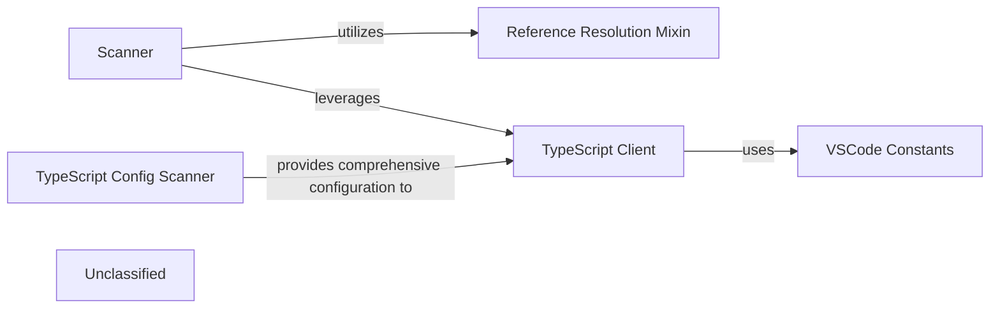

## Details

The system's architecture is centered around a `Scanner` that performs initial code ingestion and AST generation. For TypeScript projects, the `TypeScript Config Scanner` provides essential and comprehensive project configuration to the `TypeScript Client`. The `TypeScript Client`, now with significantly enhanced capabilities, then communicates with an external TypeScript Language Server (LSP) to extract rich semantic information, leveraging `VSCode Constants` for environment-specific parameters. The `Scanner` further utilizes a `Reference Resolution Mixin` to resolve code references, enabling deep code understanding and navigation across the project. This integrated approach ensures comprehensive and accurate static analysis, particularly for TypeScript codebases, with a strong emphasis on detailed semantic understanding and configuration-driven analysis.

### Scanner
Performs the initial parsing, lexical analysis, and Abstract Syntax Tree (AST) generation for various programming languages. It's the primary component for raw code ingestion and initial structural analysis.

**Related Classes/Methods**:

- <a href="https://github.com/CodeBoarding/CodeBoarding/blob/mainstatic_analyzer/scanner.py" target="_blank" rel="noopener noreferrer">`static_analyzer.scanner.ProjectScanner`</a>

### TypeScript Client
Manages robust and extensive communication with an external TypeScript Language Server (LSP). It now leverages LSP capabilities more deeply and broadly to retrieve richer, more detailed semantic information about TypeScript code, including advanced type definitions, comprehensive symbol references, and enhanced diagnostics, significantly expanding beyond basic syntactic analysis.

**Related Classes/Methods**:

- <a href="https://github.com/CodeBoarding/CodeBoarding/blob/mainstatic_analyzer/lsp_client/typescript_client.py" target="_blank" rel="noopener noreferrer">`static_analyzer.lsp_client.typescript_client.TypeScriptClient`</a>

### Reference Resolution Mixin
Provides a set of functionalities or methods for resolving code references (e.g., finding definitions, usages, and call hierarchies). This is a critical capability for deep code understanding and navigation.

**Related Classes/Methods**:

- <a href="https://github.com/CodeBoarding/CodeBoarding/blob/mainstatic_analyzer/reference_resolve_mixin.py" target="_blank" rel="noopener noreferrer">`static_analyzer.reference_resolve_mixin.ReferenceResolverMixin`</a>

### TypeScript Config Scanner
Specifically designed to comprehensively parse and interpret TypeScript configuration files (e.g., `tsconfig.json`). It now extracts a wider scope and deeper set of project-specific settings, module resolution strategies, and compilation options, providing more comprehensive and accurate configuration crucial for advanced TypeScript analysis.

**Related Classes/Methods**:

- <a href="https://github.com/CodeBoarding/CodeBoarding/blob/mainstatic_analyzer/typescript_config_scanner.py#L8-L57" target="_blank" rel="noopener noreferrer">`static_analyzer.typescript_config_scanner.TypeScriptConfigScanner`:8-57</a>

### VSCode Constants
Defines constants, enums, or configuration parameters that are specific to the Visual Studio Code environment. Its presence indicates a strong integration or dependency on VS Code's ecosystem, influencing how analysis is performed or how results are consumed within a VS Code context.

**Related Classes/Methods**:

- <a href="https://github.com/CodeBoarding/CodeBoarding/blob/mainvscode_constants.py" target="_blank" rel="noopener noreferrer">`vscode_constants`</a>

### Unclassified
Component for all unclassified files and utility functions (Utility functions/External Libraries/Dependencies)

**Related Classes/Methods**: _None_

### [FAQ](https://github.com/CodeBoarding/GeneratedOnBoardings/tree/main?tab=readme-ov-file#faq)
