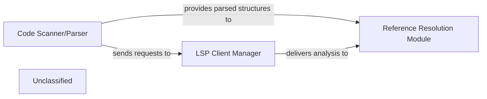

## Details

The static analysis subsystem is composed of three central components: the `Code Scanner/Parser`, the `LSP Client Manager`, and the `Reference Resolution Module`. The `Code Scanner/Parser` initiates the analysis by ingesting and structuring source code, performing language-agnostic parsing. It then interacts with the `LSP Client Manager` to leverage language-specific analysis capabilities provided by external Language Server Protocol (LSP) servers. Both the parsed structures from the `Code Scanner/Parser` and the detailed analysis from the `LSP Client Manager` feed into the `Reference Resolution Module`. This module is responsible for identifying and resolving code references, thereby establishing a comprehensive understanding of the codebase's structural interactions. This architecture ensures a modular and extensible approach to static code analysis, separating initial parsing from language-specific and reference resolution concerns.

### Code Scanner/Parser
Responsible for the initial ingestion and parsing of source code, breaking it down into a structured format suitable for further analysis. It handles language-agnostic lexical and syntactic analysis, potentially delegating language-specific parsing to specialized clients.

**Related Classes/Methods**:

- <a href="https://github.com/CodeBoarding/CodeBoarding/blob/mainstatic_analyzer/scanner.py" target="_blank" rel="noopener noreferrer">`static_analyzer/scanner.py`</a>

### LSP Client Manager
Manages communication with Language Server Protocol (LSP) servers for various programming languages. It acts as an intermediary, sending code analysis requests to external language servers and receiving detailed, language-specific structural information (e.g., ASTs, symbol tables, type information). The `LSPClient` serves as the foundational abstract class for all language-specific LSP client implementations, defining the core communication protocol and lifecycle management.

**Related Classes/Methods**:

- <a href="https://github.com/CodeBoarding/CodeBoarding/blob/mainstatic_analyzer/lsp_client/typescript_client.py" target="_blank" rel="noopener noreferrer">`static_analyzer.lsp_client.client.LSPClient`</a>

### Reference Resolution Module
Focuses on identifying and resolving code references within the parsed source code. It links declarations to their usages, providing a comprehensive understanding of how different parts of the codebase interact at a structural level. The `ReferenceResolverMixin` provides the core logic and orchestration for various reference resolution strategies, including exact, loose, file path, and LLM-based matching.

**Related Classes/Methods**:

- <a href="https://github.com/CodeBoarding/CodeBoarding/blob/mainstatic_analyzer/reference_resolve_mixin.py" target="_blank" rel="noopener noreferrer">`static_analyzer.reference_resolve_mixin.ReferenceResolverMixin`</a>

### Unclassified
Component for all unclassified files and utility functions (Utility functions/External Libraries/Dependencies)

**Related Classes/Methods**: _None_

### [FAQ](https://github.com/CodeBoarding/GeneratedOnBoardings/tree/main?tab=readme-ov-file#faq)
