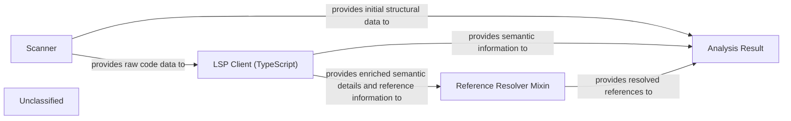

## Details

The Static Analysis Engine subsystem is responsible for performing deep, language-specific analysis and reference resolution on source code to produce comprehensive structural information. It begins with the Scanner parsing and tokenizing source code to generate an initial structural representation. The LSP Client (TypeScript) then enriches this data by interacting with Language Server Protocol servers to obtain detailed syntax and semantic information. Subsequently, the Reference Resolver Mixin leverages this enriched data to identify and link code references. Finally, all processed and enriched information, including initial structural data, semantic details, and resolved references, is aggregated and structured within the Analysis Result, which serves as the canonical output of the engine.

### Scanner
Initiates the code analysis process by parsing source code, tokenizing, and generating an initial structural representation (e.g., an Abstract Syntax Tree). It focuses on the foundational extraction of code elements.

**Related Classes/Methods**:

- <a href="https://github.com/CodeBoarding/CodeBoarding/blob/mainstatic_analyzer/scanner.py" target="_blank" rel="noopener noreferrer">`Scanner`</a>

### LSP Client (TypeScript)
Facilitates language-specific analysis by interacting with Language Server Protocol (LSP) servers. For TypeScript, it leverages LSP capabilities to obtain detailed syntax, semantic information, and crucial reference resolution data. This component is key to the 'language-specific analysis' aspect.

**Related Classes/Methods**:

- <a href="https://github.com/CodeBoarding/CodeBoarding/blob/mainstatic_analyzer/lsp_client/typescript_client.py" target="_blank" rel="noopener noreferrer">`LSP Client (TypeScript)`</a>

### Reference Resolver Mixin
Provides the core logic for identifying and linking code references (e.g., where a variable is defined and all its usages). This directly implements the 'reference resolution capabilities' of the engine, enhancing the extracted structural information with crucial contextual links.

**Related Classes/Methods**:

- <a href="https://github.com/CodeBoarding/CodeBoarding/blob/mainstatic_analyzer/reference_resolve_mixin.py" target="_blank" rel="noopener noreferrer">`Reference Resolver Mixin`</a>

### Analysis Result
Defines the standardized data structures and models used to store the comprehensive output of the static analysis process. This includes the extracted structural information and the resolved references, serving as the canonical representation of the analyzed codebase's structure.

**Related Classes/Methods**:

- <a href="https://github.com/CodeBoarding/CodeBoarding/blob/mainstatic_analyzer/analysis_result.py" target="_blank" rel="noopener noreferrer">`Analysis Result`</a>

### Unclassified
Component for all unclassified files and utility functions (Utility functions/External Libraries/Dependencies)

**Related Classes/Methods**: _None_

### [FAQ](https://github.com/CodeBoarding/GeneratedOnBoardings/tree/main?tab=readme-ov-file#faq)
