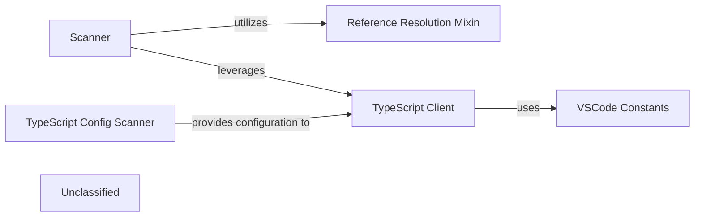

## Details

The static analysis subsystem is responsible for ingesting source code, analyzing its structure, and resolving references within the codebase. The Scanner component initiates the analysis by parsing code and generating an initial understanding of the project's languages and file types. For TypeScript and JavaScript projects, the TypeScript Client interacts with an external Language Server Protocol (LSP) server to obtain rich semantic information, which is crucial for deep code understanding. The TypeScript Config Scanner plays a vital role in this process by identifying and interpreting TypeScript configuration files, providing essential context for the TypeScript Client's operations. The Reference Resolution Mixin provides the core functionality for resolving code references across different languages, enabling the system to trace definitions, usages, and call hierarchies. Finally, VSCode Constants provides configuration parameters and definitions relevant to the VS Code environment, indicating the system's integration with or dependency on the VS Code ecosystem. This architecture allows for a flexible and extensible static analysis pipeline that can adapt to various programming languages and project configurations.

### Scanner
Performs the initial parsing, lexical analysis, and Abstract Syntax Tree (AST) generation for various programming languages. It's the primary component for raw code ingestion and initial structural analysis.

**Related Classes/Methods**:

- <a href="https://github.com/CodeBoarding/CodeBoarding/blob/mainstatic_analyzer/scanner.py" target="_blank" rel="noopener noreferrer">`static_analyzer.scanner.ProjectScanner`</a>

### TypeScript Client
Manages communication with an external TypeScript Language Server (LSP). It leverages LSP capabilities to retrieve rich, semantic information about TypeScript code, such as type definitions, symbol references, and diagnostics, going beyond basic syntactic analysis.

**Related Classes/Methods**:

- <a href="https://github.com/CodeBoarding/CodeBoarding/blob/mainstatic_analyzer/lsp_client/typescript_client.py" target="_blank" rel="noopener noreferrer">`static_analyzer.lsp_client.typescript_client.TypeScriptClient`</a>

### Reference Resolution Mixin
Provides a set of functionalities or methods for resolving code references (e.g., finding definitions, usages, and call hierarchies). This is a critical capability for deep code understanding and navigation.

**Related Classes/Methods**:

- <a href="https://github.com/CodeBoarding/CodeBoarding/blob/mainstatic_analyzer/reference_resolve_mixin.py" target="_blank" rel="noopener noreferrer">`static_analyzer.reference_resolve_mixin.ReferenceResolverMixin`</a>

### TypeScript Config Scanner
Specifically designed to parse and interpret TypeScript configuration files (e.g., `tsconfig.json`). It extracts project-specific settings, module resolution strategies, and compilation options, which are crucial for accurate TypeScript analysis.

**Related Classes/Methods**:

- <a href="https://github.com/CodeBoarding/CodeBoarding/blob/mainstatic_analyzer/typescript_config_scanner.py#L8-L46" target="_blank" rel="noopener noreferrer">`static_analyzer.typescript_config_scanner.TypeScriptConfigScanner`:8-46</a>

### VSCode Constants
Defines constants, enums, or configuration parameters that are specific to the Visual Studio Code environment. Its presence indicates a strong integration or dependency on VS Code's ecosystem, influencing how analysis is performed or how results are consumed within a VS Code context.

**Related Classes/Methods**:

- <a href="https://github.com/CodeBoarding/CodeBoarding/blob/mainvscode_constants.py" target="_blank" rel="noopener noreferrer">`vscode_constants`</a>

### Unclassified
Component for all unclassified files and utility functions (Utility functions/External Libraries/Dependencies)

**Related Classes/Methods**: _None_

### [FAQ](https://github.com/CodeBoarding/GeneratedOnBoardings/tree/main?tab=readme-ov-file#faq)
