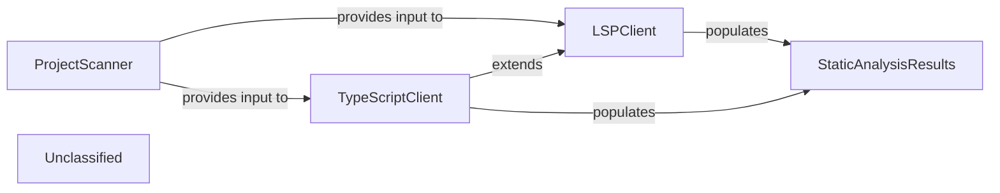

## Details

The static analysis subsystem is designed to systematically extract comprehensive code intelligence from a project. It starts with the `ProjectScanner` component, which is responsible for initial project introspection and file identification. The identified files are then handed over to language-specific analysis clients, primarily the `LSPClient` and its specialized extension, `TypeScriptClient`. These clients leverage the Language Server Protocol to perform deep static analysis, generating detailed insights into the codebase, such as call graphs, class hierarchies, and symbol references. All the generated analysis data is then consolidated and managed by the `StaticAnalysisResults` component, which acts as a central, language-agnostic repository for structured analysis outcomes, making them readily available for subsequent processing and consumption by other parts of the system.

### ProjectScanner
Initiates the static analysis process by scanning the project repository. It identifies relevant source files, determines programming languages used, and extracts basic project metadata. This component acts as the initial data gatherer, preparing the input for more detailed LSP-based analysis.

**Related Classes/Methods**:

- <a href="https://github.com/CodeBoarding/CodeBoarding/blob/main/static_analyzer/scanner.py#L13-L66" target="_blank" rel="noopener noreferrer">`ProjectScanner`:13-66</a>

### LSPClient
Serves as the generic Language Server Protocol client. It manages the communication lifecycle with an LSP server (initialization, sending requests, receiving responses, shutdown). It orchestrates the detailed static analysis for individual files and the entire workspace, extracting symbols, imports, call graphs, and class hierarchies. It populates the `StaticAnalysisResults` with its findings.

**Related Classes/Methods**:

- <a href="https://github.com/CodeBoarding/CodeBoarding/blob/main/static_analyzer/lsp_client/client.py#L37-L924" target="_blank" rel="noopener noreferrer">`LSPClient`:37-924</a>

### TypeScriptClient
A specialized implementation of `LSPClient` tailored for TypeScript projects. It handles TypeScript-specific initialization parameters, workspace configuration (e.g., processing `tsconfig.json`), and file discovery, ensuring the LSP server is correctly set up for TypeScript analysis. This component exemplifies the extensibility of the static analysis engine for different programming languages and also populates `StaticAnalysisResults`.

**Related Classes/Methods**:

- <a href="https://github.com/CodeBoarding/CodeBoarding/blob/main/static_analyzer/lsp_client/typescript_client.py#L10-L214" target="_blank" rel="noopener noreferrer">`TypeScriptClient`:10-214</a>

### StaticAnalysisResults
This central component acts as a repository for all aggregated static analysis results across different programming languages. It collects and manages various types of analysis data, including class hierarchies, control flow graphs, package dependencies, and source code references, provided by the LSP clients. It offers methods to add and retrieve these structured results for downstream processing and consumption.

**Related Classes/Methods**:

- <a href="https://github.com/CodeBoarding/CodeBoarding/blob/main/static_analyzer/analysis_result.py#L6-L171" target="_blank" rel="noopener noreferrer">`StaticAnalysisResults`:6-171</a>

### Unclassified
Component for all unclassified files and utility functions (Utility functions/External Libraries/Dependencies)

**Related Classes/Methods**: _None_

### [FAQ](https://github.com/CodeBoarding/GeneratedOnBoardings/tree/main?tab=readme-ov-file#faq)
