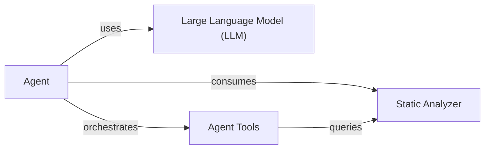

## Details

The CodeBoarding system is designed to provide comprehensive code analysis and insights, primarily driven by an AI Agent. At its core, the system leverages a Static Analyzer subsystem to generate detailed structural and relational data about the codebase, including call graphs and package dependencies. This rich static analysis data is then consumed by the Agent component, which acts as an intelligent orchestrator. The Agent utilizes a Large Language Model (LLM) for reasoning and decision-making, and interacts with the codebase through a suite of Agent Tools. These tools allow the Agent to dynamically query source code, file structures, and the static analysis results, enabling it to answer complex questions, identify architectural patterns, and provide actionable insights.

### Agent
The central orchestrator of the AI-driven analysis. It interprets user prompts, leverages a Large Language Model for reasoning, and coordinates the use of various specialized tools to interact with the codebase and static analysis data.

**Related Classes/Methods**:

- <a href="https://github.com/CodeBoarding/CodeBoarding/blob/main/agents/agent.py#L27-L207" target="_blank" rel="noopener noreferrer">`agents.agent.CodeBoardingAgent`:27-207</a>

### Static Analyzer [[Expand]](./Static_Analyzer.md)
A foundational subsystem responsible for performing deep static analysis of the codebase. It generates comprehensive structural and relational data, including call graphs, package dependencies, and code references, which serve as critical input for the Agent. This component encapsulates the functionalities of the Scanner, Programming Language identification, LSP Client interactions, Call Graph construction, and Graph Data Structures.

**Related Classes/Methods**:

- <a href="https://github.com/CodeBoarding/CodeBoarding/blob/main/static_analyzer/scanner.py" target="_blank" rel="noopener noreferrer">`static_analyzer.scanner`</a>
- <a href="https://github.com/CodeBoarding/CodeBoarding/blob/main/static_analyzer/programming_language.py" target="_blank" rel="noopener noreferrer">`static_analyzer.programming_language`</a>
- <a href="https://github.com/CodeBoarding/CodeBoarding/blob/main/static_analyzer/lsp_client/client.py" target="_blank" rel="noopener noreferrer">`static_analyzer.lsp_client.client`</a>
- <a href="https://github.com/CodeBoarding/CodeBoarding/blob/main/static_analyzer/graph.py" target="_blank" rel="noopener noreferrer">`static_analyzer.graph.node`</a>
- <a href="https://github.com/CodeBoarding/CodeBoarding/blob/main/static_analyzer/graph.py" target="_blank" rel="noopener noreferrer">`static_analyzer.graph.edge`</a>

### Large Language Model (LLM)
An external or integrated AI model that provides the reasoning capabilities for the Agent. It processes prompts, generates responses, and assists the Agent in making decisions and formulating queries to the Agent Tools.

**Related Classes/Methods**:

### Agent Tools
A collection of specialized functionalities that enable the Agent to interact with the codebase and the results of the Static Analyzer. These tools abstract various data retrieval and analysis operations, allowing the Agent to focus on high-level reasoning.

**Related Classes/Methods**:

- <a href="https://github.com/CodeBoarding/CodeBoarding/blob/main/agents/tools/read_file.py" target="_blank" rel="noopener noreferrer">`agents.tools.ReadFileTool`</a>
- <a href="https://github.com/CodeBoarding/CodeBoarding/blob/main/agents/tools/read_docs.py#L19-L147" target="_blank" rel="noopener noreferrer">`agents.tools.read_docs.ReadDocsTool`:19-147</a>
- <a href="https://github.com/CodeBoarding/CodeBoarding/blob/main/agents/tools/external_deps.py#L17-L95" target="_blank" rel="noopener noreferrer">`agents.tools.external_deps.ExternalDepsTool`:17-95</a>

### [FAQ](https://github.com/CodeBoarding/GeneratedOnBoardings/tree/main?tab=readme-ov-file#faq)
