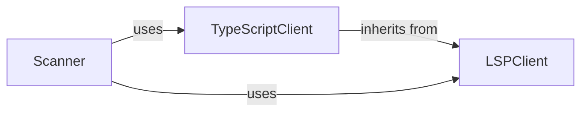

## Details

The `Static Analyzer` subsystem is primarily defined by the `static_analyzer/scanner.py` module and the `static_analyzer/lsp_client/` package. This encompasses the core logic for language-aware static analysis, including the Language Server Protocol (LSP) client implementations and the orchestration of the scanning process.

### LSPClient
This is the abstract foundation for all language-specific static analysis. It encapsulates the generic Language Server Protocol (LSP) communication, managing the lifecycle of an LSP connection (initialization, request/response handling, shutdown). It provides methods for sending various LSP requests (e.g., for document symbols, call hierarchies, class hierarchies, references, definitions) and processing the server's responses to extract raw code insights. It also handles file filtering and directory exclusion.

**Related Classes/Methods**:

- <a href="https://github.com/CodeBoarding/CodeBoarding/blob/main/static_analyzer/lsp_client/client.py#L19-L900" target="_blank" rel="noopener noreferrer">`LSPClient`:19-900</a>

### TypeScriptClient
A concrete implementation extending `LSPClient`, specifically tailored for TypeScript projects. It inherits the core LSP communication capabilities and adds TypeScript-specific logic for project initialization, configuration, and bootstrapping the TypeScript Language Server. This specialization ensures accurate and efficient analysis of TypeScript codebases by correctly setting up the language server environment.

**Related Classes/Methods**:

- <a href="https://github.com/CodeBoarding/CodeBoarding/blob/main/static_analyzer/lsp_client/typescript_client.py#L10-L214" target="_blank" rel="noopener noreferrer">`TypeScriptClient`:10-214</a>

### Scanner
This component acts as the orchestrator and entry point for initiating the static analysis process within the subsystem. It is responsible for selecting the appropriate `LSPClient` implementation (e.g., `TypeScriptClient` for TypeScript projects), configuring it with project-specific details, and invoking its methods to perform the actual code scanning, data collection, and potentially initial processing of the raw analysis results.

**Related Classes/Methods**:

- <a href="https://github.com/CodeBoarding/CodeBoarding/blob/main/static_analyzer/scanner.py#L13-L66" target="_blank" rel="noopener noreferrer">`Scanner`:13-66</a>

### [FAQ](https://github.com/CodeBoarding/GeneratedOnBoardings/tree/main?tab=readme-ov-file#faq)
