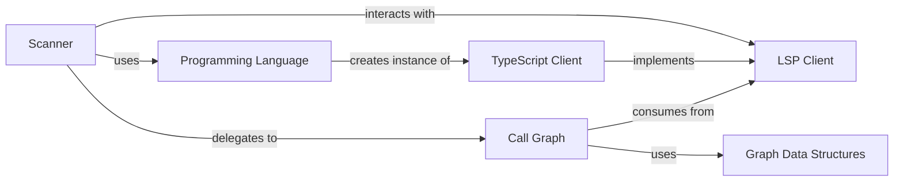

## Details

One paragraph explaining the functionality which is represented by this graph. What the main flow is and what is its purpose.

### Scanner
The primary orchestrator and entry point of the subsystem. It traverses the target project's file system, determines the language, and coordinates the analysis process by delegating to the appropriate LSP client and graph-building components.

**Related Classes/Methods**:

- <a href="https://github.com/CodeBoarding/CodeBoarding/blob/main/static_analyzer/scanner.py" target="_blank" rel="noopener noreferrer">`static_analyzer/scanner.py`</a>

### Programming Language
A factory component responsible for identifying the programming language of the source code and providing the corresponding language-specific LSP client instance. This isolates language-specific logic and simplifies the `Scanner`'s responsibilities.

**Related Classes/Methods**:

- <a href="https://github.com/CodeBoarding/CodeBoarding/blob/main/static_analyzer/programming_language.py" target="_blank" rel="noopener noreferrer">`static_analyzer/programming_language.py`</a>

### LSP Client
An abstract base class defining a standardized interface for communication with any Language Server Protocol server. It decouples the `Scanner` and `Call Graph` from the concrete implementation details of specific language servers.

**Related Classes/Methods**:

- <a href="https://github.com/CodeBoarding/CodeBoarding/blob/main/static_analyzer/lsp_client/client.py" target="_blank" rel="noopener noreferrer">`static_analyzer/lsp_client/client.py`</a>

### TypeScript Client
A concrete implementation of the `LSP Client` interface, specifically designed to manage and communicate with the TypeScript language server. It demonstrates the system's extensibility for different languages.

**Related Classes/Methods**:

- <a href="https://github.com/CodeBoarding/CodeBoarding/blob/main/static_analyzer/lsp_client/typescript_client.py" target="_blank" rel="noopener noreferrer">`static_analyzer/lsp_client/typescript_client.py`</a>

### Call Graph
Responsible for constructing the call graph data structure. It consumes information retrieved from an `LSP Client` and uses it to build a graph of nodes and edges representing the code's relationships.

**Related Classes/Methods**:

- `static_analyzer/graph/call_graph.py`

### Graph Data Structures
A set of data models (`Node`, `Edge`) that represent the fundamental elements of the call graph. These structures provide a clean, language-agnostic representation of code entities and their interactions.

**Related Classes/Methods**:

- `static_analyzer/graph/node.py`
- `static_analyzer/graph/edge.py`

### [FAQ](https://github.com/CodeBoarding/GeneratedOnBoardings/tree/main?tab=readme-ov-file#faq)
