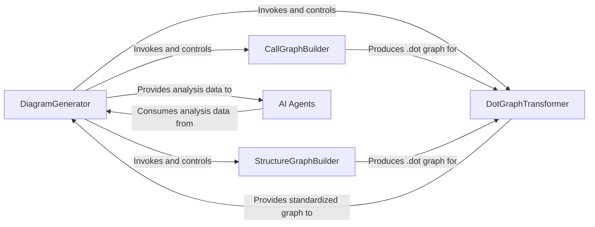

## Details

An analysis of the CodeBoarding subsystem reveals a sophisticated architecture orchestrated by a central controller that leverages static analysis tools to feed a suite of AI-driven agents.

### DiagramGenerator
Acts as the central orchestrator for the entire analysis process. It initiates static analysis, transforms the resulting data, and manages a pool of AI agents to produce a hierarchical, component-based model of the software architecture.

**Related Classes/Methods**:

- <a href="https://github.com/CodeBoarding/CodeBoarding/blob/main/diagram_analysis/diagram_generator.py#L23-L211" target="_blank" rel="noopener noreferrer">`diagram_analysis.diagram_generator.DiagramGenerator` (23:211)</a>
- `generate_static_analysis`
- `generate_analysis`
- `process_component`

### CallGraphBuilder
Parses the source code using AST techniques to construct a directed graph representing the relationships and call sequences between functions and methods.

**Related Classes/Methods**:

- <a href="https://github.com/CodeBoarding/CodeBoarding/blob/main/static_analyzer/pylint_analyze/call_graph_builder.py#L88-L240" target="_blank" rel="noopener noreferrer">`static_analyzer.pylint_analyze.call_graph_builder.CallGraphBuilder` (88:240)</a>

### StructureGraphBuilder
Uses `pyreverse` (from the Pylint suite) to analyze the source code and build a high-level graph outlining the code's architectural structure, including class definitions, inheritance, and module relationships.

**Related Classes/Methods**:

- <a href="https://github.com/CodeBoarding/CodeBoarding/blob/main/static_analyzer/pylint_analyze/structure_graph_builder.py#L7-L48" target="_blank" rel="noopener noreferrer">`static_analyzer.pylint_analyze.structure_graph_builder.StructureGraphBuilder` (7:48)</a>

### DotGraphTransformer
Ingests `.dot` file outputs from both the `CallGraphBuilder` and `StructureGraphBuilder`. It transforms these raw graphs into a standardized format suitable for consumption by the AI agents.

**Related Classes/Methods**:

- <a href="https://github.com/CodeBoarding/CodeBoarding/blob/main/static_analyzer/pylint_graph_transform.py#L10-L75" target="_blank" rel="noopener noreferrer">`static_analyzer.pylint_graph_transform.DotGraphTransformer` (10:75)</a>

### AI Agents
A collection of specialized agents (e.g., `DetailsAgent`, `AbstractionAgent`, `PlannerAgent`) that consume the prepared graph data. Each agent performs a specific task, such as abstracting high-level components, analyzing component details, or planning the next steps of the analysis.

**Related Classes/Methods**:

- `agents.agent.Agent`
- <a href="https://github.com/CodeBoarding/CodeBoarding/blob/main/agents/details_agent.py#L11-L103" target="_blank" rel="noopener noreferrer">`agents.details_agent.DetailsAgent` (11:103)</a>
- <a href="https://github.com/CodeBoarding/CodeBoarding/blob/main/agents/abstraction_agent.py#L9-L95" target="_blank" rel="noopener noreferrer">`agents.abstraction_agent.AbstractionAgent` (9:95)</a>
- <a href="https://github.com/CodeBoarding/CodeBoarding/blob/main/agents/planner_agent.py#L9-L27" target="_blank" rel="noopener noreferrer">`agents.planner_agent.PlannerAgent` (9:27)</a>

### [FAQ](https://github.com/CodeBoarding/GeneratedOnBoardings/tree/main?tab=readme-ov-file#faq)